# Creating an IAM user in AWS and giving only required permissions to user and create a S3 bucket

## Create IAM User
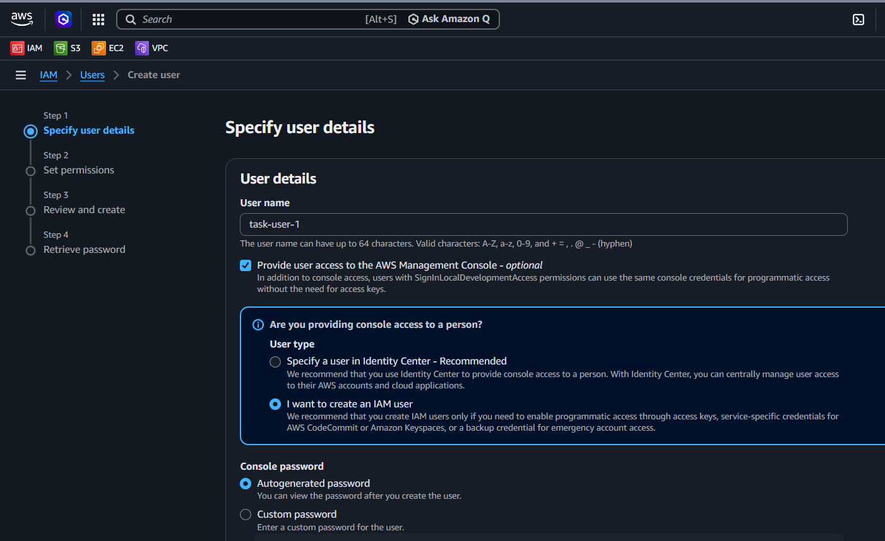
## Added Perms for S3 policy
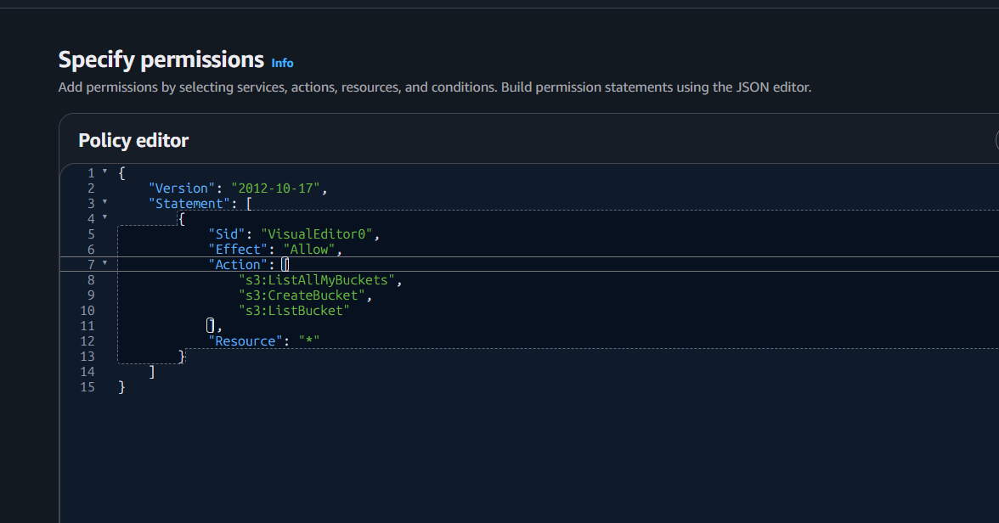
## Creating bucket with unique bucket name:
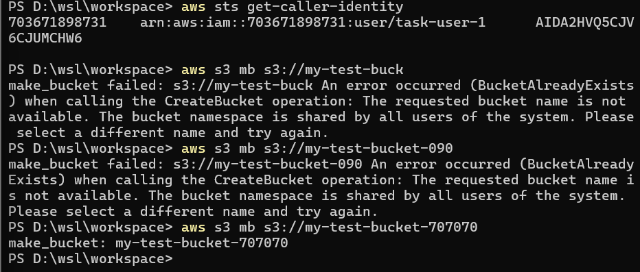
## Verified the buckets
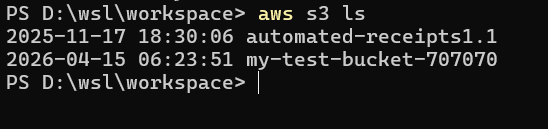
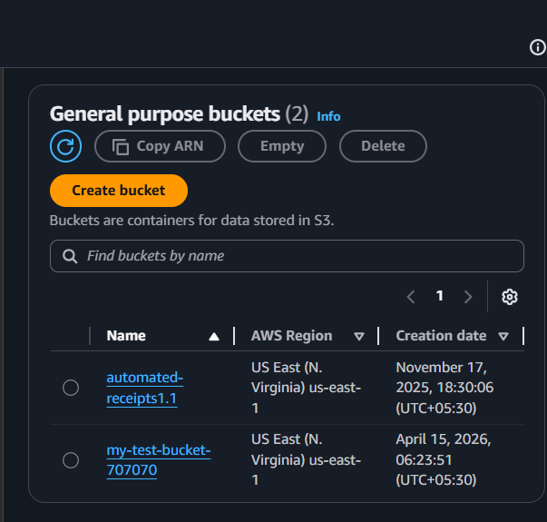

---

# Create an IAM Role, give only required permissions to this iam-role, and delete above created S3 bucket using this iam-role.

## Create IAM Role
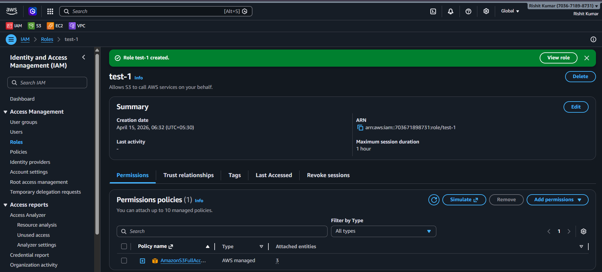
## Add Trust Policy (User → Role)
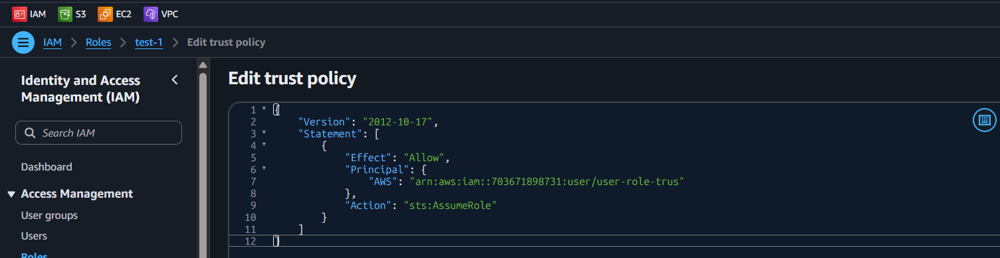
## Add S3 Delete Policy
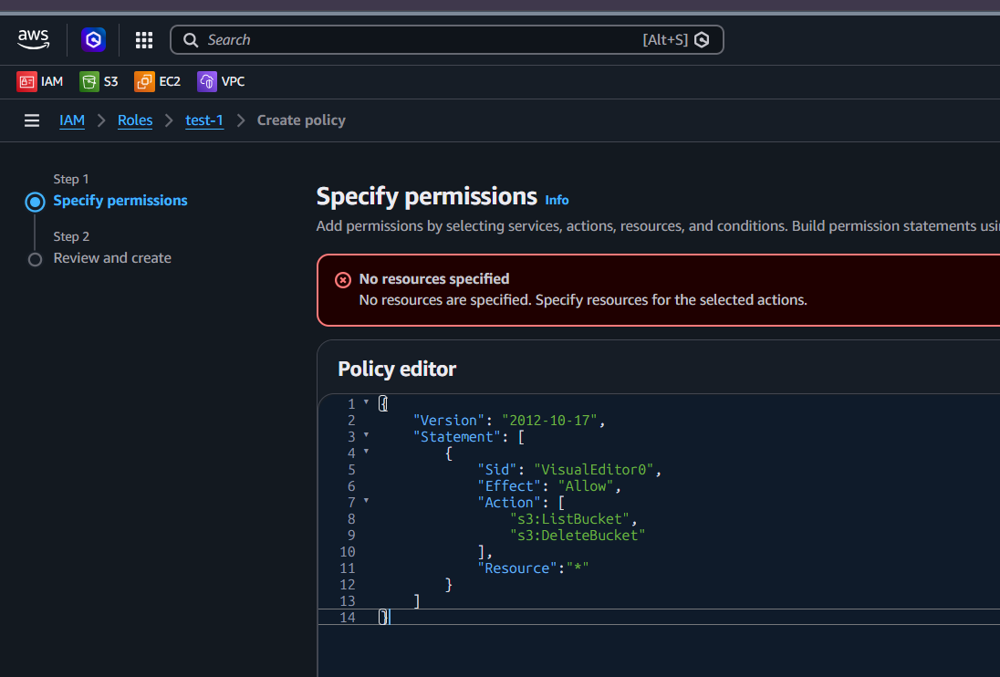
## created policy with ls and delete permission
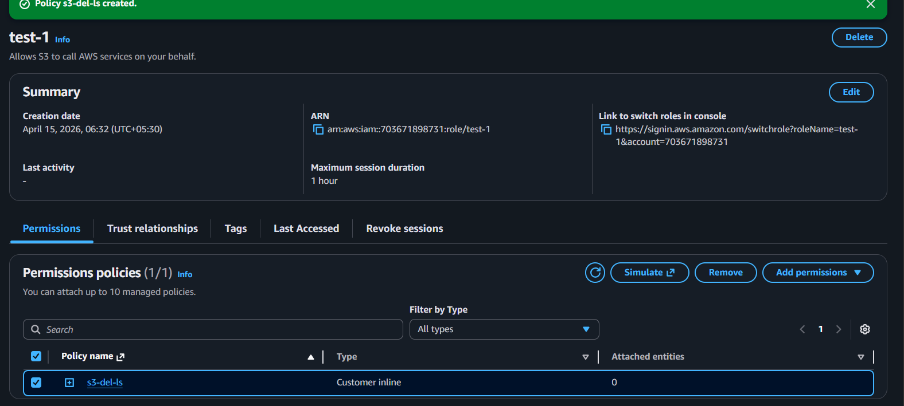
## Assume Role
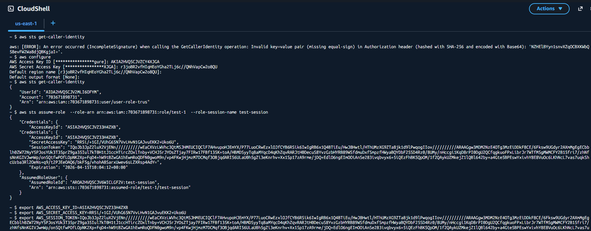
## Deleted Bucket & verified
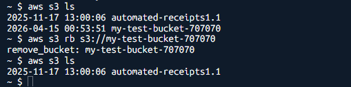

---

#  Test Trust Relationship policy by creating an IAM-ROLE-1 who will use (assume)IAM-ROLE-2 and will create S3 Bucket. Ensure that IAM-ROLE-1 should not have any permission for S3 bucket.

## Create IAM Role 1 & IAM Role 2
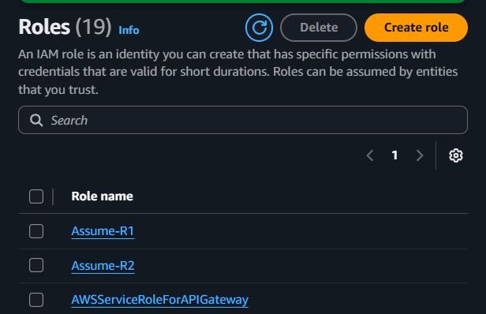
## added trust policy Allow Role1 → Assume Role2
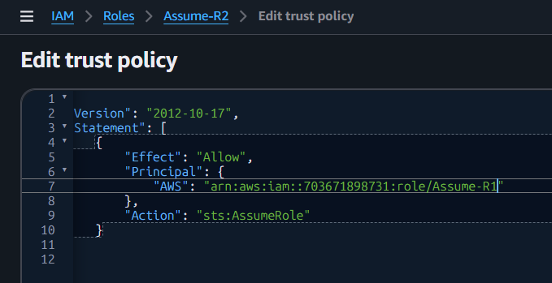
## Gave s3 full perms to Asuume role 2 
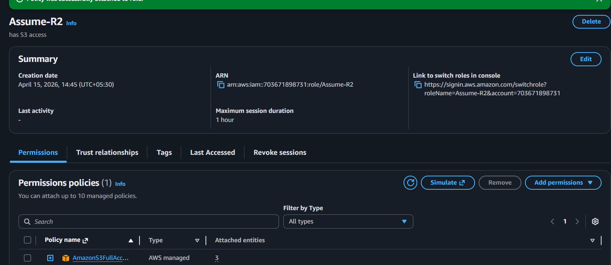
## added trust policy Attach Role1 to User
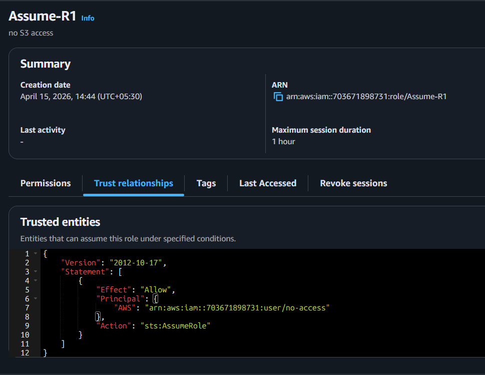
## No s3 perms to assume role 1
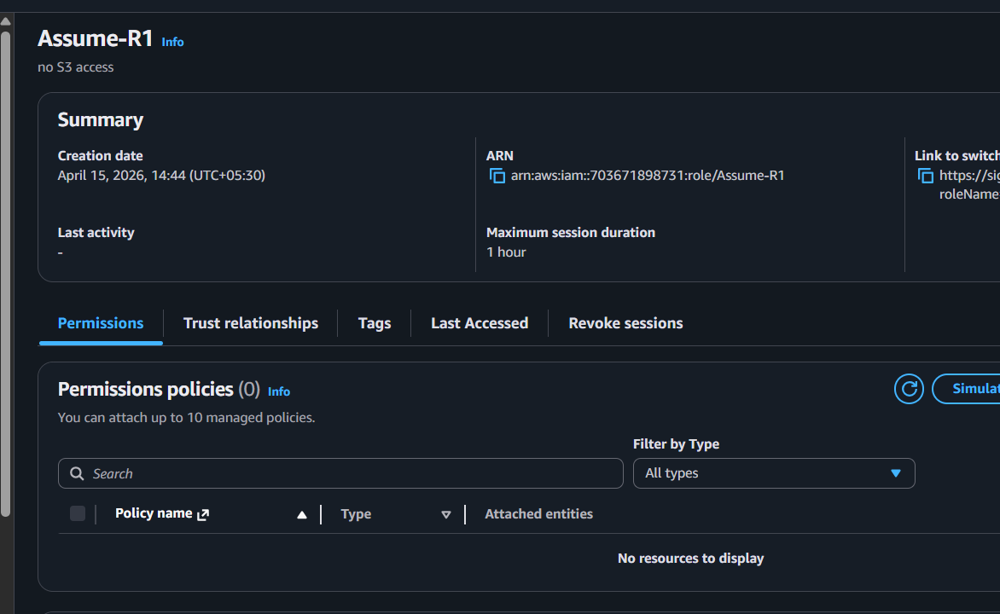
## Logged into the user using cli
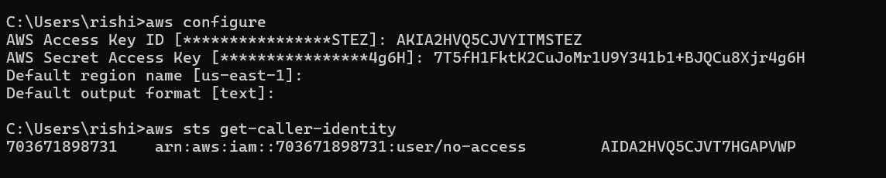
## Assume Role 1
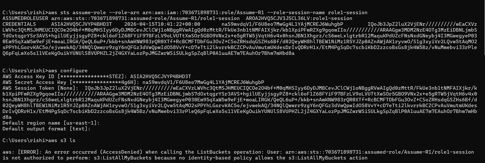
## Assume role 2
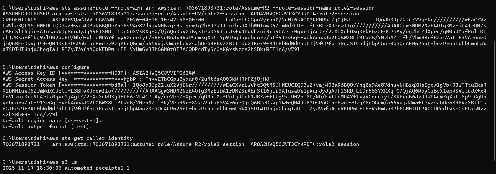
## Created bucket
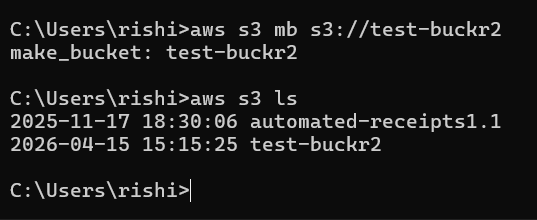
## Verified bucket
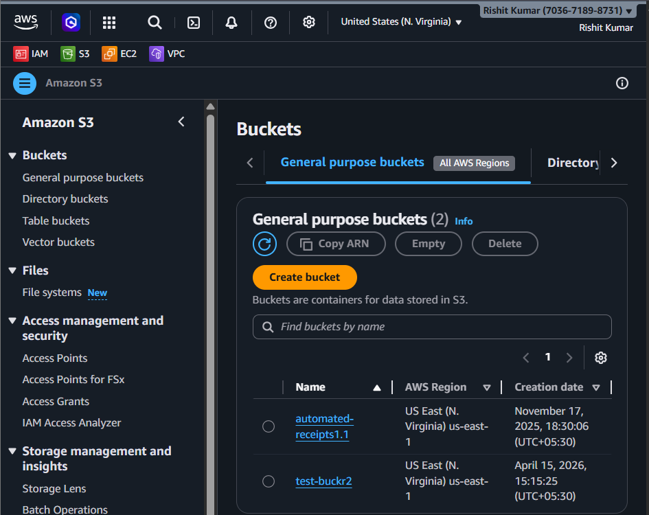
