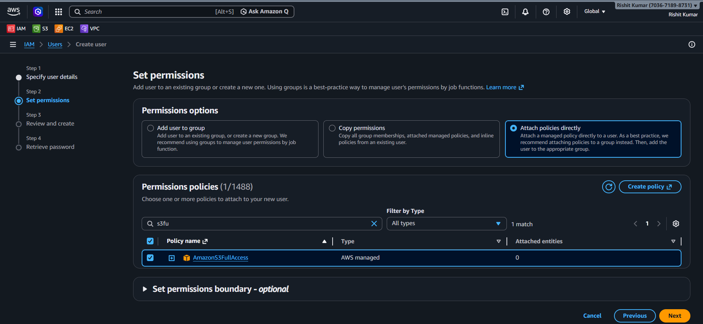
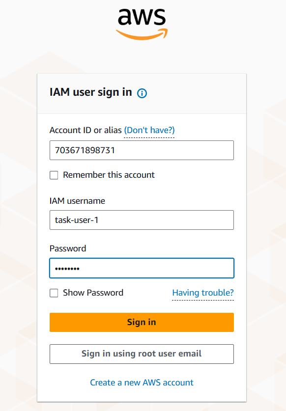

# Creating an IAM user in AWS and giving only required permissions to user and create a S3 bucket

# Create an IAM Role, give only required permissions to this iam-role, and delete above created S3 bucket using this iam-role.

#  Test Trust Relationship policy by creating an IAM-ROLE-1 who will use (assume)IAM-ROLE-2 and will create S3 Bucket. Ensure that IAM-ROLE-1 should not have any permission for S3 bucket.

