# Task 1. Simple EC2 Instance
a. Create an EC2 instance (OS: Ubuntu) in default VPC

b. Enable Public-IP
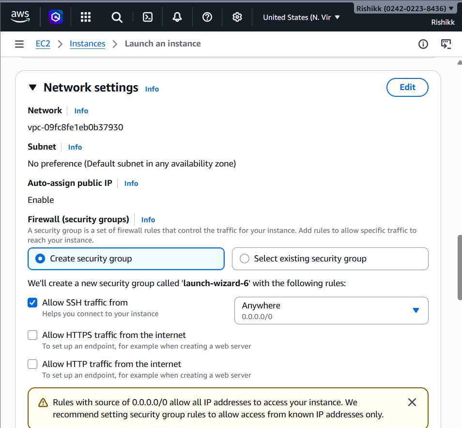

c. Create SSH-KeyPair
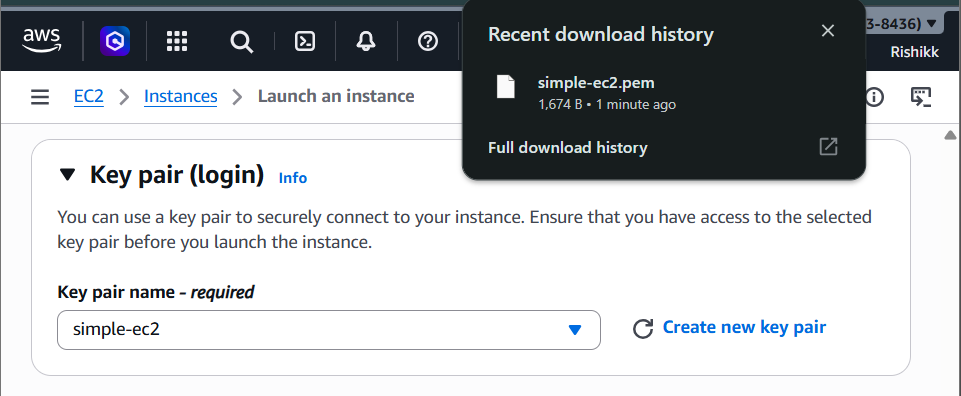

d. Let it create a default security-group for you

e. Keep root volume size 20GB.
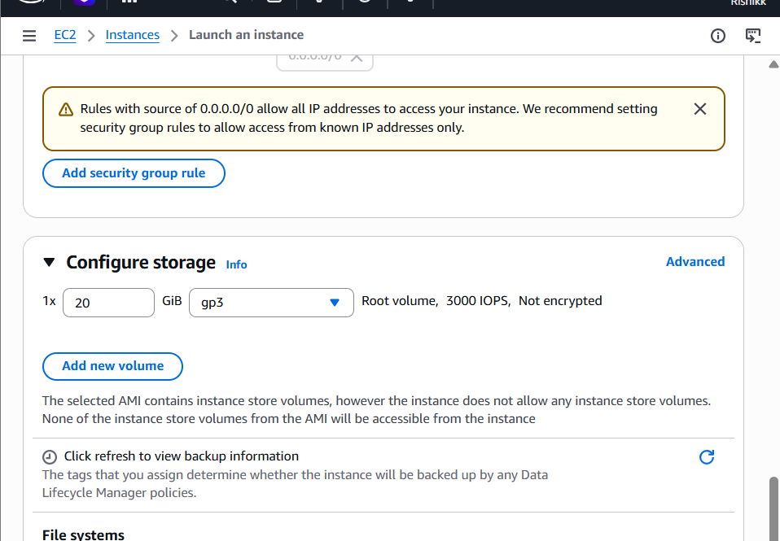

## Verified Everything on the console:
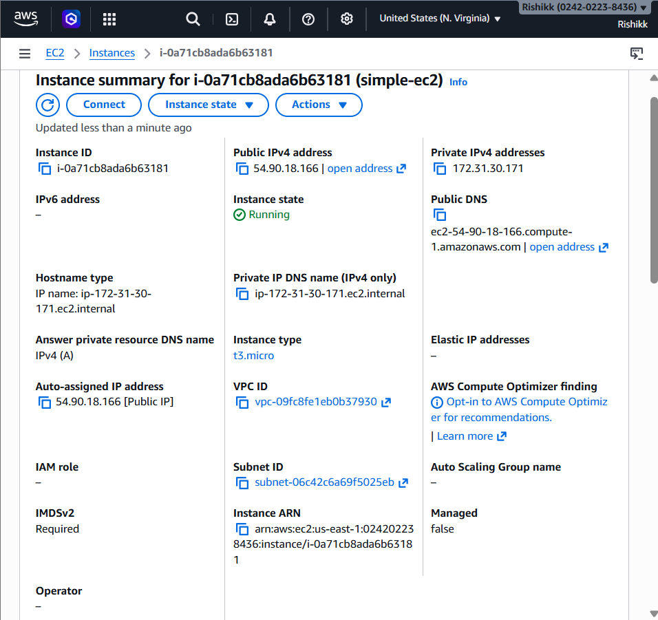
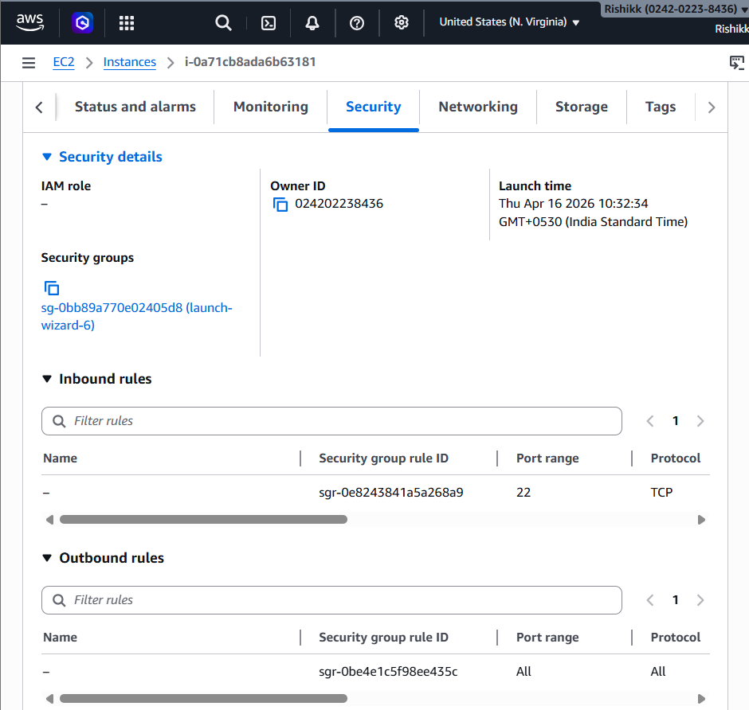
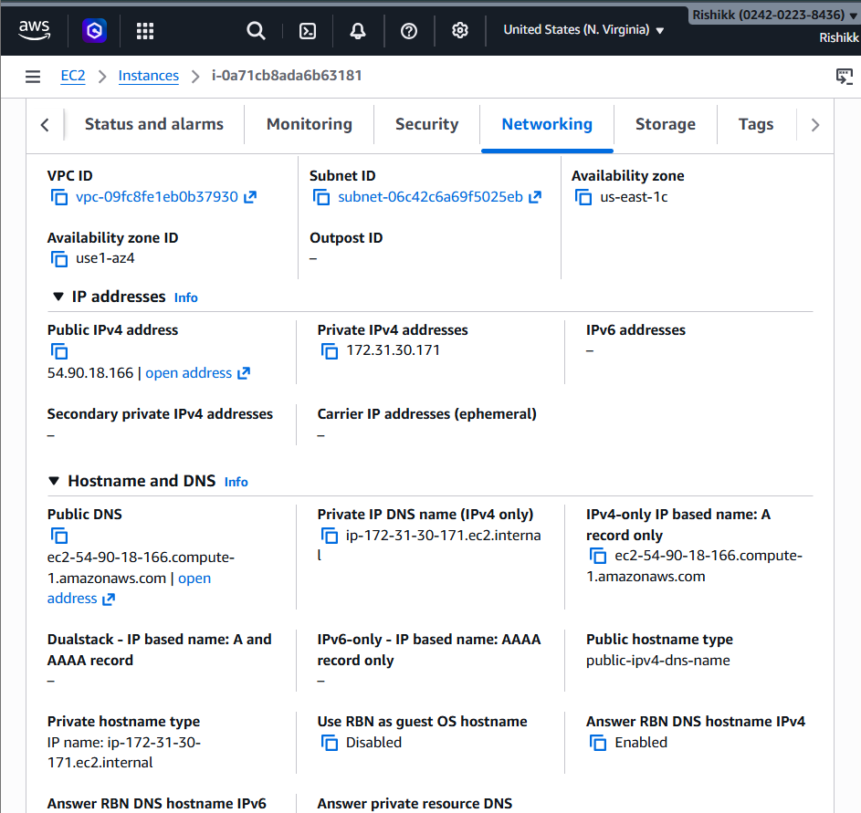

---

# 2. EC2, S3 & Instance Profile
a. Create an EC2 instance in default VPC with Public IP enabled.

b. SSH into EC2 instance using keypairs
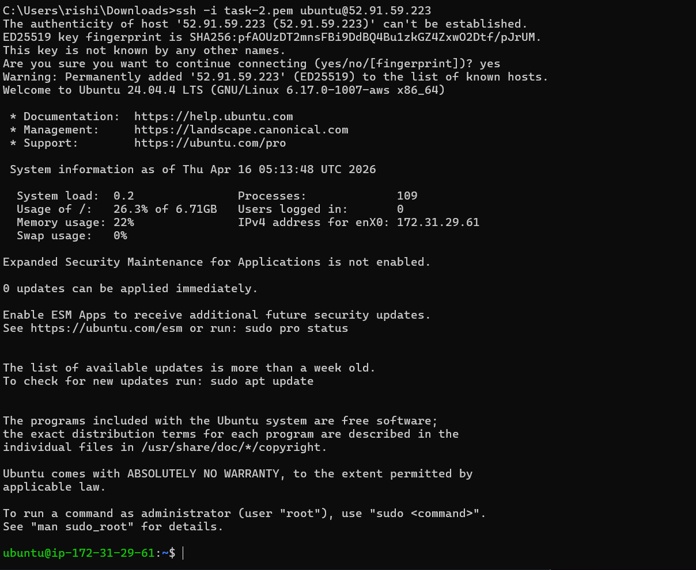

c. Use awscli to upload some data (pdf, image, txt files) to S3 bucket (you can create s3
using GUI).
To use aws cli we have to firstly install awscli:
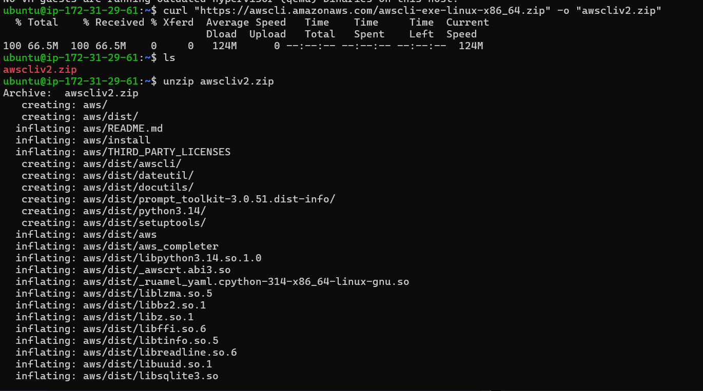
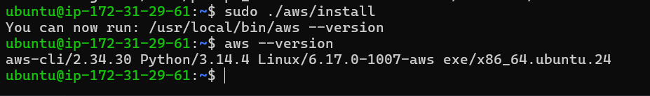

Creating a service role:
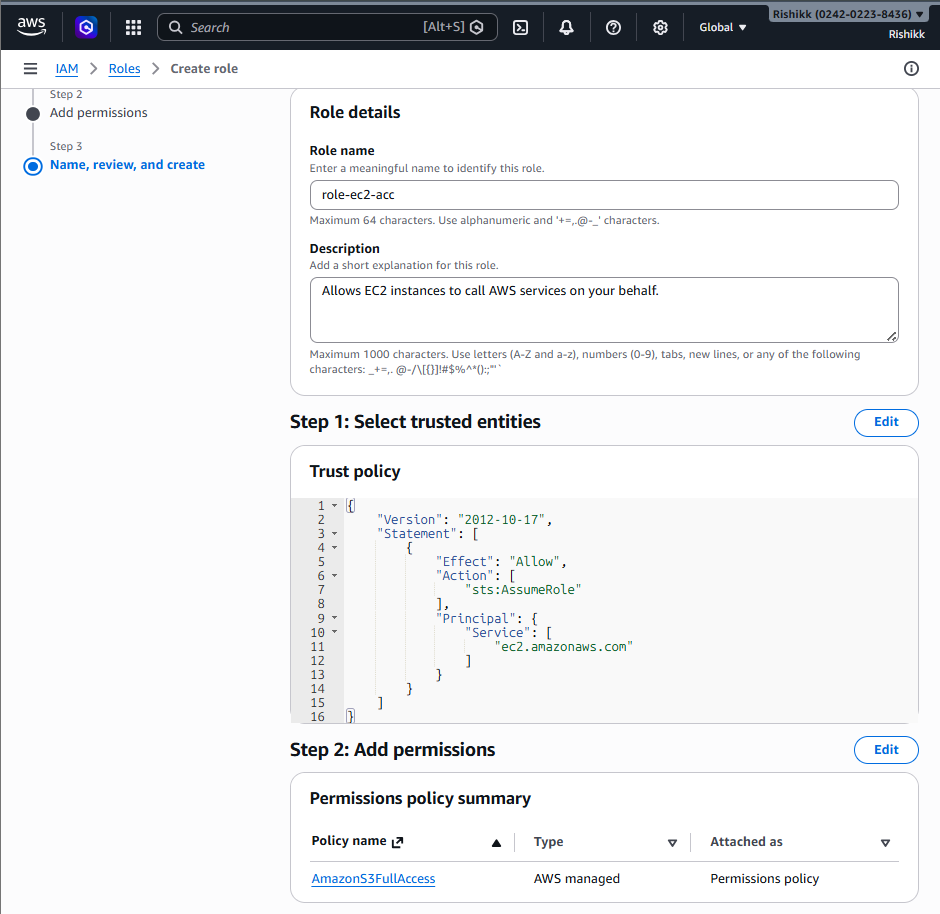

Attaching it to instance:
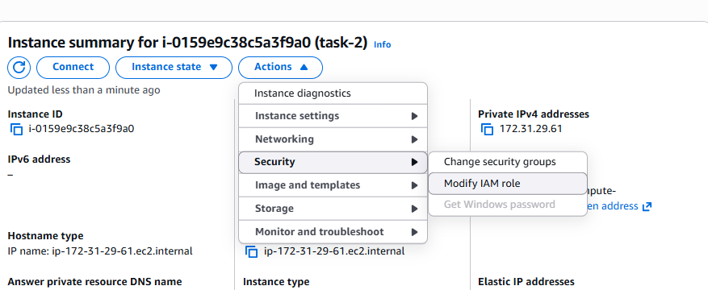

uploaded files:

d. Verify that files are uploaded in S3 Bucket.
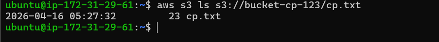

---

# 3. EC2 & User-data
## a. Task 1
i. Create an EC2 instance in default VPC with SSH-Keys & Public IP enabled.
making sure the ports are enabled

ii. Prepare user data to automatically install Nginx service and access it using
ec2-public-ip-here:80

## b. Task 2
i. Create an EC2 instance in default VPC with SSH-Keys & Public IP enabled.
making sure the ports are enabled:
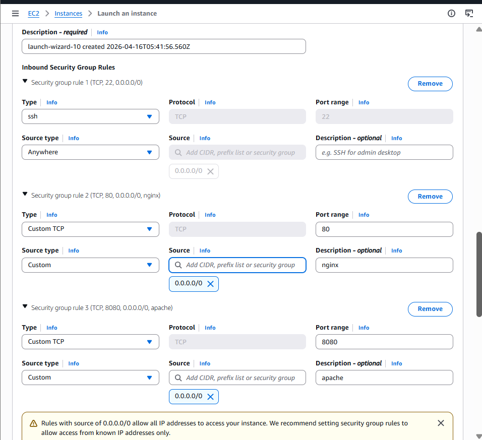

ii. Create user-data to install docker on EC2.
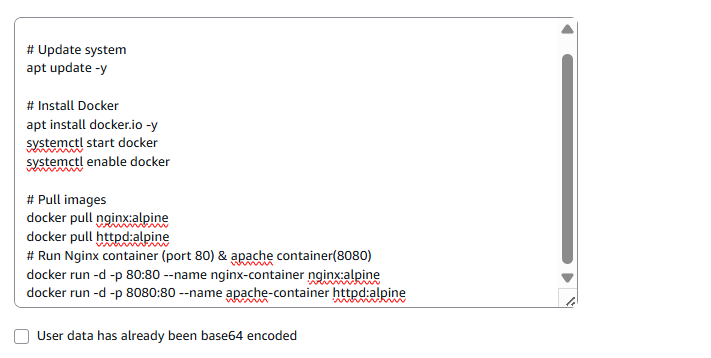

iii. Create 2 docker containers, apache and nginx using user-data.

iv. Access content of both containers using IP:8080 (for apache), IP:80 (for
nginx

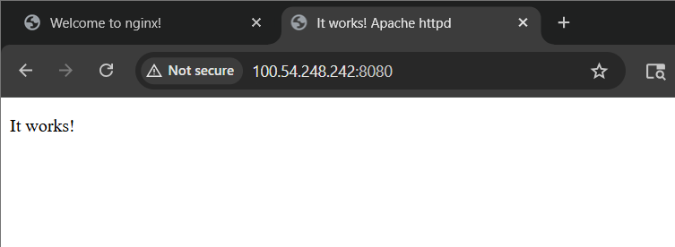

---

# task 4: Access Private EC2 instance
a. Create EC2 in Private Subnet and SSH into it.

b. Create a flow (network) diagram that should show - how you are accessing your Private
EC2.
