# Task

## Create a Launch Template
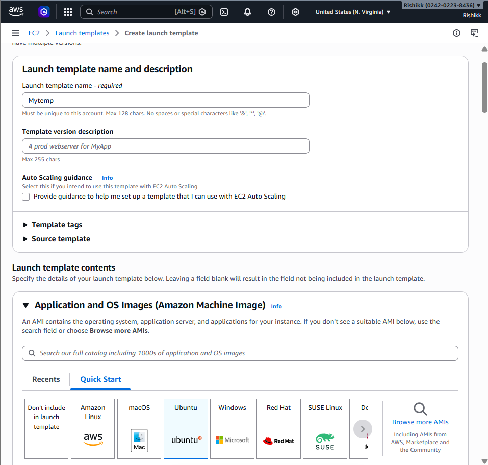
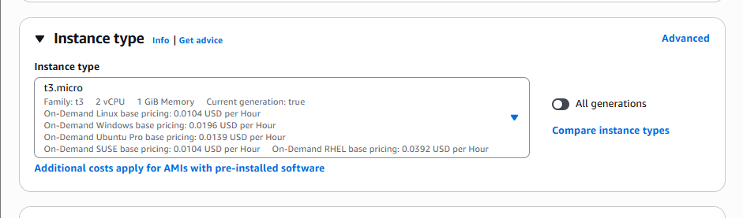
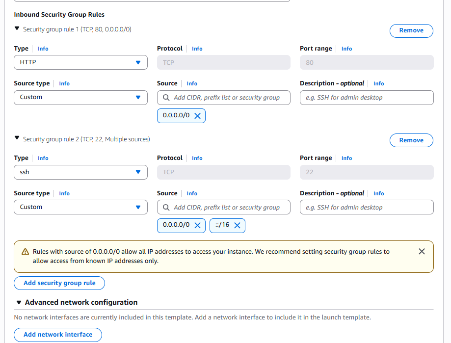

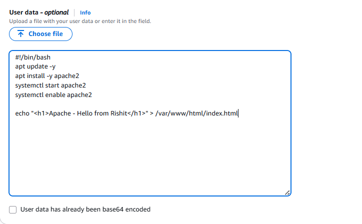

## Create Autoscaling-Group and use above Launch Template.
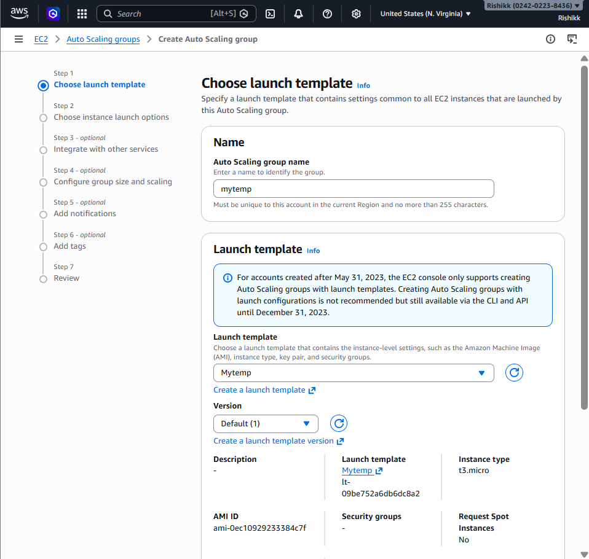
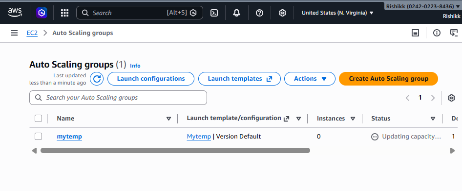
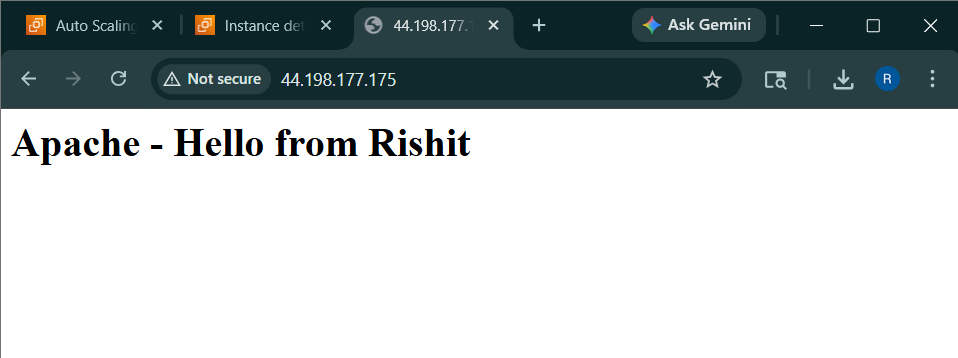

## Increase instance count and access the webpage from new servers.
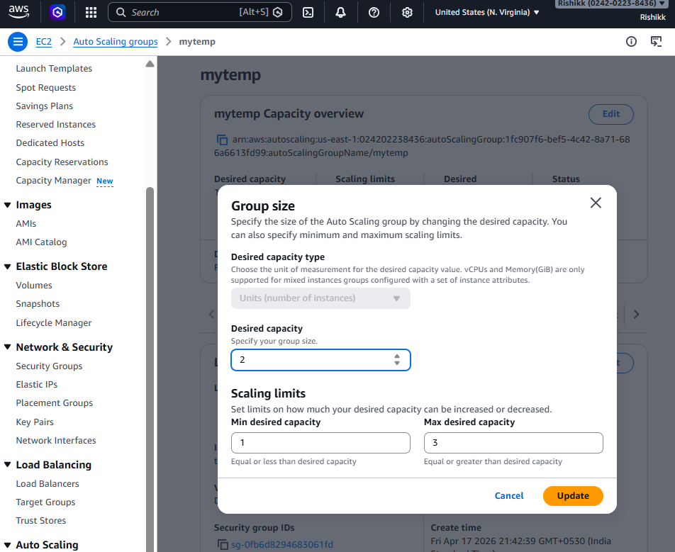
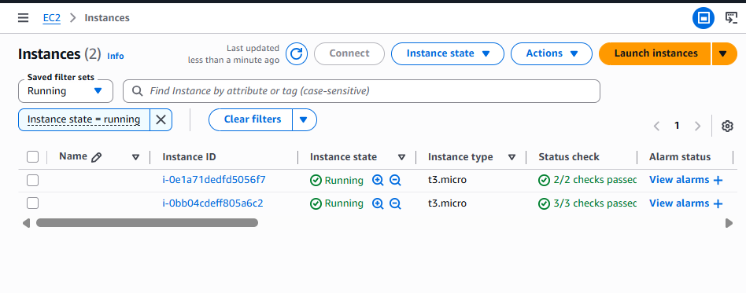
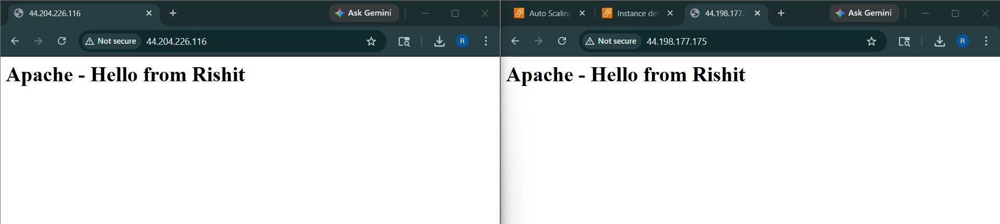

## Update existing Launch Template (created above), remove apache user-data & add nginx user data. Use custom index.html containing “Nginx - Hello from Your Name!”
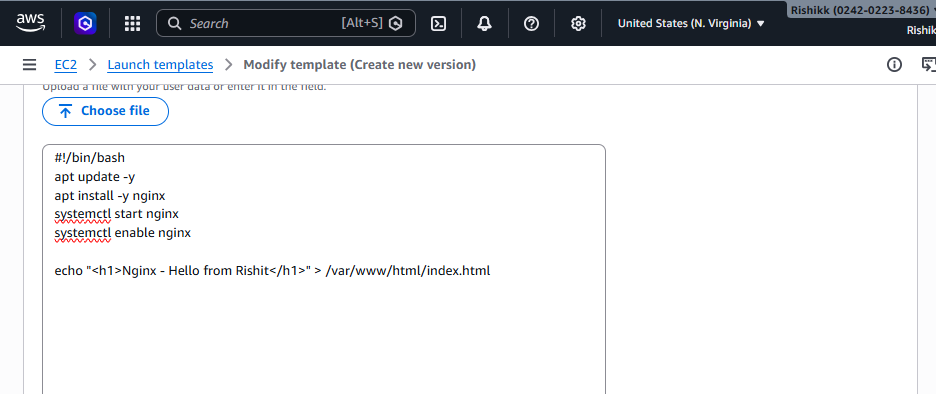
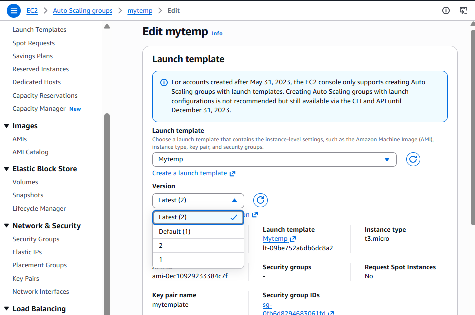
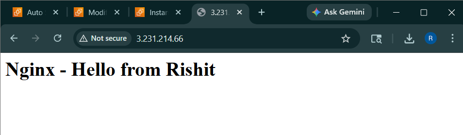

---

# Auto-Scaling
```To create auto-scaling we firstly have to create a launch template.```

### Launch Template:
```A launch template is like a blueprint were we define what specified launch parameters in a template that can be used for on-demand launches and with managed services, including EC2 Auto Scaling```

---

## Creating Launch Template:
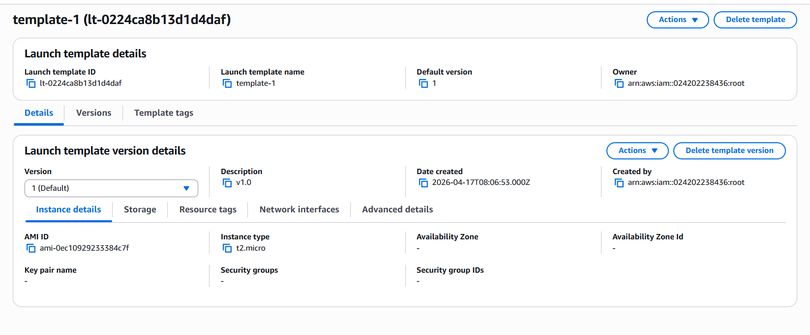

## Creating Auto-Scaling Group:

### Selecting the launch template we made above:
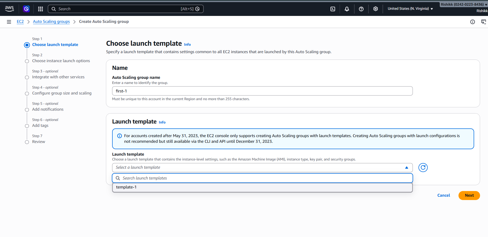

### Adding the need parameters:
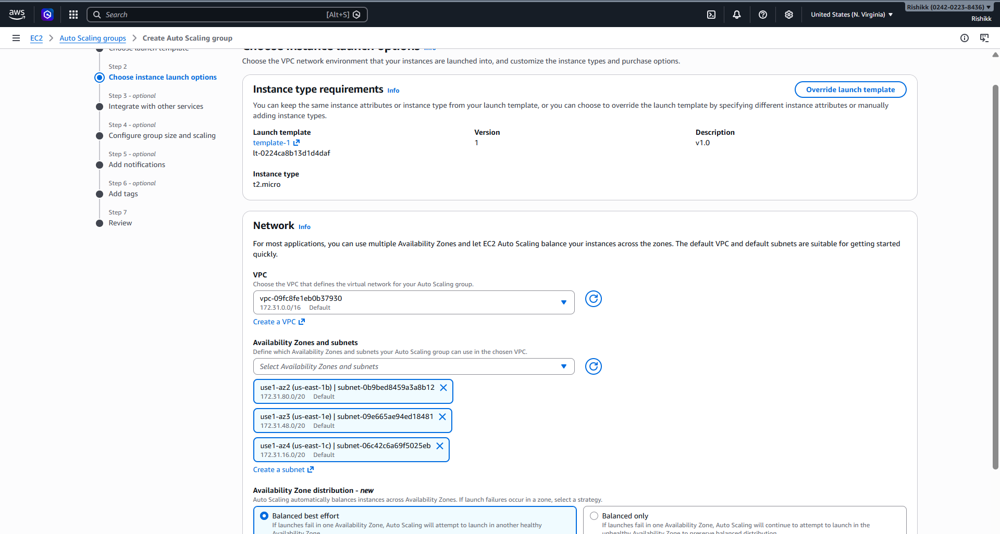

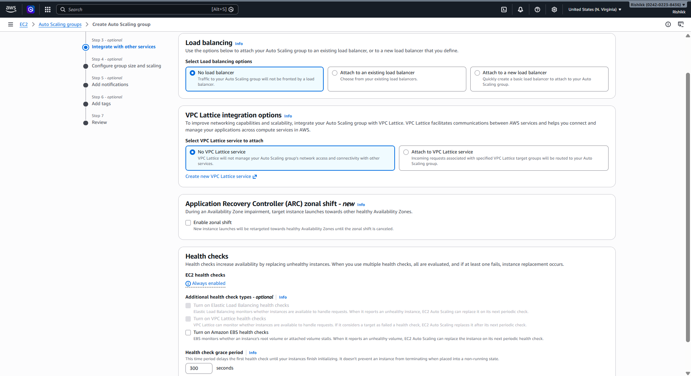

### Set desired no. of instances:
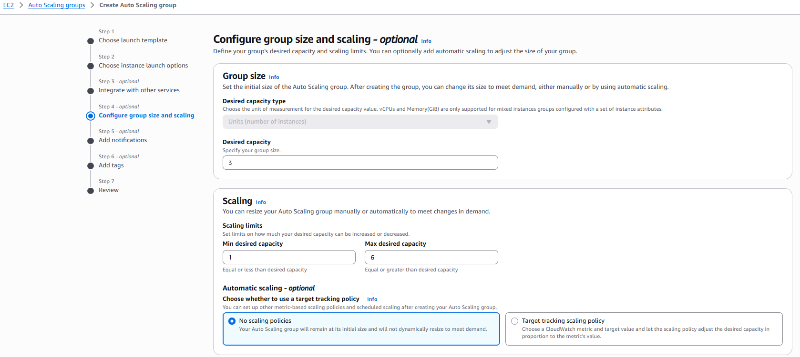

### Reviewing all the parameters:
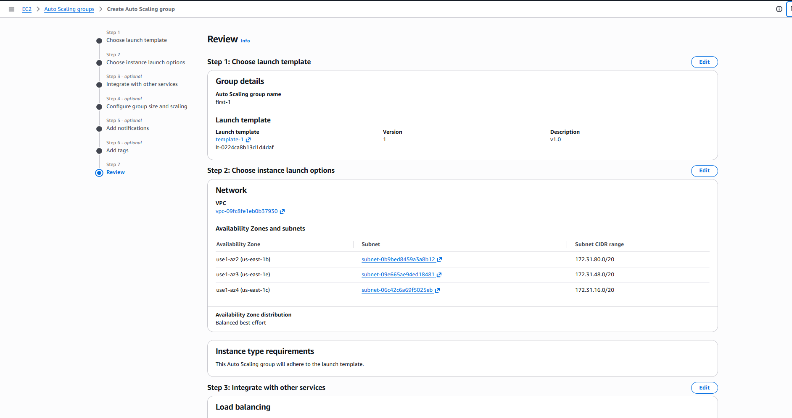

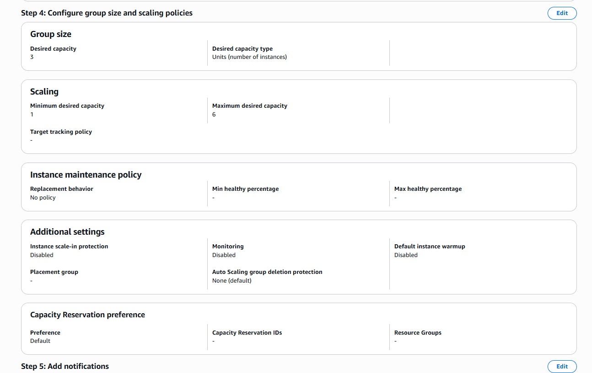

### 3 instance launched
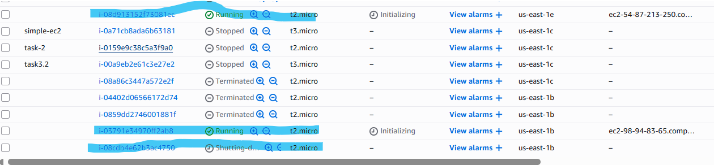

### tested by terminating one instance:
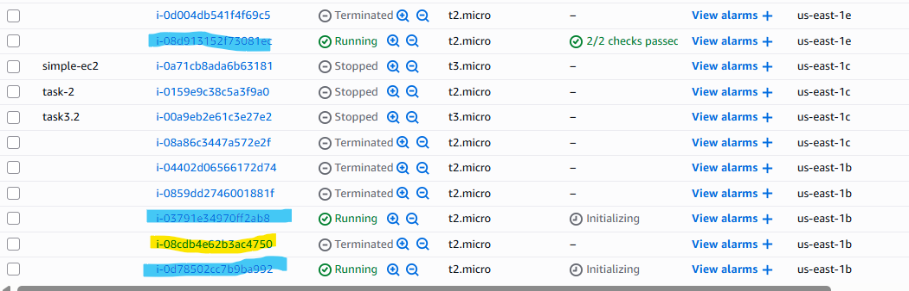
---
working on this rn!
