# Tasks for VPC

## Create a custom VPC, having

1.  1xIGW (internet gateway)
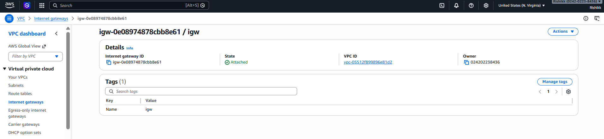

2.  1xNAT Gateway
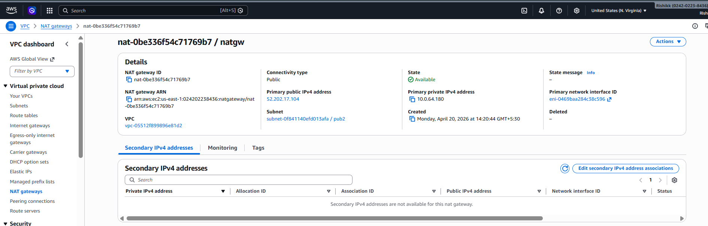

3.  3xPublic Subnet
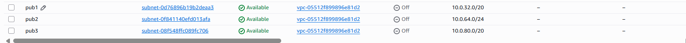

4.  3xPrivate Subnet
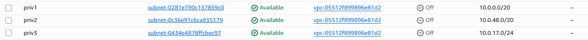

5.  All 3 private subnet has route to NAT Gateway for Internet access (0.0.0.0/0 )
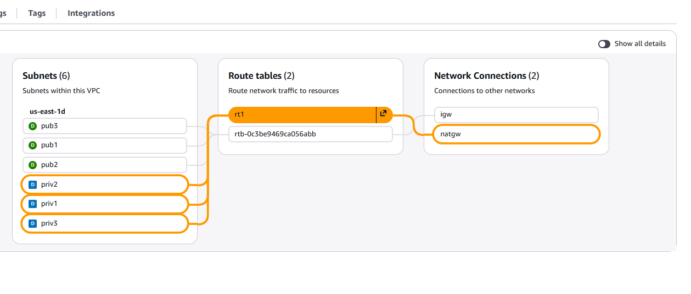

6.  All 3 public subnet has route to IGW for Internet access (0.0.0.0/0 )
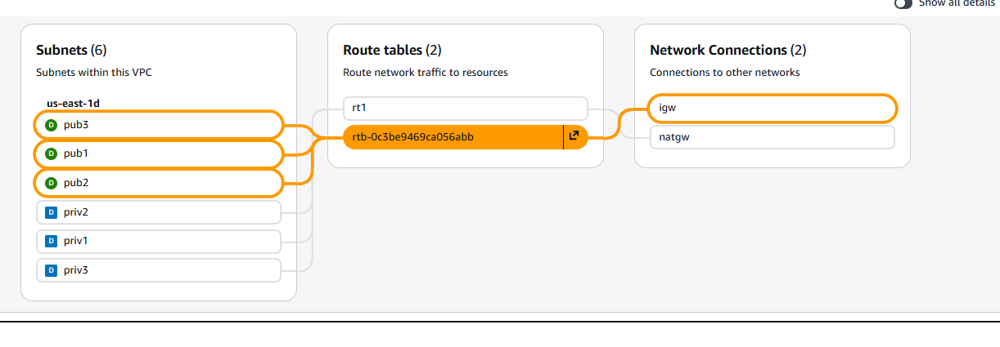

7.  Update NACL & Security Group rules to allow traffic from Internet (0.0.0.0/0 )
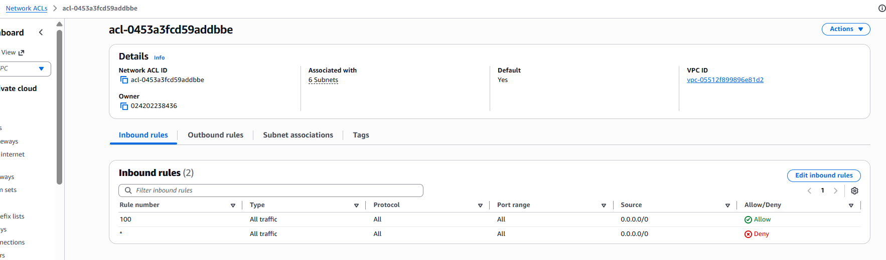

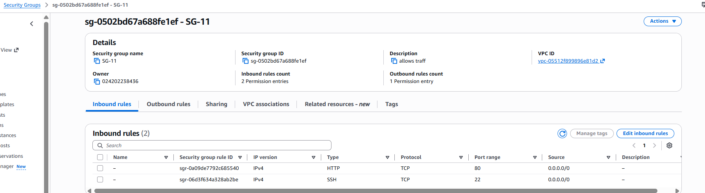

8.  Launch an EC2 in PUBLIC subnet, run ```sudo yum update``` or ```sudo apt-get update``` > install nginx server and access the webpage.
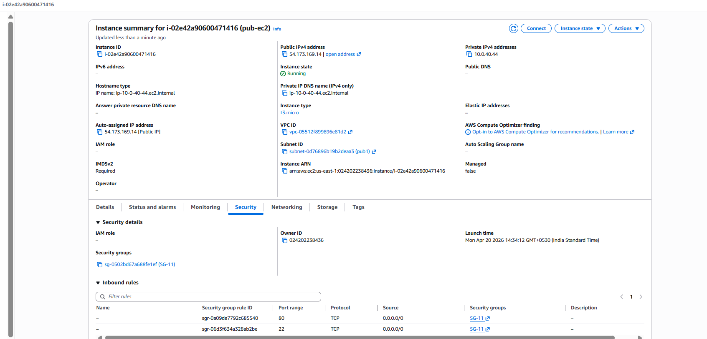

### sshing the pub ec2 
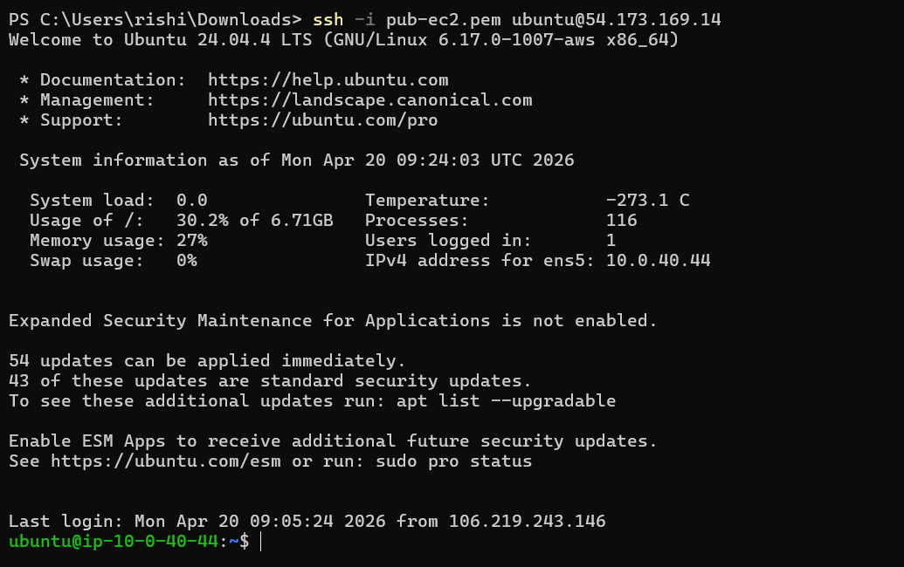

### installed nginx and tested update
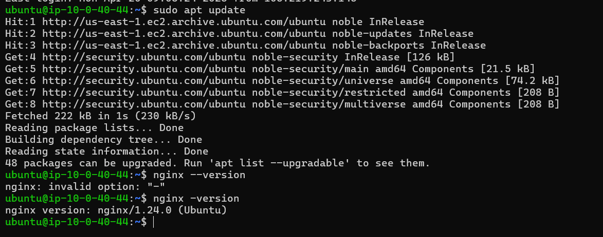

### accessing the webpage
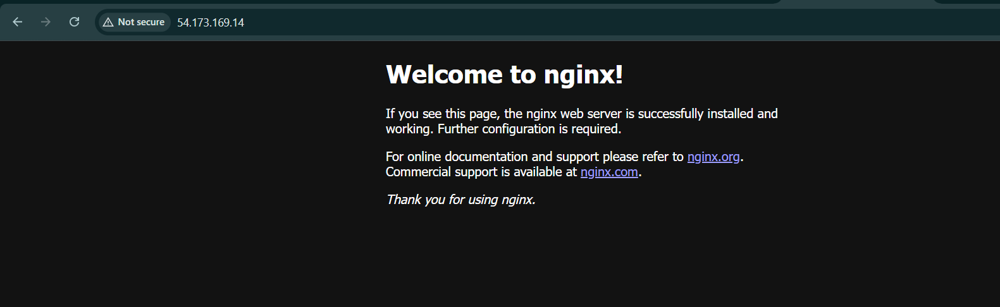

9.  Launch an EC2 in PRIVATE subnet, run ```sudo yum update``` or ```sudo apt-get update``` > install nginx server and access the webpage using ```curl -I http://Private-EC2-IP:80```
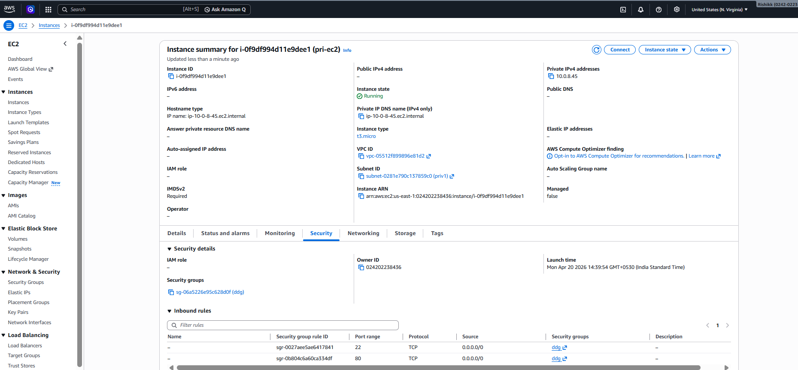

### ssh the private ec2 in public ec2
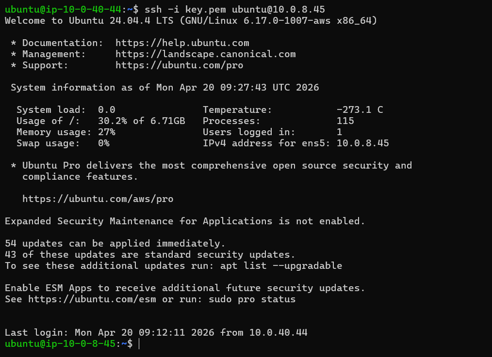

### installed nginx and tested update
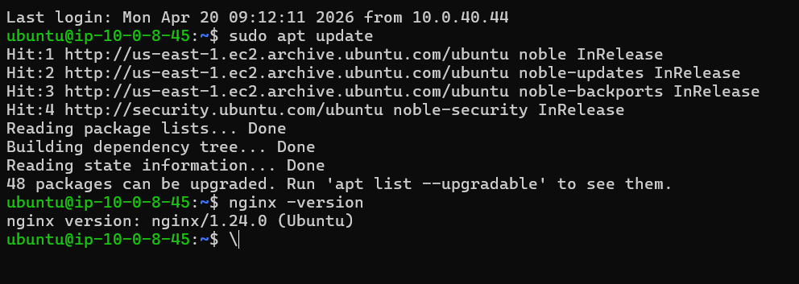

### accessing curl from pub-ec2 using private ec2 private ip
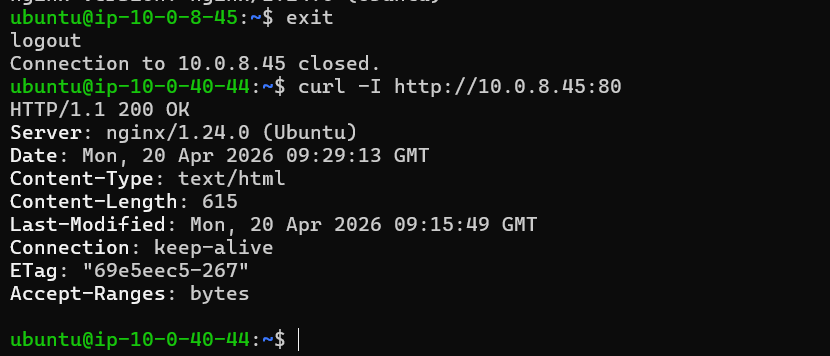
