# Tasks for RDS
1. Create Amazon RDS (MySQL) in private subnet
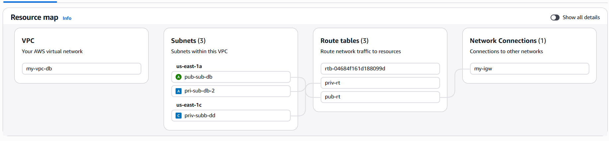
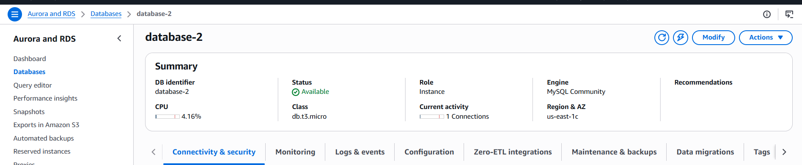

2. Launch EC2 in public subnet → connect using mysql CLI
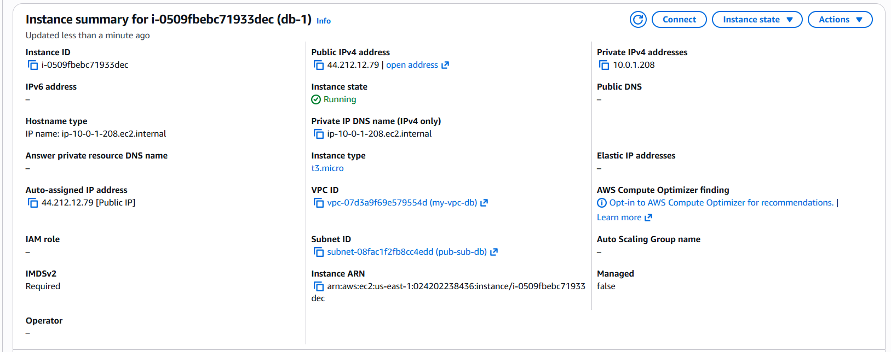
3. Inside RDS create:
a. Multiple databases
b. Separate db-users per database
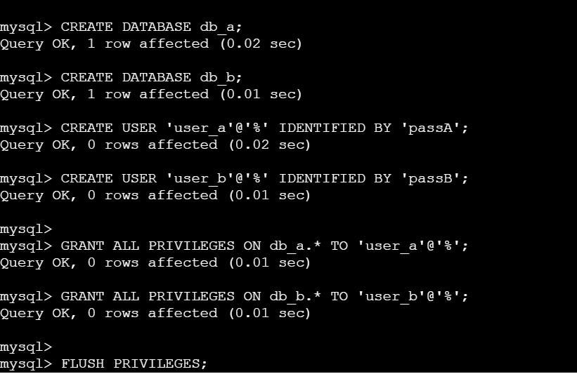
4. Test:
a. SSH into EC2 → Use mysql client to access DB-A via User-A → Perform actions
via User A
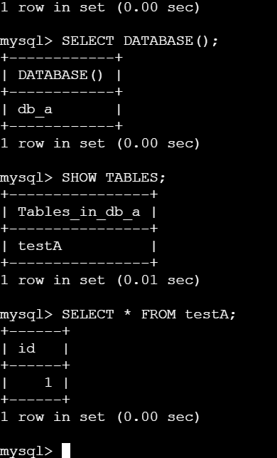
b. SSH into EC2 → Use mysql client to access DB-B via User-B → Perform actions
via User A
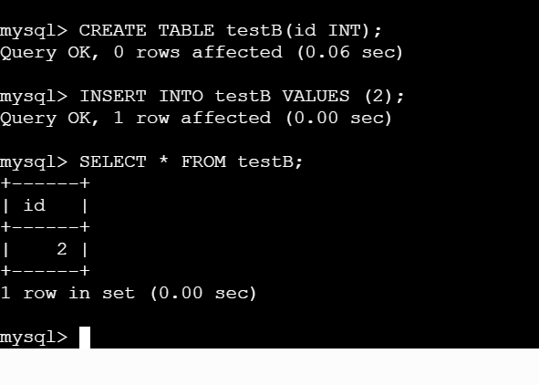
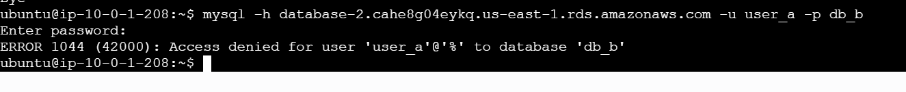
5. Break/fix:
a. Block DB via Security Group → restore access
Removed access via Security Group
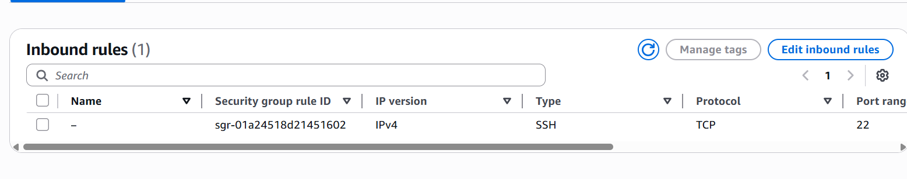
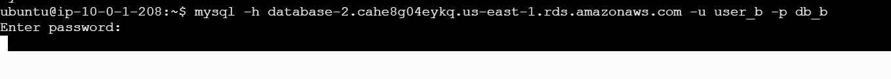
Restore access via Security Group
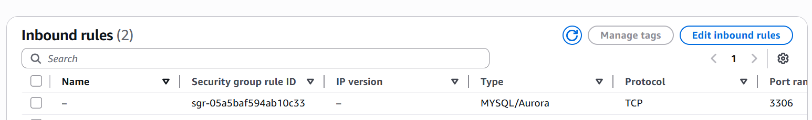
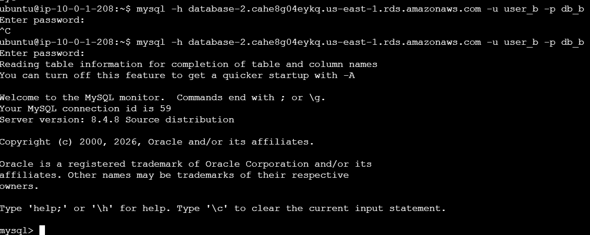
6. Take snapshot → modify instance type   
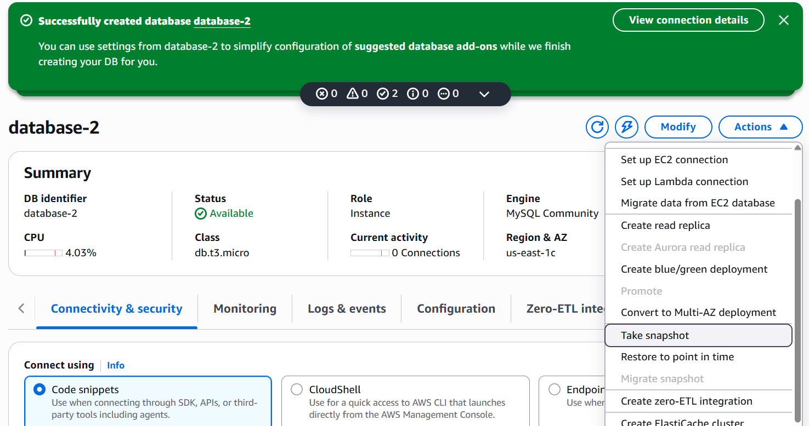
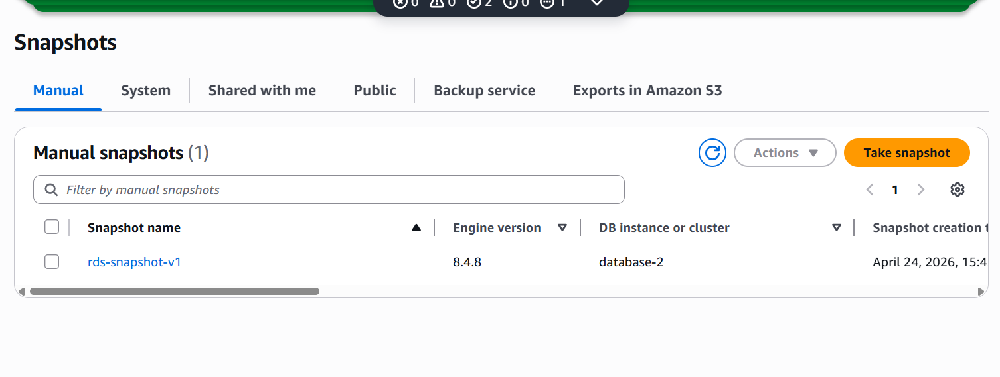

# Tasks for ElastiCache
1. Create Amazon ElastiCache (Redis) in private subnet
2. Enable auth (password/token)
3. Connect from Public EC2 using redis-cli
4. Perform:
SET / GET
TTL (expiry)
5. Break/fix:
Block access via Security Group → fix
6. Enable replica → identify primary/replica
7. Change node type (scaling)