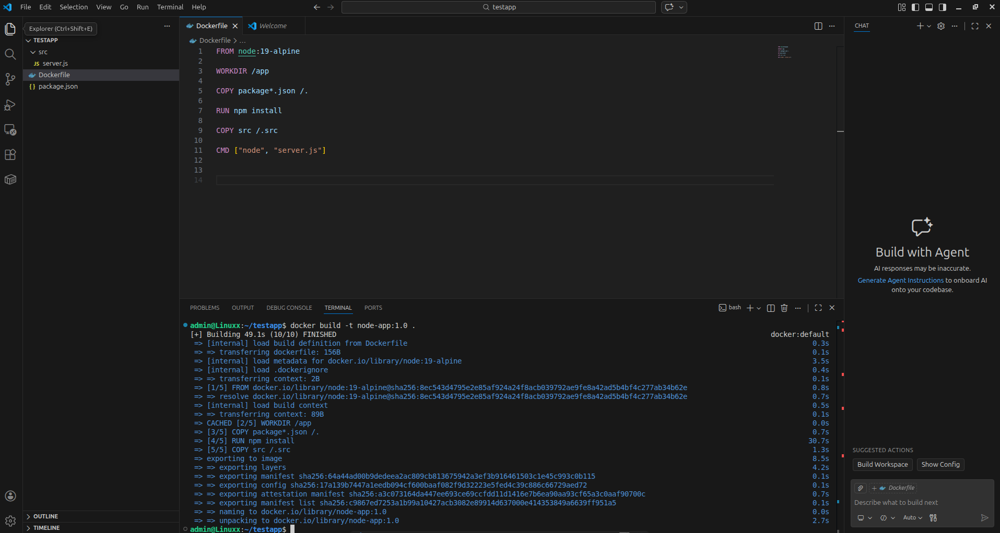
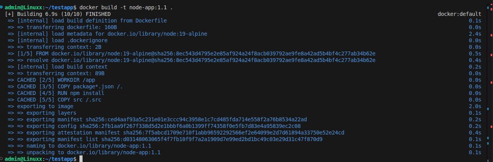
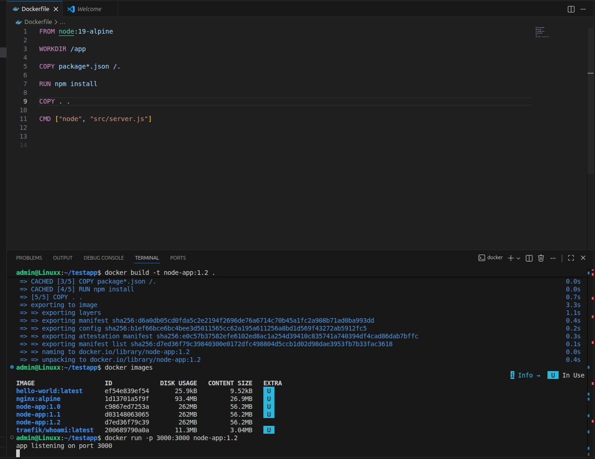
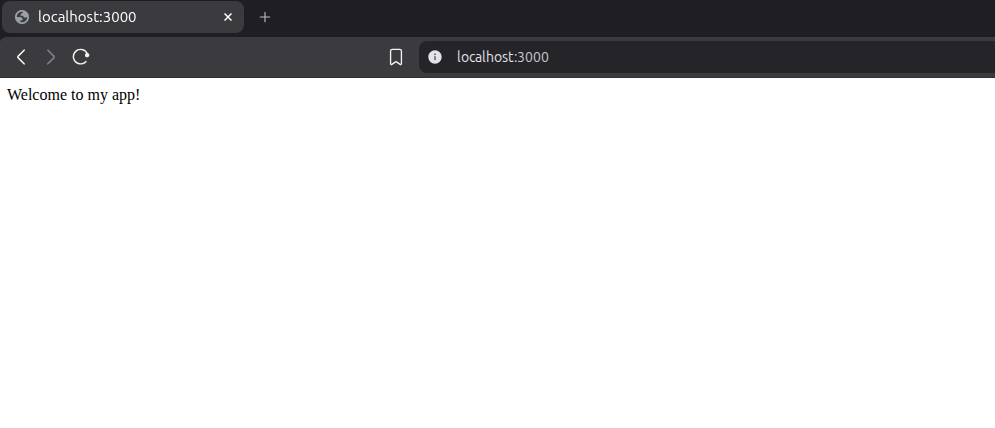
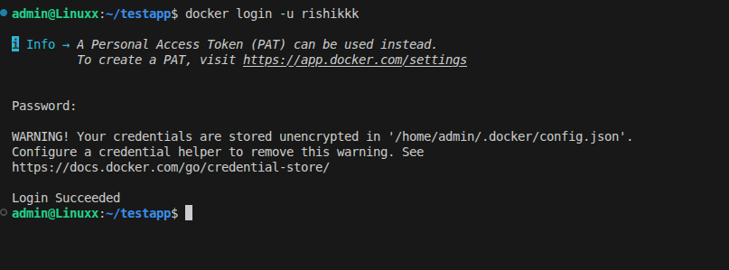
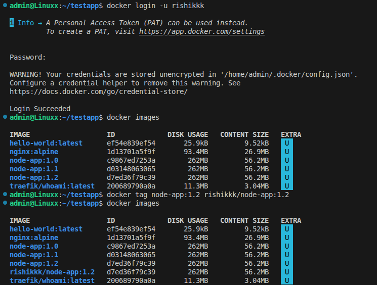
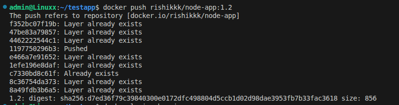
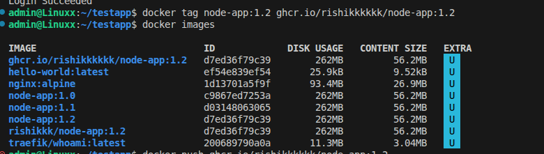
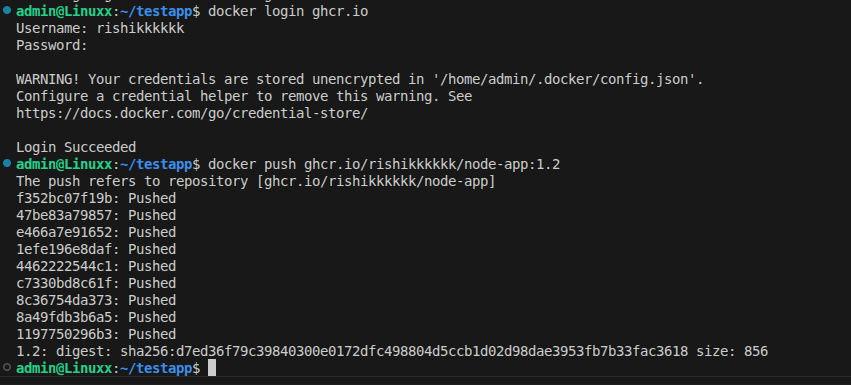

# docker
### built image

### verified using docker images

### opened on local host with port 3000

# docker hub
### used docker login credtials to push to docker hub

### recreated a more informed tagged image as dockere hub supports that format

### pushed to docker hub (got to know that if the file layer is previously pushed it will repl layed already exist)

### Link:
https://hub.docker.com/repository/docker/rishikkk/node-app

# ghcr
### to push to github ghcr we have to tag the image and then push it

### to push to ghcr we firstly have to login to ghcr

### Link:
https://github.com/rishikkkkkk?tab=packages