# Bridge
### created a container con1 and cont2 for checking default bridge connection
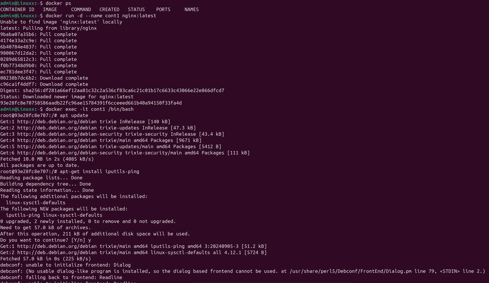
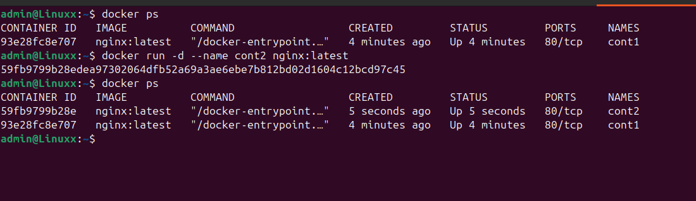
### now we will check that the second container pings or not using the first container ip address:
### ip address in cont2
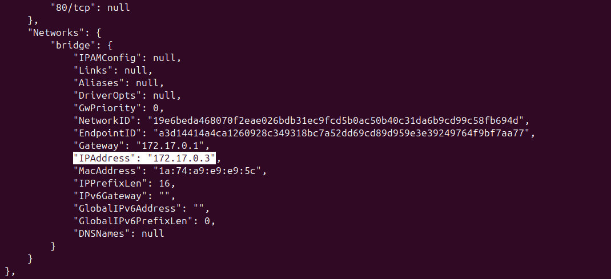
### ip address in cont1
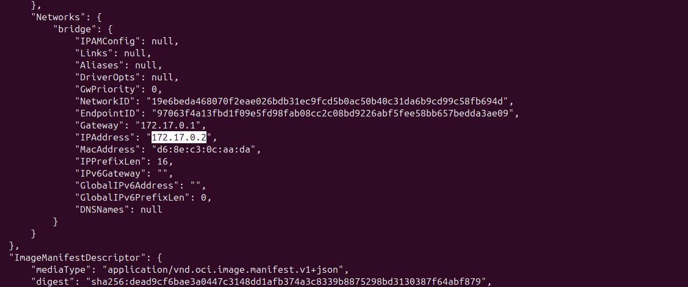
### now to actually check bridge is working or not we will ping in cont1 using the ip of cont2
as we can see here from cont1 we can actually ping cont2 usig its ip.
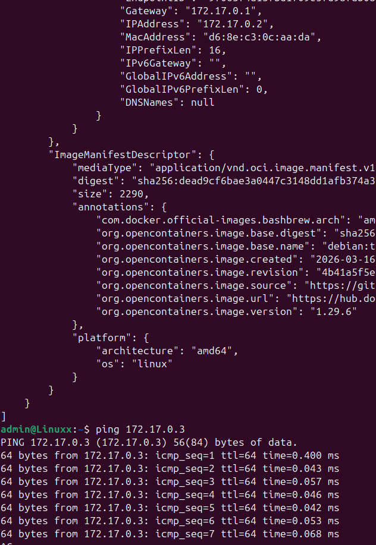

# Host
### firstly we will create the cont using host

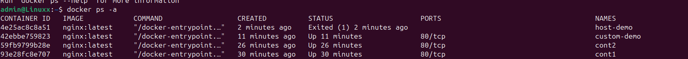
### as we can see in inspect ip add has no val it means it is directly using the hosts ip address.
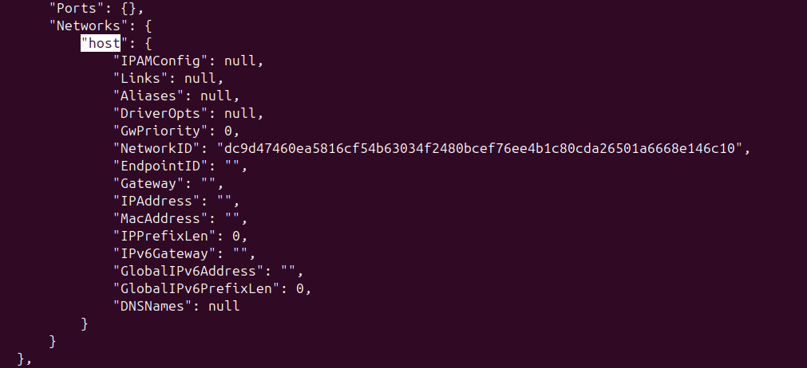

# none

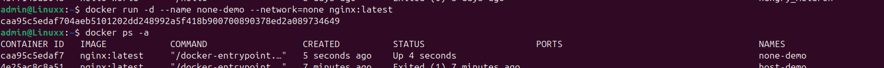
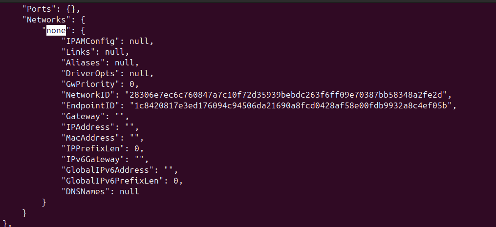
### as we can see using none cont has no internet access
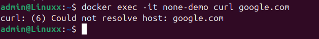

# Custom
### to create custom we can use command: docker network create custom-net
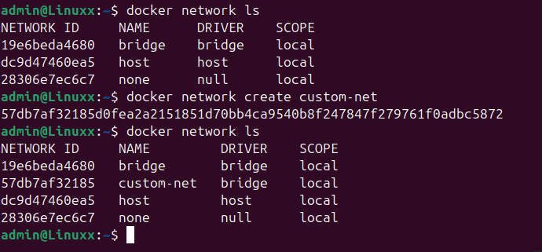
### now creating a new container using that custom network
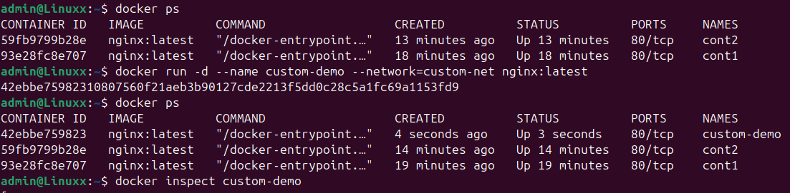
### verifying using inspect
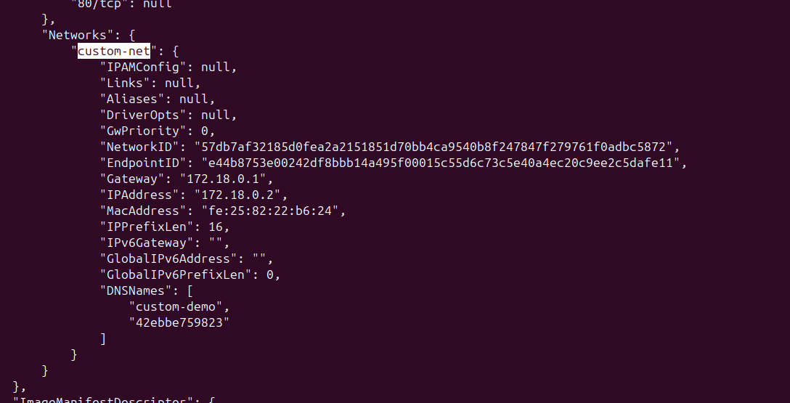
### going to cont1 and trying to ping the ip address of custom-demo
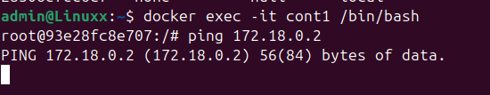
as we can see no req coming.
