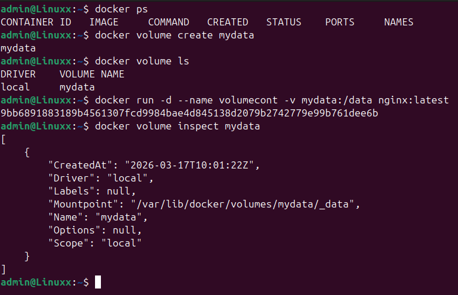
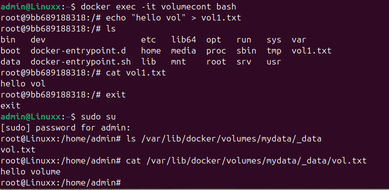
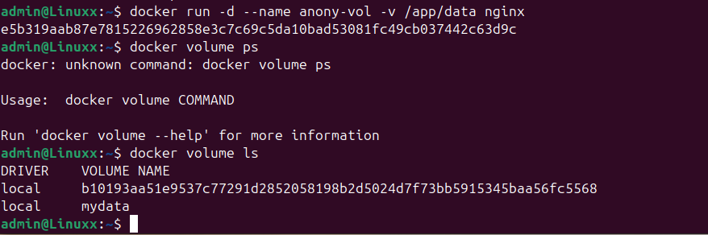
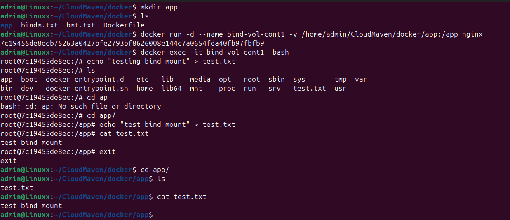
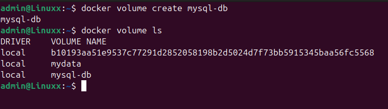
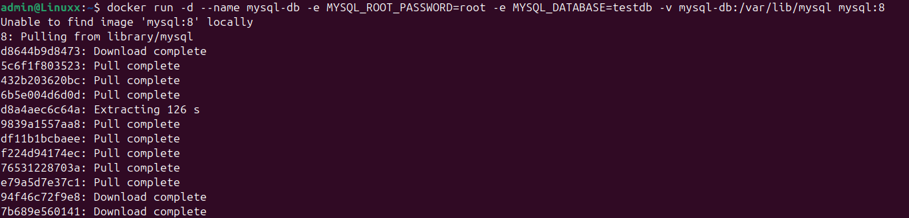
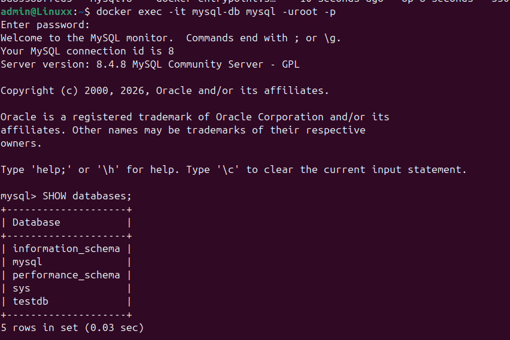
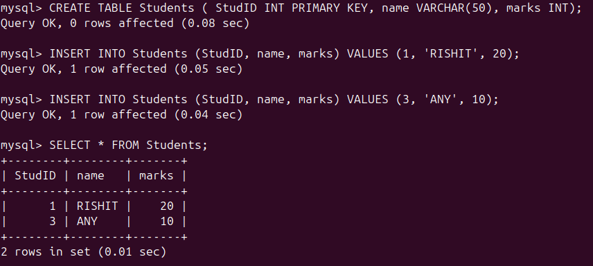
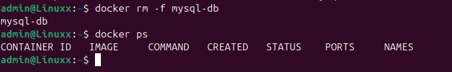
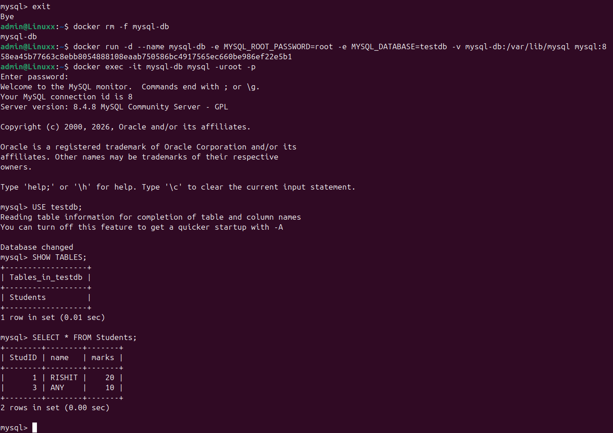

# Docker Volumes
1.  Created a volume named mydata
2.  also ran a container with that volume:

3.  verified that the volume mounting was correct:

# Mounted to anonymous volume:
1.  created a container and letting docker decide the anonymous volume:
2.  verifyinh the volume using docker ps:

## Key Learning:
If i want to do it for temporary purpose it is ok, but if on any org level i think we should avoid using anonymous volume and to keep track of things in org we should use named volumes.

# Bind Mount
1.  Firstly created a directory in my local wich is going to be linked
2.  after that i ran the container
    docker run -d --name <cont_name> -v host local path:/data 
3.  added a test.txt file in the conatiner which will help me check the bind mount.
4.  got to that path in my local directory and found the test.txt file

## Key Understanding:
Bind mount helps in syncing live data from my local directory to the container folder.

# Practise After removing container data doesnt get deleted
### Created a volume:

### Runing a MYSQL container with that volume:

### verifying using docker ps:
 
### we will access the container and add a database to testdb:

### Removing the container:

### started the container again and checked that there the table exists:

## Key understanding:
If the data is stored in docker volume, even if you delete the container it doesn't mean that the data is completely deleted.
