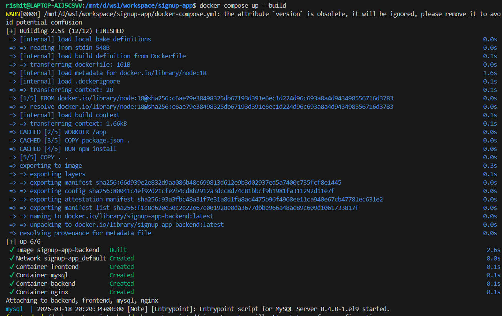
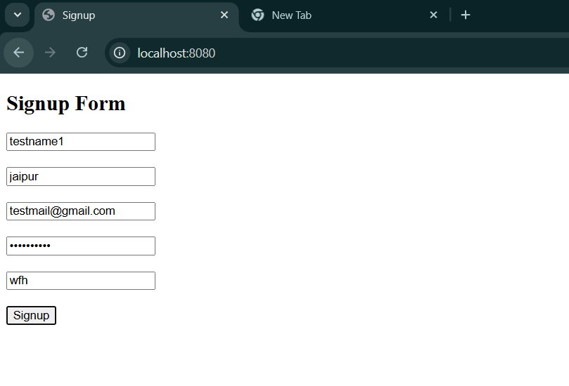
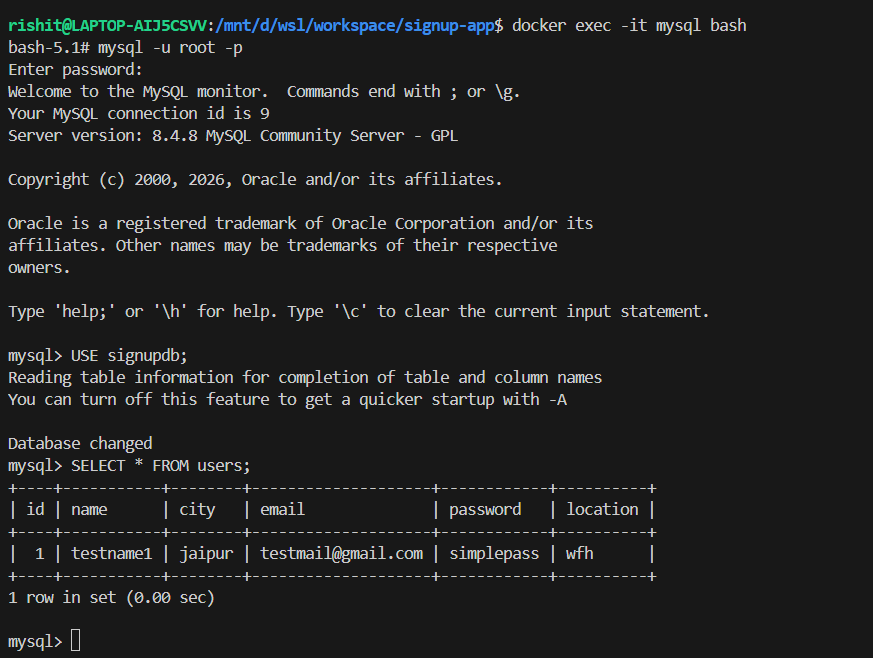
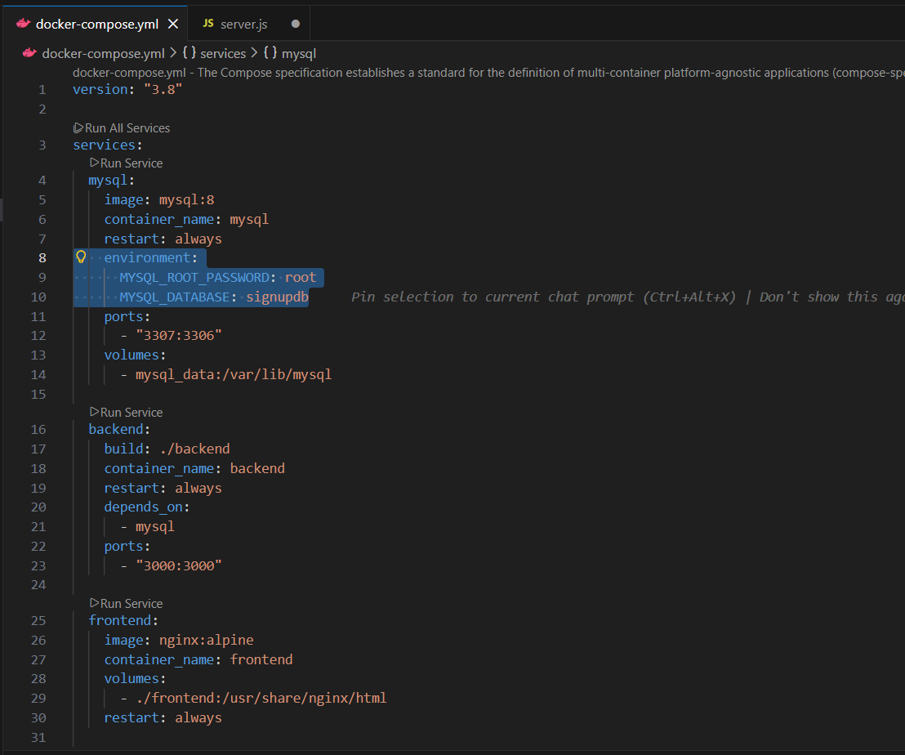
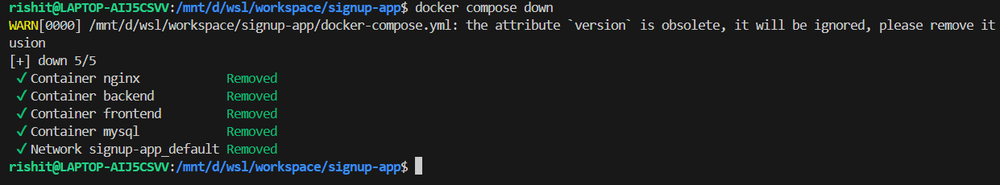

# Signup Application with Docker, Nginx, Node.js & MySQL
## Signup Application Overview:
This project is a full-stack Signup Application built using:
1.  Frontend: HTML (Signup Form)
2.  Backend: Node.js (Express)
3.  Database: MySQL
4.  Reverse Proxy: Nginx
5.  Containerization: Docker & Docker Compose

## Purpose
The application allows users to register with their details, which are then stored in a MySQL database.

## Architecture
Browser → Nginx → Backend (Node.js) → MySQL
Nginx serves frontend and routes API requests
Backend handles business logic & DB operations
MySQL stores user data
Docker Compose manages all services

## Docker compose

## Entered the details to the registration page

## Check that the information is redirecting to the database

## Exposed data:

## Docker compose down
