# Task 1: Install Git in your machine and attach a screenshot
### Installed Git in Linux:
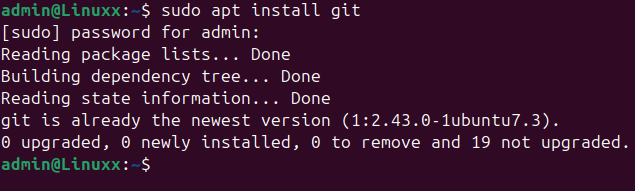
### Verified that git is installed:

# Task 2: Configure git global and local config and attach a screenshot.
### Configure git global:
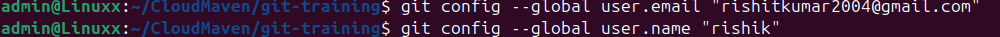
### Verified Using:
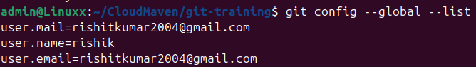
### Configure git local:
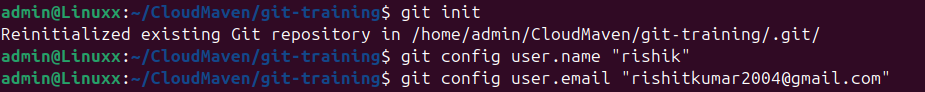
### Verified Using : '''git config --list'''
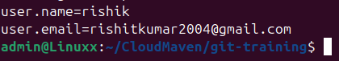

# Task 3: Create a directory called git-training , initialize git repo, create two files readme.md and app.py , stage and commit the changes, and attach the screenshot of git log.
### Create a directory called git-training:
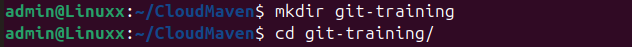
### Initialize git repo:
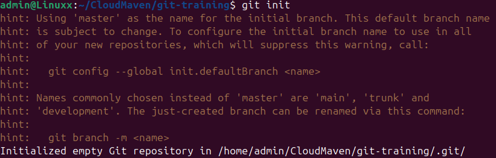
### Create two files readme.md and app.py:
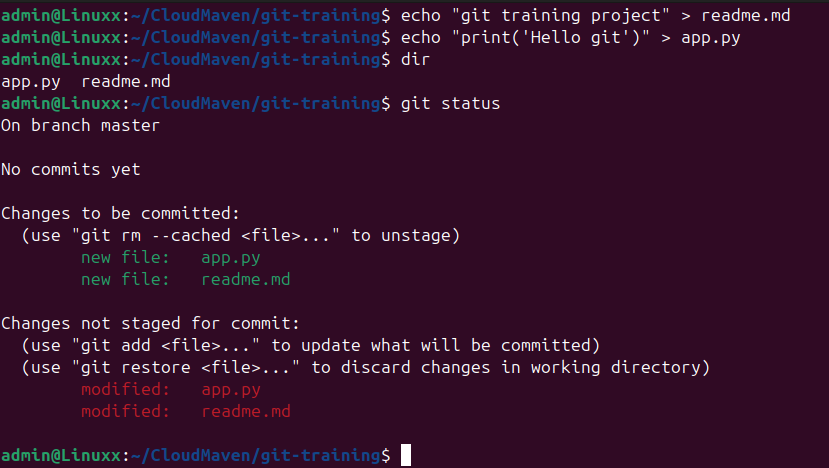
### Stage and commit the changes:
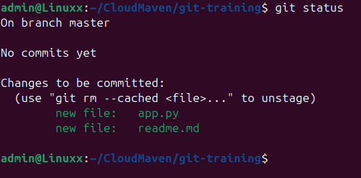
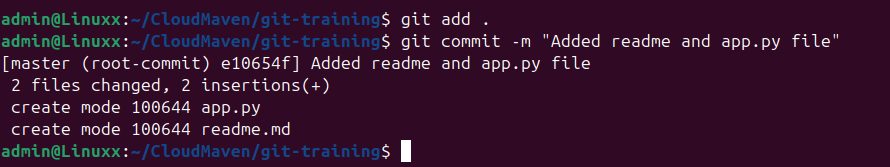
### Verified Using:
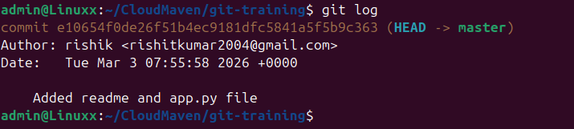

# Tas 4: Create a git branch out of the main/master branch, do changes and commits, and create a PR for the same using git best practices and attach a screenshot.
### Create a git branch out of the main/master branch and did changes and commits:
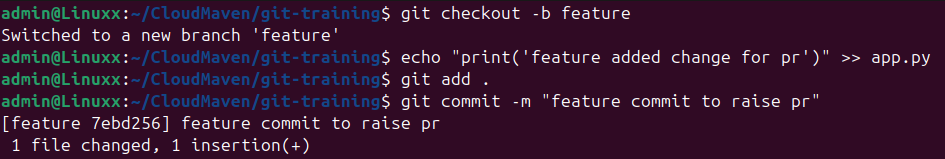
### Pushed to the branch:
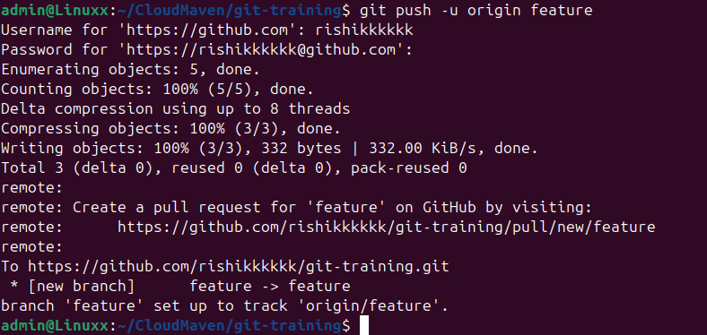
### Created Pull Request:
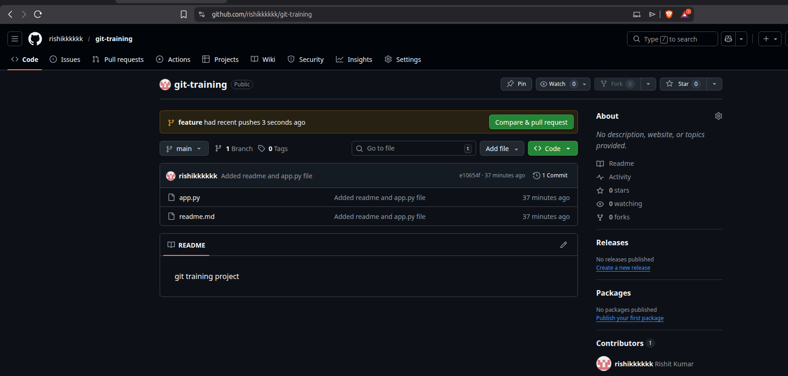

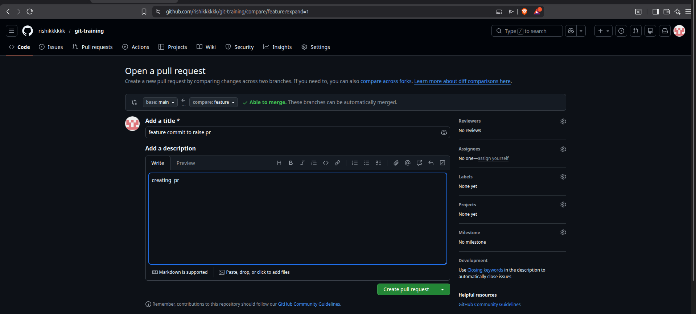
