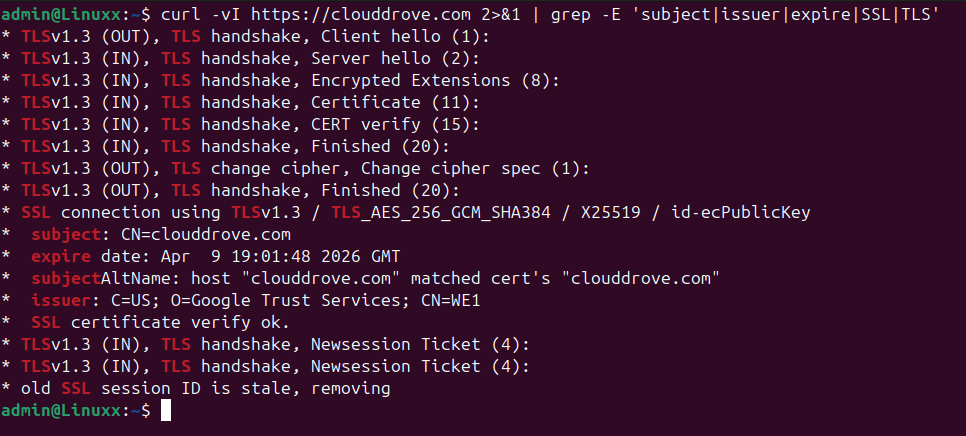
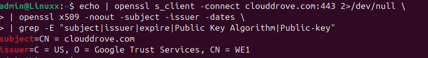
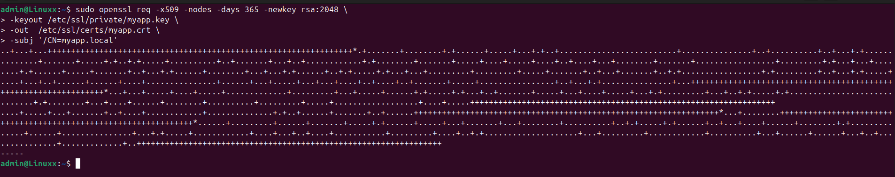
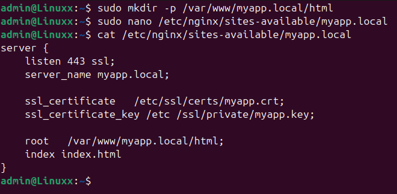
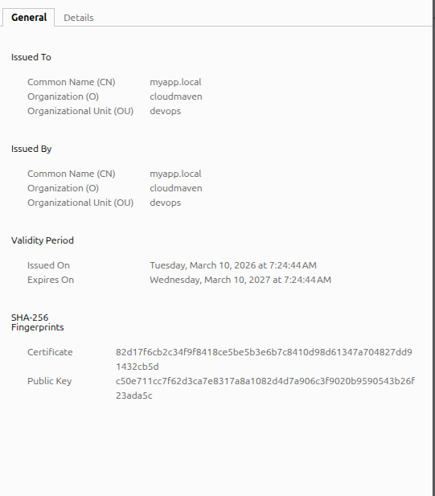
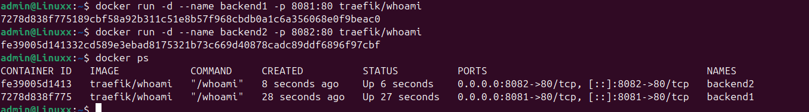
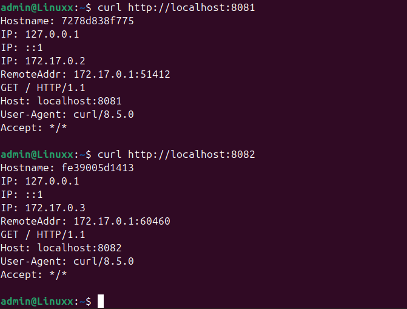
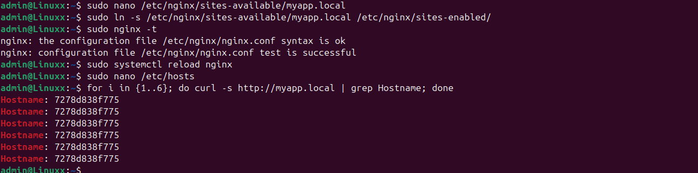
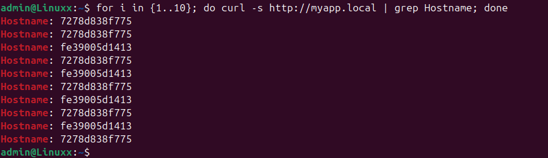

# Task 1 : Inspect a live TLS certificate
## Use curl to fetch the TLS certificate details from any HTTPS site.

## Identify: the issuer (CA), the subject (domain), and the expiry date and also note whether the cert uses RSA or ECDSA and what the key size is.

# Task 2 : Simulate Certbot on a local domain with a self-signed cert

# Task 3 :  Set up Nginx load balancing across two Docker containers

