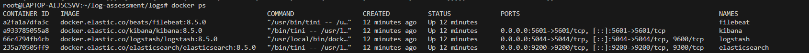
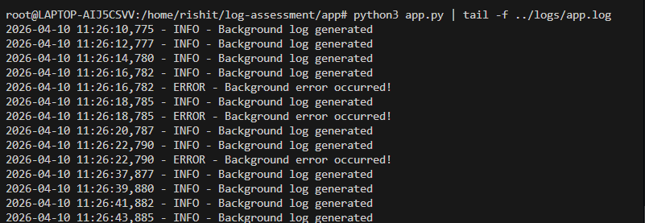
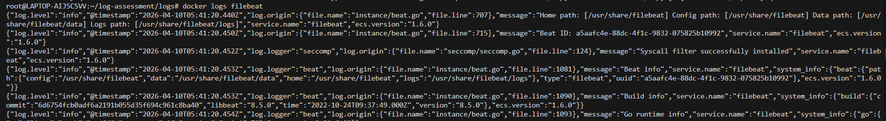
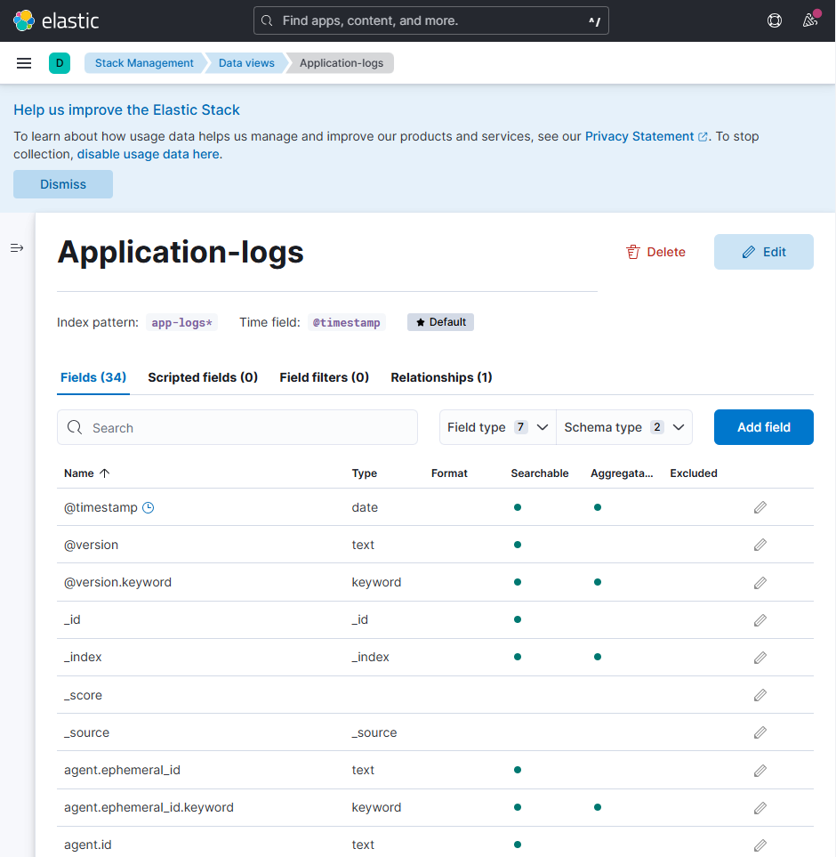
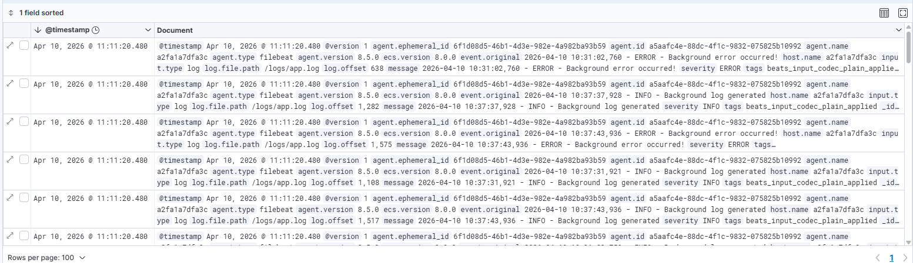
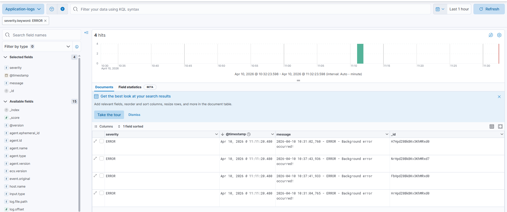
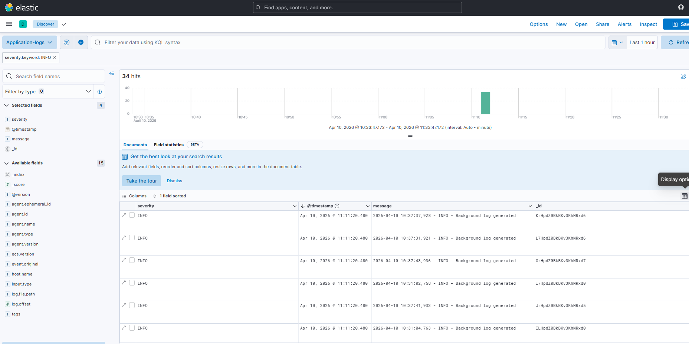
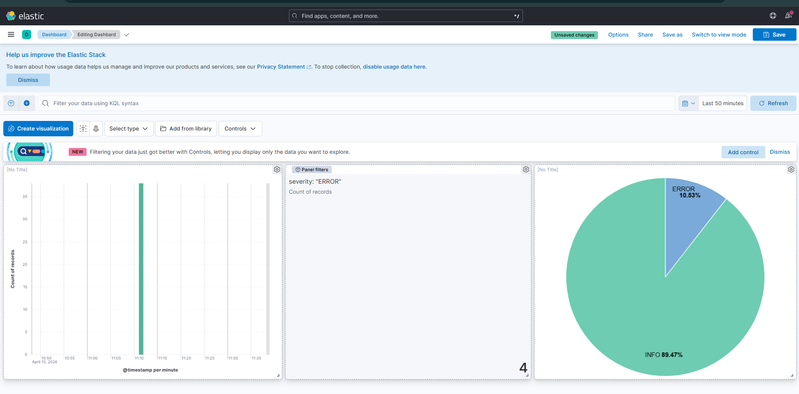

# 🚀 Centralized Logging Setup using ELK Stack

## 📌 Overview

This project implements a centralized logging system using the ELK stack (Elasticsearch, Logstash, Kibana) along with Filebeat.
It collects application logs, processes them, stores them in Elasticsearch, and visualizes them in Kibana dashboards.

---

## 🎯 Objective

* Collect application logs
* Process and enrich logs
* Store logs in Elasticsearch
* Visualize logs in Kibana
* Enable filtering and analysis

---

## 🏗️ Architecture

```
Application → Filebeat → Logstash → Elasticsearch → Kibana
```

## 📁 Project Structure

```
elk-logging/
│
├── docker-compose.yml
├── filebeat.yml
├── logstash.conf
├── README.md
│
├── app/
│   ├── app.py
│   ├── requirements.txt
│
├── logs/
│   └── app.log
```

---

## ⚙️ Technologies Used

* Docker & Docker Compose
* Elasticsearch
* Logstash
* Kibana
* Filebeat
* Python (Flask)

---

## 🚀 Setup Instructions

### 1. Clone the Repository

```
git clone <repo-url>
cd elk-logging
```

---

### 2. Start ELK Stack

```
docker-compose up -d
```



---

### 3. Run Application

```
cd app
pip install -r requirements.txt
python3 app.py
```



### 4. Verify Logs

```
tail -f ../logs/app.log
```


---

## 📥 Log Ingestion

* Filebeat reads logs from:

```
/logs/app.log
```

* Sends logs to Logstash

* Logstash processes logs and adds:

  * `severity: ERROR`
  * `severity: INFO`



## 🔍 Kibana Exploration

### Create Data View

* Go to **Stack Management → Data Views**
* Create:

```
app-logs-*
```



---

### View Logs in Discover

* Open **Discover**
* Select data view
* View incoming logs



---

### Apply Filters

Example:

```
severity: "ERROR"
```



```
severity: "INFO"
```



---

## 📊 Dashboard

### Visualizations Created

1. **Logs Over Time** (Line/Bar chart)
2. **Error Count** (Metric)
3. **Log Distribution** (Pie chart)

---

### Dashboard Creation

* Go to **Dashboard → Create**
* Add all visualizations



---

## 💡 Key Decisions

* Used Filebeat for lightweight log shipping
* Used Logstash for log parsing and enrichment
* Used Elasticsearch for fast indexing and search
* Used Kibana for visualization and analysis

---

## 🧠 Learnings

* Built end-to-end logging pipeline
* Understood log flow across ELK stack
* Learned log parsing and enrichment
* Gained experience in observability tools

---

## ✅ Conclusion

Successfully implemented a centralized logging system using ELK stack, enabling real-time log monitoring, filtering, and visualization.

---

## 🔥 Sample Output Flow

```
App → Filebeat → Logstash → Elasticsearch → Kibana
```

