# 📊 ELK Stack Logging & Monitoring Setup

## Objective

To set up a centralized logging and monitoring system using the ELK stack (Elasticsearch, Logstash, Kibana) with Filebeat for log shipping from an application.

---

## Architecture

```
Application Logs → Filebeat → Logstash → Elasticsearch → Kibana
```

---

## Tech Stack

* Elasticsearch (Data storage & search)
* Logstash (Log processing pipeline)
* Kibana (Visualization & dashboarding)
* Filebeat (Log shipper)
* Docker & Docker Compose

---

##  Project Structure
```
ELK-project/
│
├── app/
│   ├── logs/
│   │   └── app.log
│   ├── app.py
│   └── Dockerfile
│
├── filebeat.yml
├── logstash.conf
├── docker-compose.yml
```

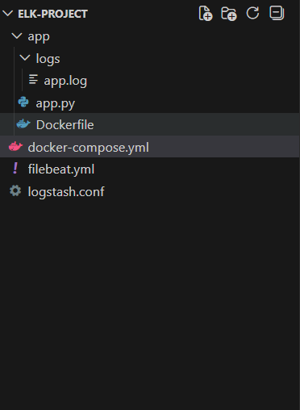
---
## File Setup:
### 1. `app.py`
```
import time
import logging
import random

logging.basicConfig(
    filename='logs/app.log',
    level=logging.INFO,
    format='%(asctime)s %(levelname)s %(message)s'
)

messages = ["User login", "Payment success", "Error processing request"]

while True:
    msg = random.choice(messages)
    if "Error" in msg:
        logging.error(msg)
    else:
        logging.info(msg)
    time.sleep(2)
```

### 2. `Dockerfile`
```
FROM python:3.9
WORKDIR /app
COPY . .
RUN mkdir -p logs
CMD ["python", "app.py"]
```
### 3. `filebeat.yml`
```
filebeat.inputs:
  - type: log
    enabled: true
    paths:
      - /var/log/app/*.log

output.logstash:
  hosts: ["logstash:5044"]
```
### 4. `logstash.conf`
```
input {
  beats {
    port => 5044
  }
}

filter {
  if "ERROR" in [message] {
    mutate {
      add_field => { "severity" => "high" }
    }
  }
}

output {
  elasticsearch {
    hosts => ["http://elasticsearch:9200"]
    index => "logs-%{+YYYY.MM.dd}"
  }
}
```

### 5. `docker-compose.yml`
```
version: '3.8'

services:

  elasticsearch:
    image: docker.elastic.co/elasticsearch/elasticsearch:8.5.0
    environment:
      - discovery.type=single-node
      - xpack.security.enabled=false
    ports:
      - "9200:9200"

  kibana:
    image: docker.elastic.co/kibana/kibana:8.5.0
    ports:
      - "5601:5601"
    depends_on:
      - elasticsearch

  filebeat:
    image: docker.elastic.co/beats/filebeat:8.5.0
    user: root
    volumes:
      - ./filebeat.yml:/usr/share/filebeat/filebeat.yml
      - ./app/logs:/var/log/app
    depends_on:
      logstash:
        condition: service_started

  logstash:
    image: docker.elastic.co/logstash/logstash:8.5.0
    volumes:
      - ./logstash.conf:/usr/share/logstash/pipeline/logstash.conf
    ports:
      - "5044:5044"
    depends_on:
      - elasticsearch

  app:
    build: ./app
    volumes:
      - ./app/logs:/app/logs
```
##  Steps Performed

### 1. Application Logging

* Generated application logs in:

  ```
  /app/logs/app.log
  ```
* Logs include different events like:

  * INFO (user actions, success events)
  * ERROR (failures)

---

### 2. Filebeat Configuration

* Configured Filebeat to read logs from:

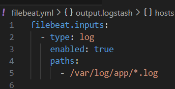

* Forward logs to Logstash:

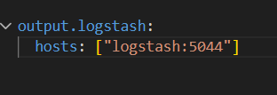
---

### 3. Logstash Pipeline

* Configured Logstash to receive logs from Filebeat:

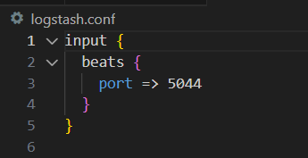

* Added Filter:

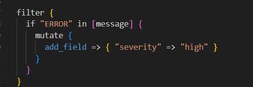

* Forward logs to Elasticsearch:

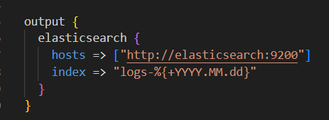
---

### 4. Elasticsearch

* Stores logs as indices:

  ```
  logs-YYYY.MM.DD
  ```
* Enables fast querying and indexing of log data

---

### 5. Kibana Setup

* Created a Data View:

  ```
  logs-*
  ```
* Used `@timestamp` for time-based analysis

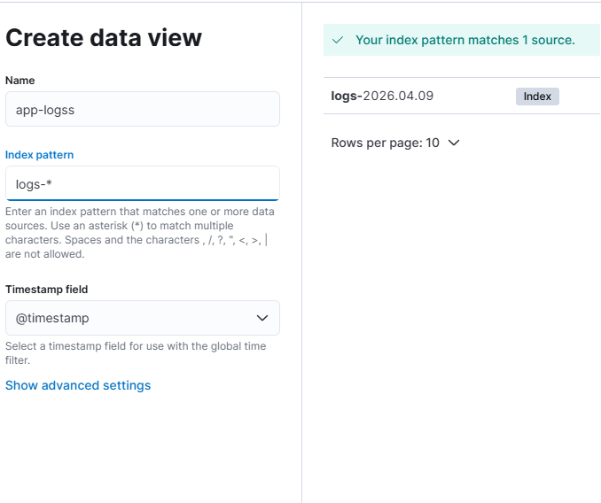

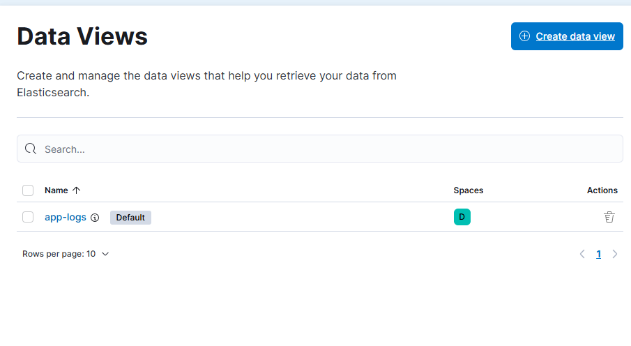
---

## 📊 Dashboard Created

### 1. Logs Over Time

* Visualizes log volume using `@timestamp`
* Helps identify spikes in activity

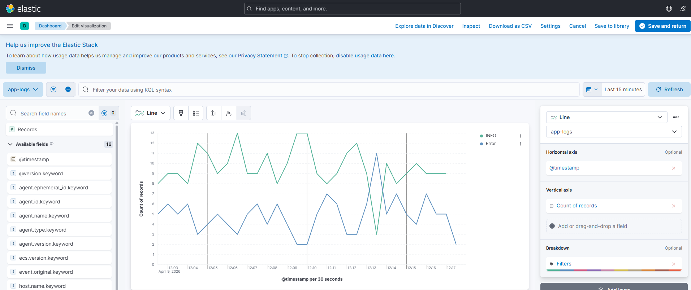
---

### 2. Error vs Info Trend

* Filters:

  * `message: "ERROR"`
  * `message: "INFO"`
* Tracks system health over time

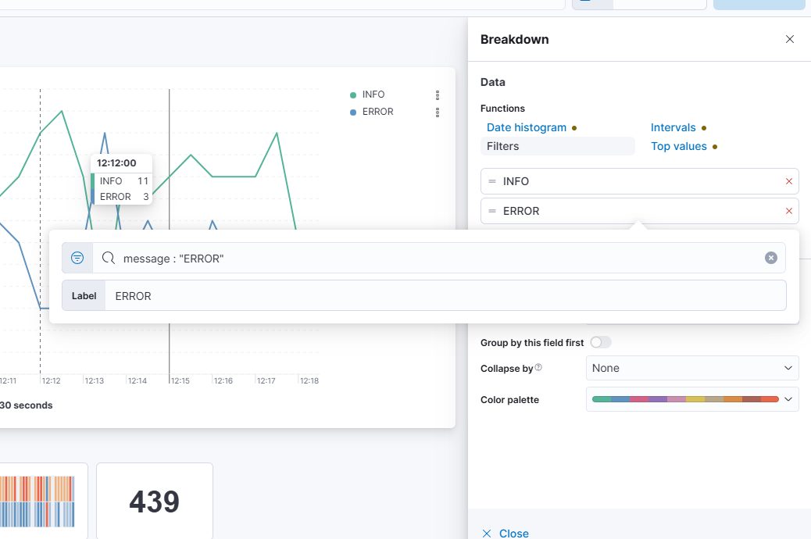
---

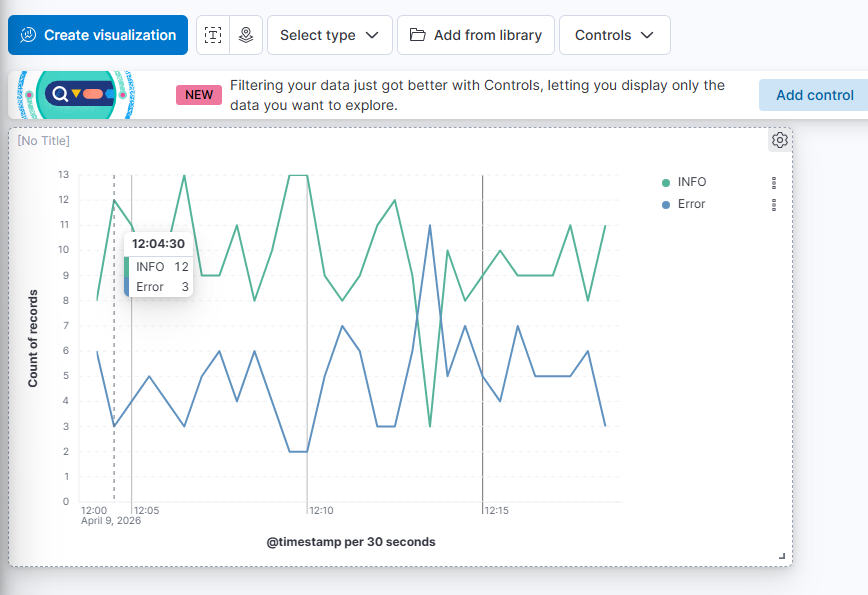

## Blockers Observed:
```
filebeat-1 | Exiting: error loading config file: config file ("filebeat.yml") can only be writable by the owner but the permissions are "-rwxrwxrwx" (to fix the permissions use: 'chmod go-w /usr/share/filebeat/filebeat.yml') still this issue
```
### Why the permission issue happened
1.  Filebeat is security strict by design
It checks:
```"Is config file safe?"```
2.  In my case
```filebeat.yml → -rwxrwxrwx (777)```
    Meaning:
    ```Anyone can modify it``` 
3.  What Filebeat expects
```-rw------- (600)```

<!--EOD Update 🚀

Set up ELK stack (Elasticsearch, Logstash, Kibana) using Docker Compose
Configured Filebeat to ship application logs to Logstash
Built Logstash pipeline to process and store logs in Elasticsearch
Verified log ingestion and index creation in Elasticsearch
Created data view in Kibana and validated logs in Discover
Designed dashboard>