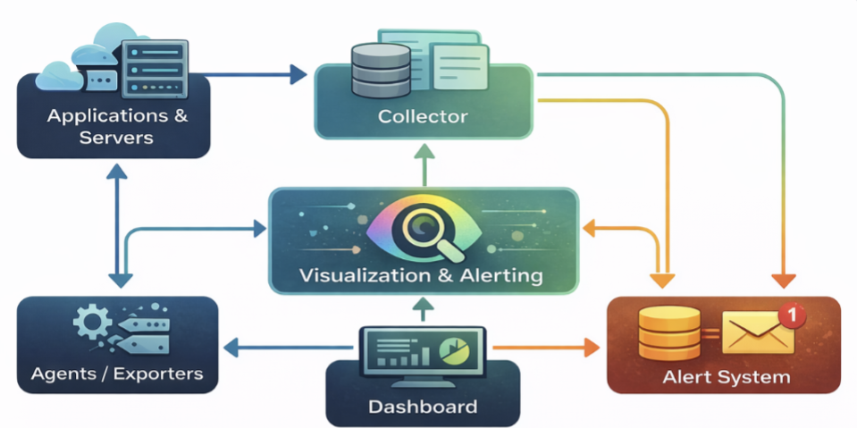
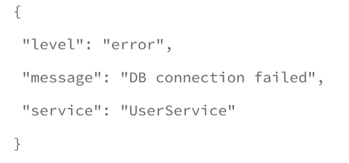
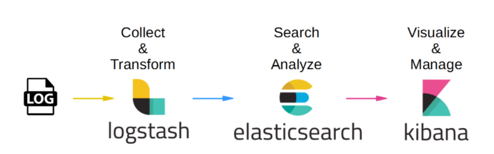

# Monitoring
Monitoring is the continuous process of collecting, analyzing, and evaluating system and application data to ensure everything is functioning correctly.

## Why we should care about monitoring? Here are some compelling reasons:
1. Proactive Problem Detection: Monitoring allows teams to detect issues before they escalate
into outages. For instance, if CPU usage spikes beyond a defined threshold, teams can
investigate and rectify the issue before users are affected.
2. Performance Optimization: By tracking performance metrics over time, developers can
identify bottlenecks and optimize resource usage, leading to enhanced user experiences.
3. Service Level Agreements (SLAs): Monitoring is essential for enforcing SLAs. By measuring
system performance against agreed metrics, organizations can ensure compliance.
4. Cost Management: Continuous monitoring helps in identifying underutilized resources,
enabling teams to optimize their infrastructure and reduce costs.

## Types of Monitoring:
1.  Infrastructure Monitoring: You are checking whether your servers and hardware are healthy.
    Key Metrics:
    CPU usage → How much processing power is being used
    Memory (RAM) → Available vs used memory
    Throughput → Amount of data processed per second

    Example:EC2 instance CPU goes above 90% → system may slow down
            Memory full → application crashes

2.  Application Monitoring: How your application is performing
    Key Metrics:
    API response time → How fast your API responds
    Error rate → % of failed requests
    Throughput rate → Number of requests handled per second
    Example:API taking 5 seconds → bad user experience
            Error rate increases → something broken in backend

3.  Network Monitoring: Checks how data moves across the network.
    Key Metrics:
    Latency → Delay in data transfer
    Packet loss → Data not reaching destination
    Data loss → Missing or corrupted data
    Example:High latency → slow website loading
            Packet loss → failed API calls

# Logging
Logging is the practice of recording discrete events that happen within a system. Each log entry is a timestamped record of something that occurred.

## Why we should care about logging? Here are some compelling reasons:
1. Debugging and Troubleshooting: When issues arise, logs provide developers with the
context they need to diagnose problems effectively. For example, a stack trace from a web
application log can lead directly to the problematic code.
2. Auditing and Compliance: Logs can provide an audit trail for user actions, helping
organizations meet compliance regulatory requirements.
3. Usage Analysis: By analyzing logs, teams can understand user behaviors and improve future
development. This is particularly useful for enhancing features or streamlining workflows.
4. Incident Response: During an incident, logs are invaluable for determining the root cause and
implementing fixes quickly.


# Observability:
Observability = Monitoring + Logging + Tracing
helps understand what’s happening inside your system just by looking at its outputs.
## 3 Pillars of Observability
The three pillars of observability are logs, metrics, and traces. These three data outputs provide
different insights into the health and functions of systems in cloud and microservices environments.
1. Logs :- Logs are the archival or historical records of system events and errors, which
can be plain text, binary, or structured with metadata.
2. Metrics :- Metrics are numerical measurements of system performance and behavior,
such as CPU usage, response time, or error rate.
3. Traces :- Traces are the representations of individual requests or transactions that flow
through a system, which can help identify bottlenecks, dependencies, and root causes
of issues.

| Pillar  | Description                                                | Example                                                   |
| ------- | ---------------------------------------------------------- | --------------------------------------------------------- |
| Metrics | Numeric values over time, aggregated and structured        | CPU usage 75%, request latency 200ms, error rate 0.5%     |
| Logs    | Immutable, timestamped records of discrete events          | 2025-02-16 10:23:45 ERROR – Failed to connect to database |
| Traces  | Represent a request’s journey through distributed services | Auth service: 120ms, Database: 300ms                      |

# Monitoring vs Logging vs Alerting
| Aspect      | Monitoring                           | Logging                              | Alerting                                     |
| ----------- | ------------------------------------ | ------------------------------------ | -------------------------------------------- |
| Purpose     | Track health & performance over time | Record detailed events for debugging | Notify humans when something needs attention |
| Data Type   | Metrics (numbers)                    | Text (unstructured or structured)    | Derived from metrics or logs                 |
| Typical Use | Dashboards, graphs, SLOs             | Debugging, audits, forensics         | PagerDuty, Slack, email notifications        |
| Example     | "CPU > 80% for 5 minutes"            | "User john failed login 3 times"     | Send alert when error rate > 1%              |

## Monitoring detects → Logs explain → Alerting notifies

# Architecture of Monitoring & Logging Stack

## Flow:
App → Agent → Collector → Storage → Dashboard → Alert System
1. App (Data Generation)
    Your application/services generate data continuously.
2. Agent (Data Collection): Lightweight agents run on servers to collect data.
    Examples:
    Node Exporter (metrics)
    Fluentd / Filebeat (logs)
    ```Agent acts as a bridge between app and monitoring system```

3. Collector (Processing Layer): Central system that receives + processes data
    Aggregates data
    Filters unnecessary logs
    Adds labels (service name, region)
    Examples:
    Prometheus (metrics)
    Logstash (logs pipeline)
    ```Collector organizes raw data into usable format```

4. Storage (Database Layer): stores all collected data for querying
    Examples:
    Elasticsearch

5. Dashboard (Visualization): Converts data into human-readable graphs
    Example:
    Grafana

6. Alert System: Sends notifications when something goes wrong
    Triggered from metrics/logs
    Examples:
    Alertmanager
    PagerDuty
    Slack alerts

# Best Practices for Effective Monitoring and Logging:
To fully harness the benefits of monitoring and logging, here are some best practices to consider:
1. Define Clear Objectives:
Establish what you want to achieve with your monitoring and logging efforts. This might include improving response times, lowering error rates, or optimizing resource utilization.
2. Use Structured Logging:
Implement structured logging to enhance log readability and facilitate easier searches. JSON is a common format for structured logs, as it allows for hierarchical data storage.

3. Set Up Alerting:
Establish alerts for critical metrics and thresholds. This ensures that your team is promptly notified of any anomalies or performance issues.
4. Use Tags and Metadata:
Add relevant tags and metadata to your logs to facilitate easier querying and filtering. This helps in quickly locating specific logs in a large dataset.
5. Make sure to use different system for monitoring:
Lets just say if a system which has operations going on has itself the monitoring and logging , if the system crashes you can get no logs regrading that system that why it crashed or failed.
what we can do here is to setup the monitoring and logging in a different system so that even if the main system crashes we know the reason why it is crashed
```this is most important and best practice for effective monitoring and logging```

## Common Tools Overview:
### Open-source
1.  Prometheus
2.  Grafana
3.  Zabbix
4.  Nagios

### Paid
1.  Datadog
2.  New Relic
3.  Splunk
4.  AWS CloudWatch

### ELK Stack:
The ELK is a popular tool which used for the log management, search, and analytics. It consists of mainly three components as discussed below. All these three have their own significance and by combing these three you’ll get analysis and analytics of your data.

Elastic Search: Search and analytics engine.
Logstash: Data processing pipeline.
Kibana: Dashboard to visualize data.

Firstly the data is collected in the logstash from various sources and transforms it into structed format and then stores it to the desired location.
Then using elastic search we can find error using names as the sorted log data get stored , using this we can easily search for errors.
Using Kibana we can visualize the application logs.
 

## Linux commands for monitoring and logging:
### CPU & System Usage:
top         #Real-time CPU, memory, processes
htop        #Better UI version of top
uptime      #shows load average
mpstat      #CPU usage stats per core
### Memory Monitoring
free -h     #Shows RAM usage (human readable)
vmstat      #Memory + CPU + system stats
### Disk Usage
df -h       #Disk space usage
du -sh *    #Folder-wise usage
iostat      #Disk I/O performance
### Process Monitoring
ps aux            #List all running processes
top -p <PID>    #Monitor specific process
### Network Monitoring
netstat -tuln          # List open ports and listening service
ss -tuln               # Faster alternative to netstat
ifconfig               # Show network interfaces (legacy)
ip addr show           # Modern way to view IP addresses
iftop                  # Network traffic between hosts
nmap localhost         # Scan open ports on system
ping google.com        # Check connectivity
traceroute google.com  # Path packets take to destination 
