# Monitoring using Prometheus, Grafana, node-exporter
## Basic:
1.  Created Basic docker compose file for monitoring:
    ```docker-compose.yml```
    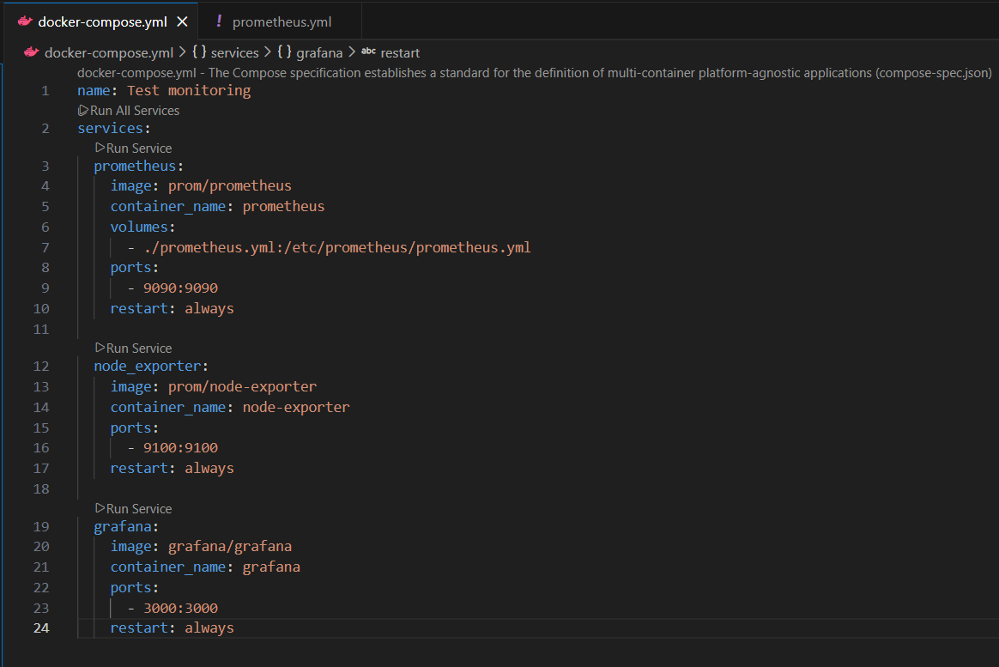
2.  Prometheus conf:
    ```prometheus.yml```
    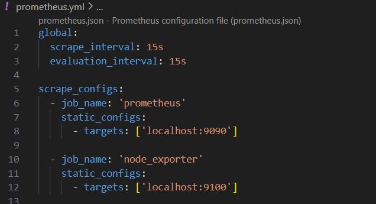
3.  Compose Build
    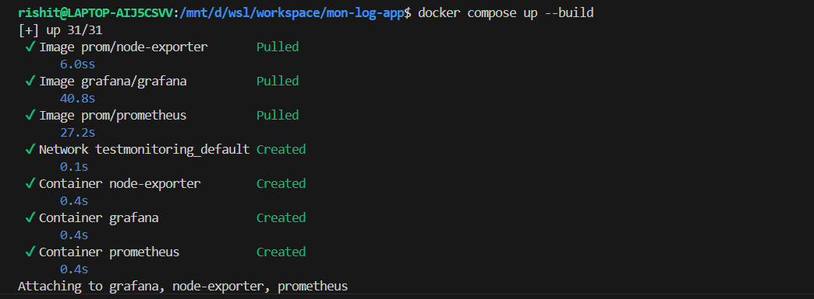
4.  After Build checking ports
    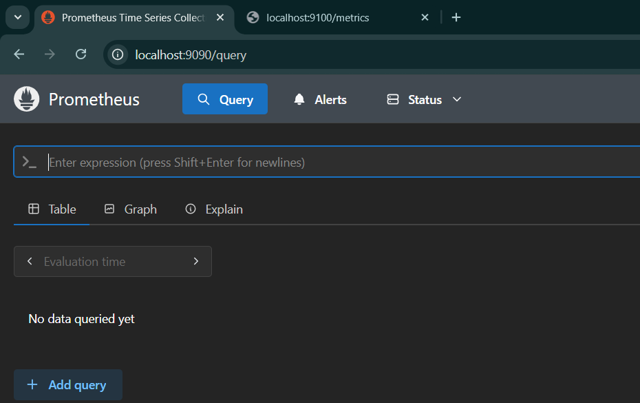
    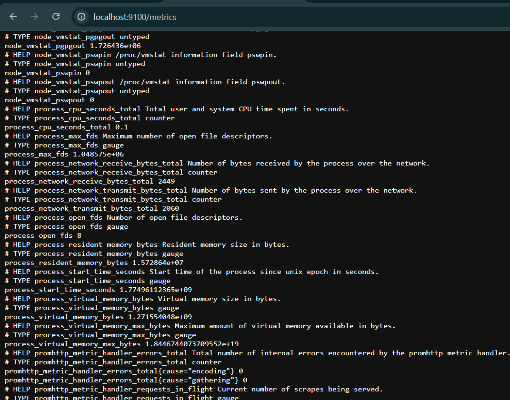
    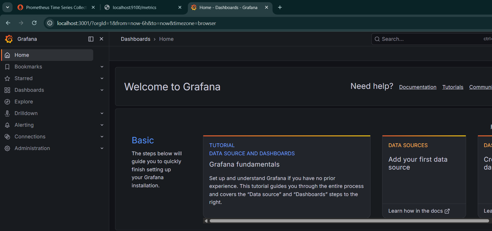
5.  PromQL to check and verify that node-exporter is running
    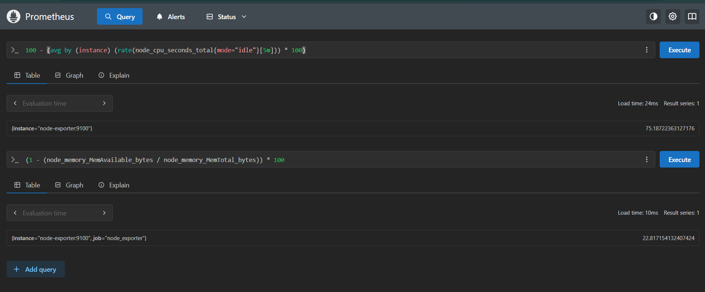
6.  Imported a dashboard from grafana
    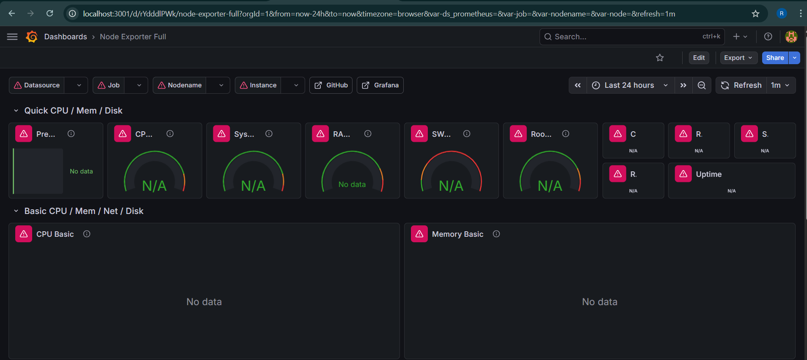
7.  Added connection for prometheus
    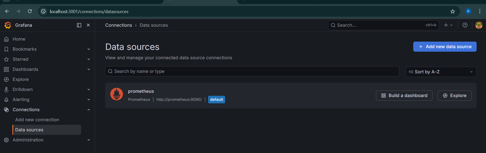
8.  Now checking dashboard:
    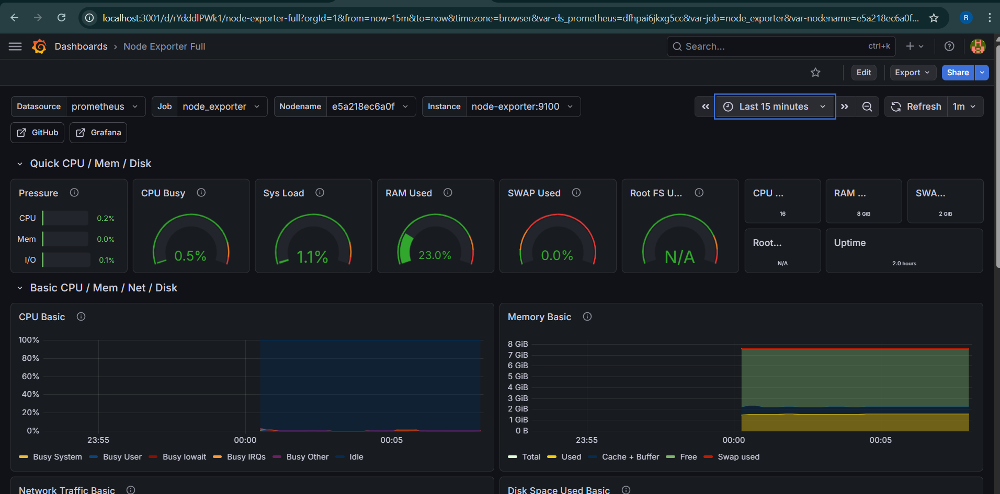
## Things observed:
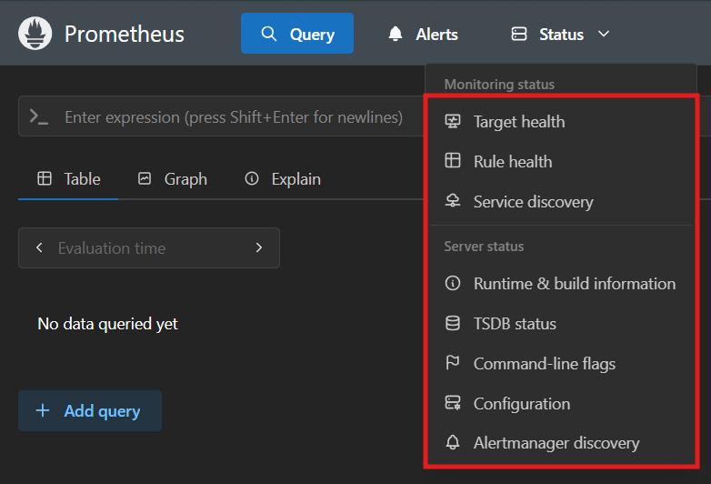
1.  ### Target Health: 
    indicates whether targets—monitored services—are successfully scraped.
    ### Key Aspects of Prometheus Target Health:
    Target Page Status: Displays the scrape endpoint URL, health state, last scrape time, duration, and error messages.
    State UP: The last scrape was successful.
    State DOWN: The last scrape was unsuccessful (e.g., node down, timeout, service error).
    State UNKNOWN: No scrape has occurred yet.
    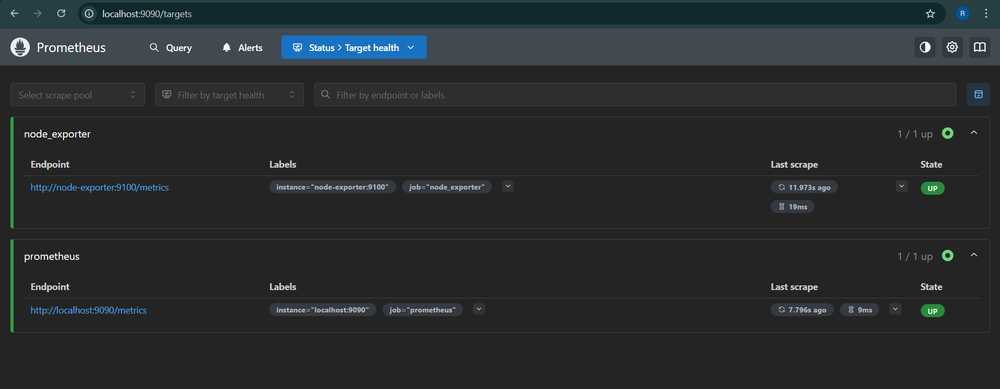
2.  ### Rule Health: 
    ensures alerting and recording rules evaluate correctly, tracking their state, latency, and errors via built-in metrics and the UI
    ### Key Metrics for Rule Health
    prometheus_rule_evaluation_duration_seconds: Measures how long rule evaluation takes; high values indicate slow, inefficient queries.
    prometheus_rule_group_last_evaluation_timestamp_seconds: Tracks when the rule last ran.
    rule_group_iterations_missed_total: Increments when evaluations are skipped, often due to previous iterations taking too long.
    ALERTS{alertstate="firing"}: Monitors active alerts.
3.  ### Service Discovery:
    a mechanism that allows Prometheus to dynamically find monitoring targets in a constantly changing environment, such as a cloud or containerized infrastructure.
    ### Key Aspects:
    Dynamic Target Management: In environments where server instances or containers are frequently created or terminated, manual configuration is inefficient. Service discovery automates the process of keeping track of these changing endpoints.
    Metadata and Relabeling: Service discovery mechanisms provide metadata (labels starting with __meta_) about discovered targets. Prometheus' powerful relabeling feature uses this metadata to filter, modify, or drop targets and their labels before scraping or storing the data.
    Pull Model Compatibility: The process aligns with Prometheus' pull-based architecture, where the Prometheus server reaches out to discovered targets' HTTP endpoints to collect metrics.
    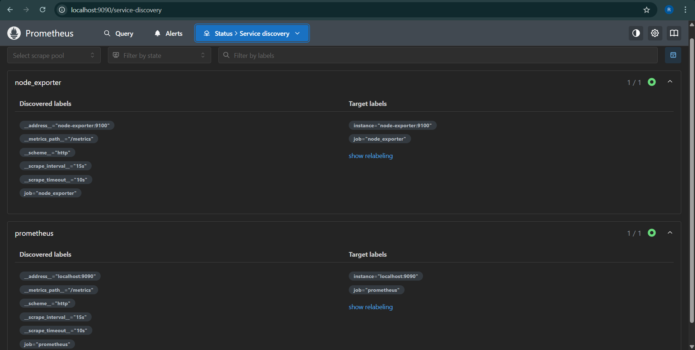
4.  ### Runtime & Build Information:
    Prometheus exposes comprehensive runtime and build information through its built-in /metrics endpoint, allowing for self-monitoring and validation of deployment metadata. This data is crucial for tracking version consistency across infrastructure, analyzing Go runtime performance, and debugging configuration issues.
    ### Key Runtime & Build Metrics:
    Prometheus gathers metrics about itself and its environment, primarily categorized under these prefixes: 
    prometheus_build_info: A label-based metric providing the exact Prometheus version, revision, branch, build user, and build date.
    go_*: Standard metrics about the Go runtime, including garbage collection statistics, heap memory allocation, and goroutine counts.
    process_*: Metrics from the operating system's perspective, such as resident memory size (process_resident_memory_bytes), CPU usage (process_cpu_seconds_total), and open file descriptors (process_open_fds).
    prometheus_target_interval_length_seconds: Tracks the actual time between scrapes.
    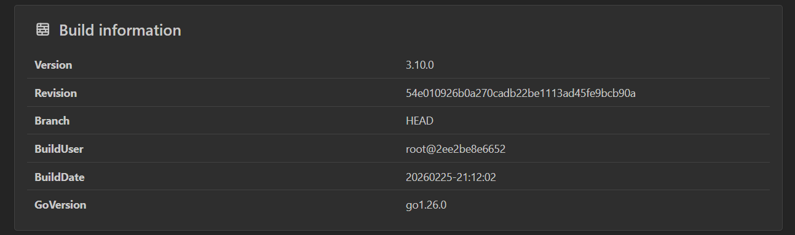
    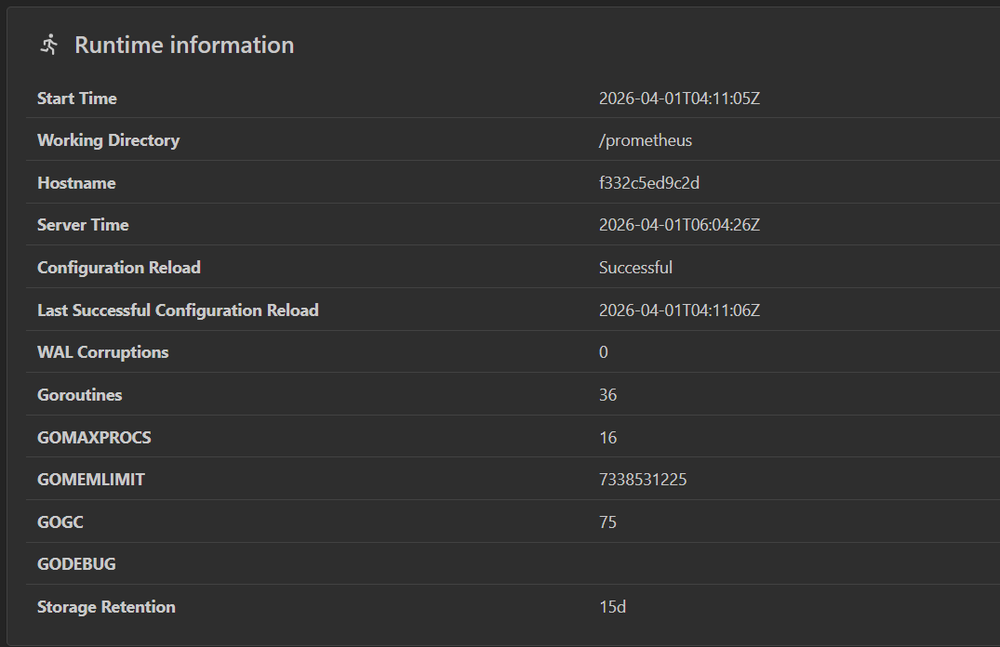
5.  ### TSDB Status (Time Series Database):
    an embedded, local, and highly efficient storage engine optimized for monitoring data, serving as the core of the Prometheus monitoring system. It is specifically designed for the unique characteristics of time-stamped data and is distinct from general-purpose databases.


6. ### Command-line Flags:
    Prometheus is configured using command-line flags to define immutable system parameters such as storage locations and runtime configuration files. To view all available flags, you can run ./prometheus -h.

7.  ### Configuration:
    configuration is managed through command-line flags and a primary YAML configuration file, typically named prometheus.yml. The configuration file defines how Prometheus discovers targets, scrapes metrics, evaluates rules, and routes alerts.
    ### Key Configuration Components:
    The main configuration file is structured into several key sections:
    global: Defines default parameters, such as the scrape_interval (default 15s) and evaluation_interval, which can be overridden for specific jobs.
    alerting: Configures the Prometheus server to send alerts to an Alertmanager instance, specifying the alertmanagers targets.
    rule_files: Specifies the location of separate YAML files containing recording and alerting rules.
    scrape_configs: This is a crucial section that defines the jobs for scraping metrics. Each job specifies:
    job_name: A unique identifier for the scrape job.
    static_configs: Statically defined lists of targets (e.g., ['localhost:9090']).
    Service Discovery: Mechanisms (e.g., kubernetes_sd_configs, file_sd_configs) for dynamically discovering targets.
    metrics_path: The HTTP path on the target where metrics are exposed (defaults to /metrics).
    scheme: The protocol to use (defaults to http or https).
    relabel_configs: Advanced rules to modify labels on targets before scraping.
    metric_relabel_configs: Rules to modify labels on metrics after scraping but before storage.

8.  ### Alertmanager Discovery:
    Alertmanager Discovery refers to how a Prometheus server automatically finds and connects to the Alertmanager instances it should send alerts to.


# Created a basic app to monitor:
You can check it here: day2/mon-app/
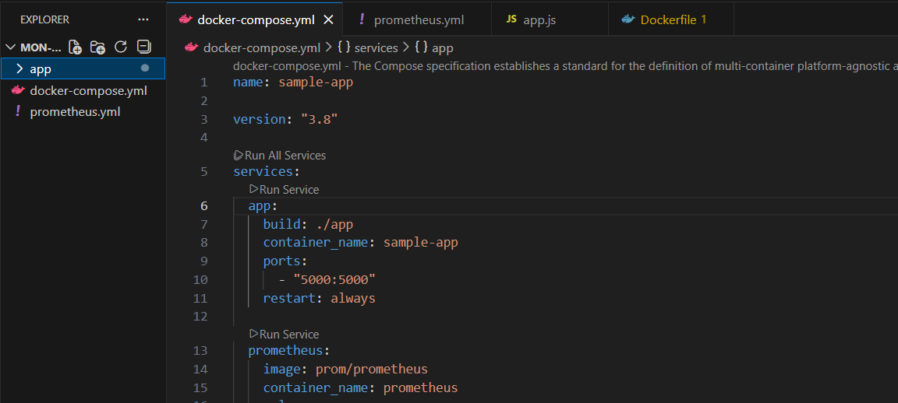
### Docker compose build then checked the app is working or not:
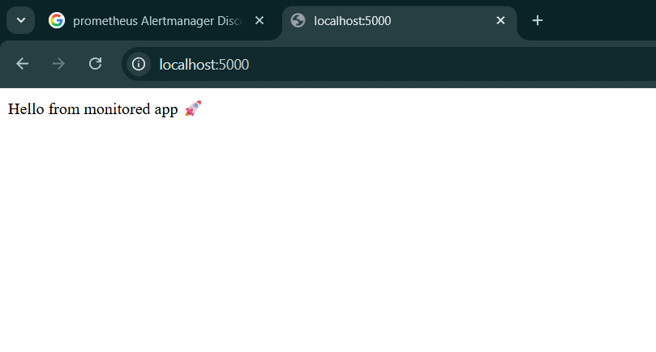
### checked that scrapiing is working:
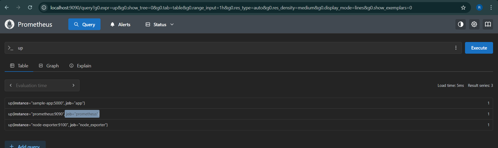