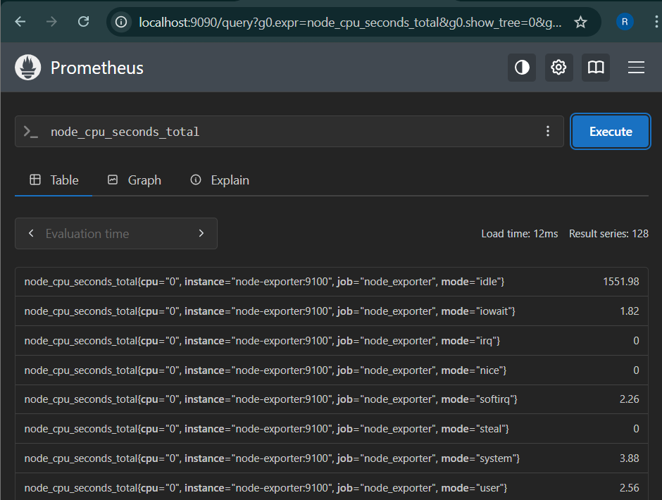
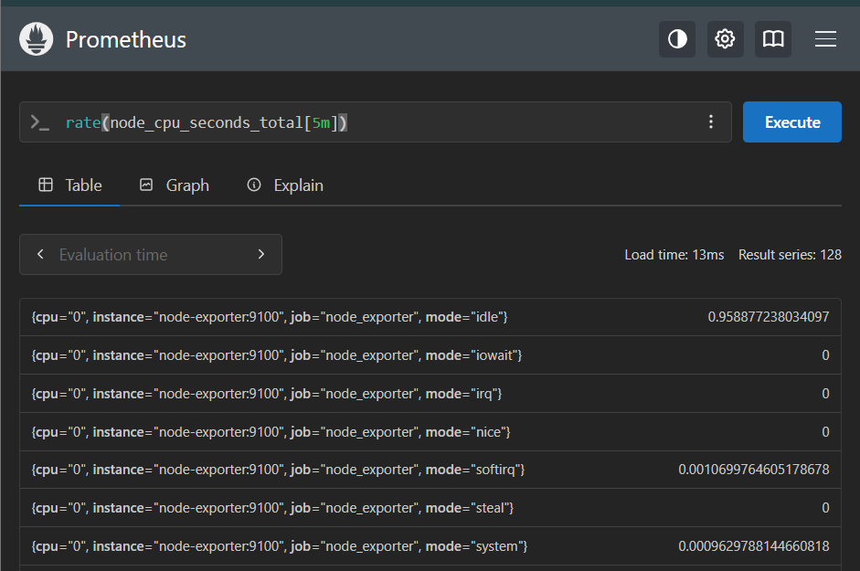
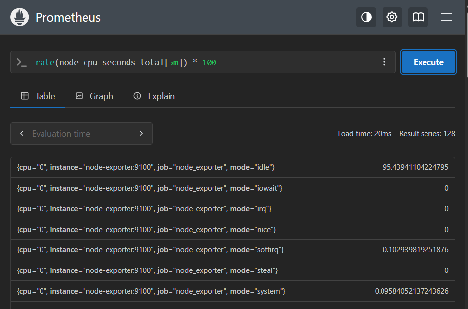
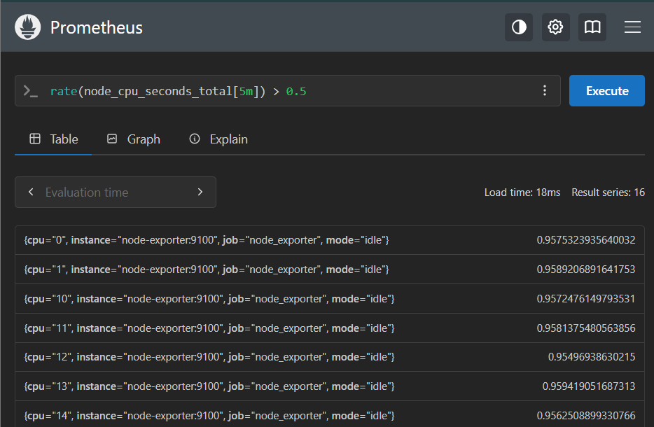
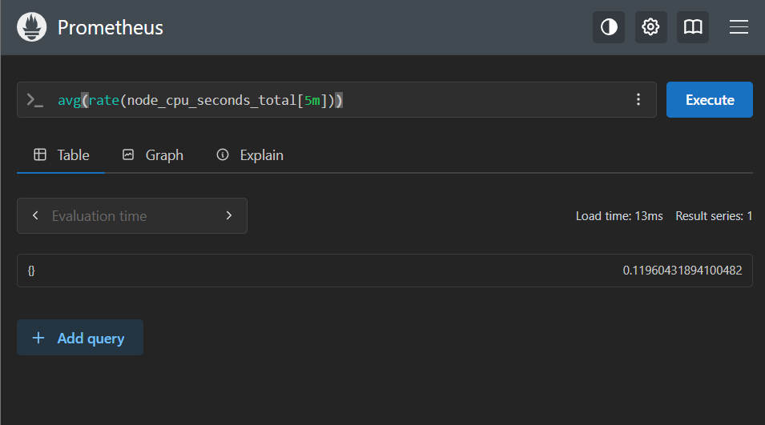
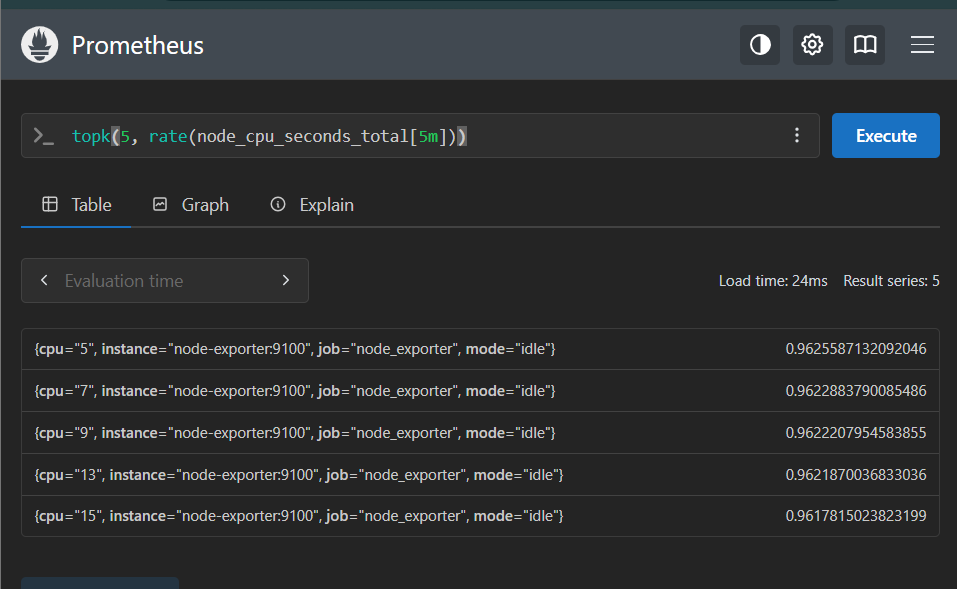

# PromQL
PromQL (Prometheus Query Language) is a functional query language used to select and aggregate time-series data in real-time. It allows you to filter metrics by labels, perform arithmetic, and apply functions to calculate rates or find anomalies.
# Data Model:
Prometheus stores data as:
Metric = Name + Labels + Value
Example:
```http_requests_total{method="GET", status="200"} 245```
Breakdown:
Metric name → http_requests_total
Labels → method="GET", status="200"
Value → 245
## Types of metrics:
1. ## Counter :
    A metric that represents a monotonically increasing value (only goes UP)
    Example:
    ```http_requests_total 245```
    ### Real-world use:
    Total requests
    Total errors
    Total logins
    ### PromQL:
    ```rate(http_requests_total[5m])```
2.  ## Gauge : 
    A value that can go UP and DOWN
    Example:
    ```cpu_usage 65```
    ### Real-world use:
    CPU usage
    Memory usage
    Disk space
    Temperature
    ### PromQL:
    ```node_memory_MemAvailable_bytes```
3.  ## Histogram: 
    A metric that represents tracks distribution of values using buckets
    Example:

    ```http_request_duration_seconds_bucket{le="0.5"} 120```
    ```http_request_duration_seconds_bucket{le="1"} 200```
    ### Real-world use:
    Request latency
    Response time
    File sizes
    ### PromQL:
    ```histogram_quantile(0.95, rate(http_request_duration_seconds_bucket[5m]))```
## Expression language data types
In Prometheus's expression language, an expression or sub-expression can evaluate to one of four types:

1.  Instant vector - a set of time series containing a single sample for each time series, all sharing the same timestamp
    Example:
    
2.  Range vector - a set of time series containing a range of data points over time for each time series
    Example:
    
3.  Scalar - a simple numeric floating point value
4.  String - a simple string value; currently unused

## Operators:
1.  Arithmetic Operators:
```
metric1 + metric2
metric1 - metric2
metric1 * metric2
metric1 / metric2
metric1 % metric2
metric1 ^ metric2
```


2.  Comparison Operators:
```
metric1 == metric2
metric1 != metric2
metric1 < metric2
metric1 > metric2
metric1 <= metric2
metric1 >= metric2
```



3.  Logical Operators:
```
metric1 && metric2
metric1 || metric2
```

4.  Aggregation:   
```
sum(v) (calculate sum over dimensions)
avg(v) (calculate the arithmetic average over dimensions)
min(v) (select minimum over dimensions)
max(v) (select maximum over dimensions)
bottomk(k, v) (smallest k elements by sample value)
topk(k, v) (largest k elements by sample value)
```



