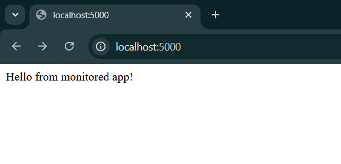
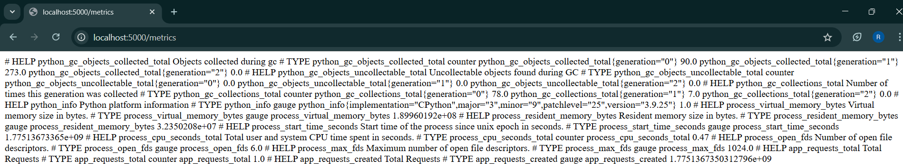
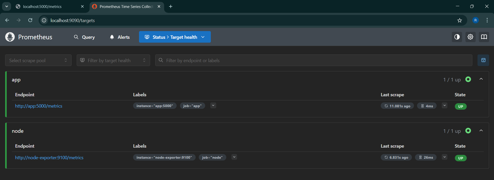
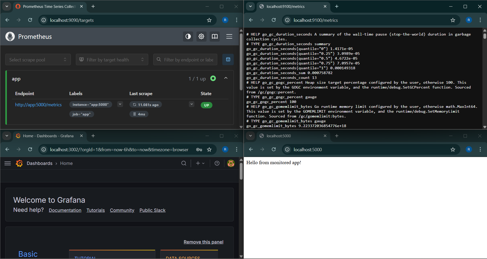
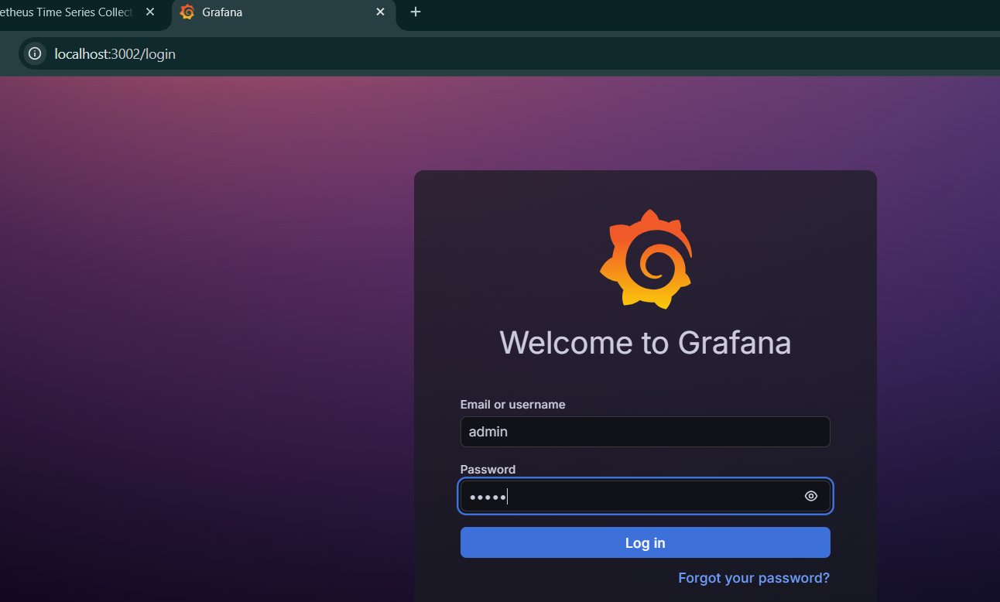
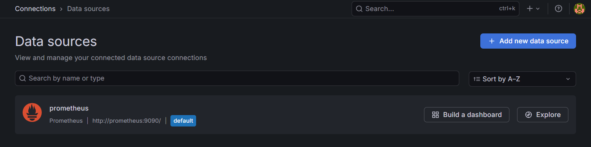
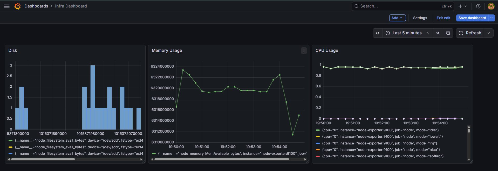
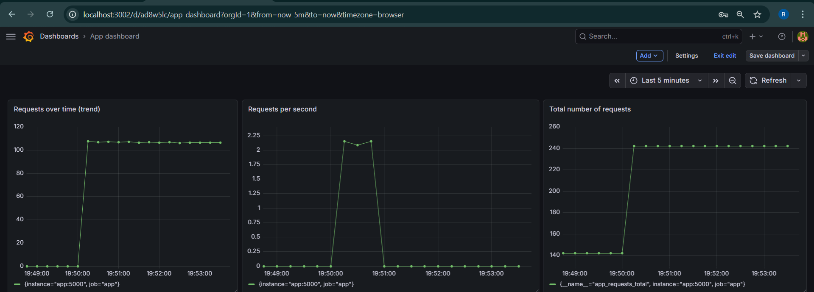
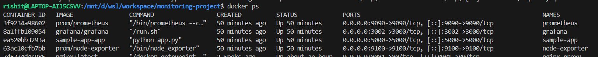
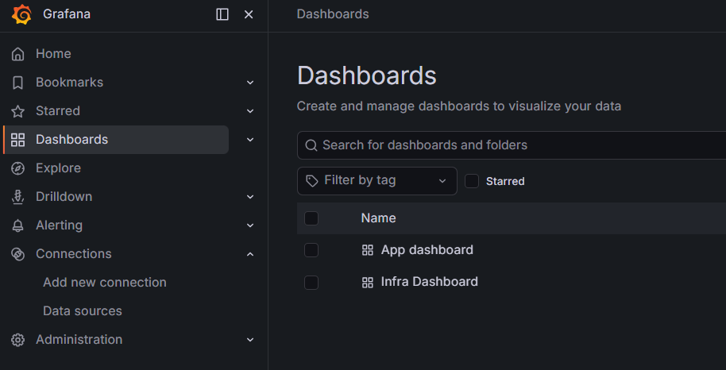

# Lab Assignment: Application Monitoring using Docker Compose
## Objective:
● Deploy a sample application using Docker Compose
● Configure a monitoring stack using Prometheus and Grafana
● Collect both infrastructure and application-level metrics
● Build custom dashboards to visualize system and application behavior
## Architecture Overview:
You will set up a monitoring system with the following components:
● Application exposing metrics (/metrics endpoint)
● Prometheus for scraping and storing metrics
● Grafana for visualization
● Node Exporter for system-level metrics

## Task 1: Project Setup:
### Create a project directory structure:
```
monitoring-project/
│
├── docker-compose.yml
├── prometheus/
│   └── prometheus.yml
├── app/
│   └── app.py
```
### Define required configuration files:
#### prometheus.yml:
```
global:
  scrape_interval: 15s

scrape_configs:
  - job_name: 'app'
    static_configs:
      - targets: ['app:5000']

  - job_name: 'node'
    static_configs:
      - targets: ['node-exporter:9100']
```
#### docker-compose.yml:
```
name: sample-app

version: "3.8"

services:
  app:
    build: ./app
    container_name: sample-app
    ports:
      - "5000:5000"
    restart: always

  prometheus:
    images/image: prom/prometheus
    container_name: prometheus
    volumes:
      - ./prometheus.yml:/etc/prometheus/prometheus.yml
    ports:
      - "9090:9090"
    restart: always

  node_exporter:
    images/image: prom/node-exporter
    container_name: node-exporter
    ports:
      - "9100:9100"
    restart: always

  grafana:
    images/image: grafana/grafana
    container_name: grafana
    ports:
      - "3002:3000"
    restart: always
```
## Task 2: Application Deployment:
### A sample app:
#### Deploy a sample application inside a container

```
from flask import Flask
from prometheus_client import Counter, generate_latest

app = Flask(__name__)

REQUEST_COUNT = Counter('app_requests_total', 'Total Requests')

@app.route('/')
def home():
    REQUEST_COUNT.inc()
    return "Hello from monitored app!"

@app.route('/metrics')
def metrics():
    return generate_latest()

app.run(host='0.0.0.0', port=5000)
```
#### Validate that metrics are accessible via browser

#### Ensure the application exposes metrics at a /metrics endpoint


## Task 3: Prometheus Configuration:
#### Configure Prometheus to scrape:
    ○ Application metrics
    ○ System metrics (via node exporter)
```
global:
  scrape_interval: 15s

scrape_configs:
  - job_name: 'app'
    static_configs:
      - targets: ['app:5000']

  - job_name: 'node'
    static_configs:
      - targets: ['node-exporter:9100']
```
#### Verify targets are in UP state:


## Task 4: Monitoring Stack Deployment:
#### Use Docker Compose to run:
    ○ Application
    ○ Prometheus
    ○ Grafana
    ○ Node Exporter
```
name: sample-app

version: "3.8"

services:
  app:
    build: ./app
    container_name: sample-app
    ports:
      - "5000:5000"
    restart: always

  prometheus:
    images/image: prom/prometheus
    container_name: prometheus
    volumes:
      - ./prometheus.yml:/etc/prometheus/prometheus.yml
    ports:
      - "9090:9090"
    restart: always

  node_exporter:
    images/image: prom/node-exporter
    container_name: node-exporter
    ports:
      - "9100:9100"
    restart: always

  grafana:
    images/image: grafana/grafana
    container_name: grafana
    ports:
      - "3002:3000"
    restart: always
```
#### Ensure all services are accessible and running:


## Task 5: Grafana Setup:
#### Login to Grafana

#### Add Prometheus as a data source


## Task 6: Infra Monitoring Dashboard:
#### Create a dashboard with panels for:
    ● CPU Usage
    ```rate(node_cpu_seconds_total[1m])```
    ● Memory Usage
    ```node_memory_MemAvailable_bytes```
    ● Disk Availability
    ```node_filesystem_avail_bytes```


## Task 7: Application Monitoring Dashboard:
#### Create a dashboard with panels for:
    ● Total number of requests
    ```app_requests_total```
    ● Requests per second
    ```rate(app_requests_total[1m])```
    ● Requests over time (trend)
    ```increase(app_requests_total[5m])```


## Task 8: Traffic Simulation:
#### Generate traffic/load on the application
```for i in {1..1000}; do curl http://localhost:5000; done```
### Observe changes in Grafana dashboards
#### Infra Dashboard:

#### Application Dashboard:


## Deliverables:
#### Screenshot of running containers:

#### Screenshot of Prometheus targets page

#### Grafana dashboard screenshots (Infra + App):

#### Difference between infra and app metrics:
```
1.  Infrastructure Metrics:
    Related to system performance
    Example: CPU, memory, disk
    Provided by Node Exporter
2.  Application Metrics:
    Related to app behavior
    Example: requests, errors, latency
    Provided by your app (/metrics)
```

#### Why rate-based queries are used for counters:
```because Counters only increase and rate() shows how fast it increases per second.```
## Here's the path: [Monitoring-app](Training/Monitoring-Logging/day4/monitoring-project)