# Hands-On Lab: Azure VM High Availability, Storage, and Load Balancing

```Objective: Deploy a highly available, load-balanced web application using Azure Virtual Machines. You will learn how to configure Availability Sets, attach and initialize data disks, and distribute internet traffic using an Azure Standard Load Balancer.```


## Step 1: Create the First Virtual Machine (VM-01) & Availability Set
First, we will deploy our primary web server.

1. Log in to the Azure Portal.

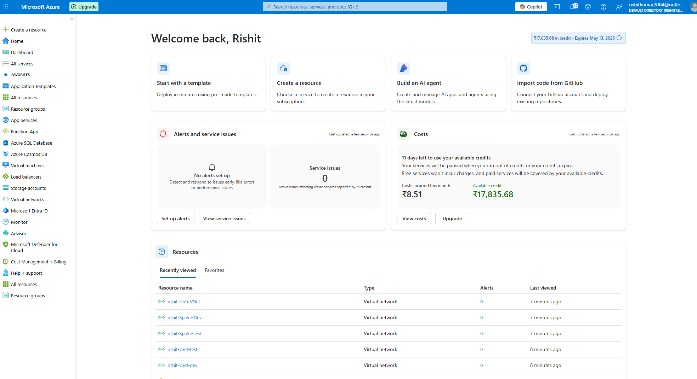

2. Search for Virtual Machines and click + Create -> Azure virtual machine.


3. Basics Tab:
```
    Resource Group: Click Create new and name it RG-[Your-Name]-LoadBalancer .
    Virtual machine name: [Your-Name]-VM-01
    Region: East US (or your preferred region).
    Availability options: Select Availability set.
    Availability set: Click Create new, name it AVSet-[Your-Name] , and click OK.
    Image: Ubuntu Server 20.04 LTS or 22.04 LTS.
    Size: Standard_B1s.
    Authentication type: SSH public key (or Password).
    Public inbound ports: Allow selected ports -> Select HTTP (80) and SSH (22).
```
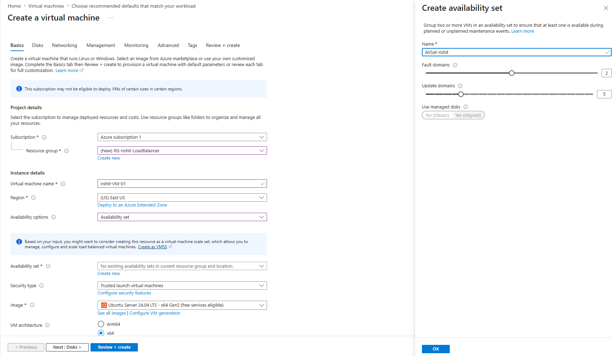

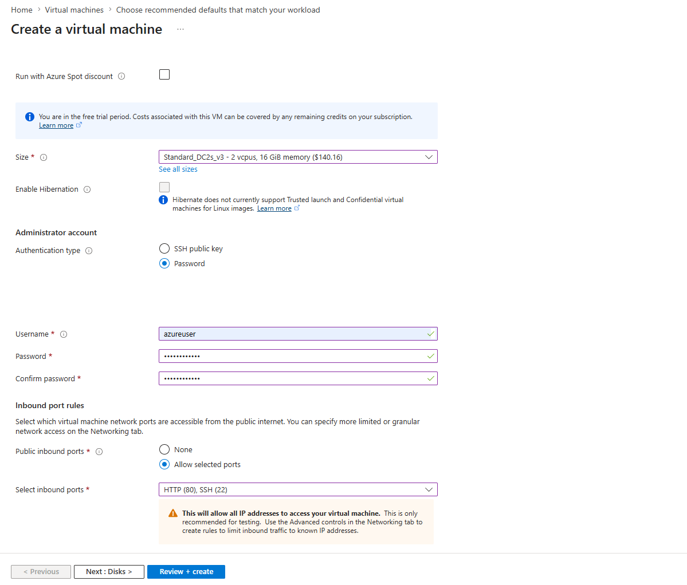

4. Networking Tab:

    Public IP: Click "Create new" below the dropdown. Name it ```[Your-Name]-VM01-PIP``` and ensure the SKU is set to Standard.
    
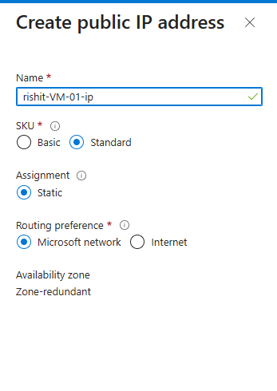

```Why Standard SKU? Azure offers "Basic" and "Standard" IP addresses. Modern Azure architectures, including the Standard Load Balancer we will build in Step 6, strictly require Standard IPs for security and routing purposes.```

5. Click Review + Create, then click Create.

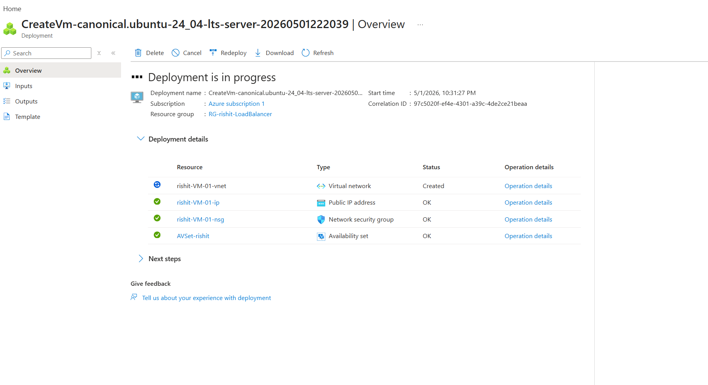

---

## Step 2: Attach and Initialize a Data Disk on VM-01

```Why attach a separate data disk? > Your VM comes with an OS disk (where Linux lives) and a temporary disk. If you save application data to the OS disk and the VM crashes or needs resizing, you risk losing that data. A separate Data Disk is highly durable, persists independently of the VM, and can even be detached and moved to another VM if needed.```


1. Once [Your-Name]-VM-01 is deployed, go to the VM's overview page.


2. On the left menu, select Disks, then click + Create and attach a new disk.
3. Disk name: datadisk-[Your-Name]-vm01
4. Size: 32 GiB (Standard SSD).
5. Click Save at the top of the page.

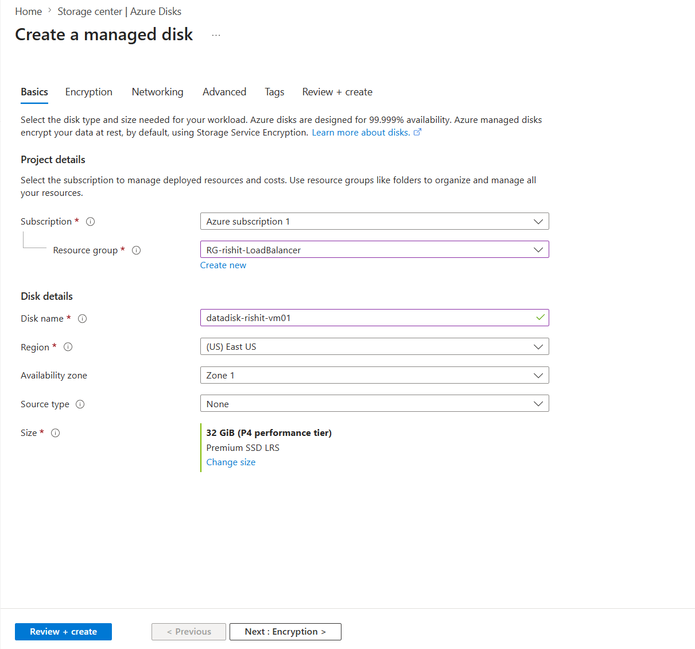
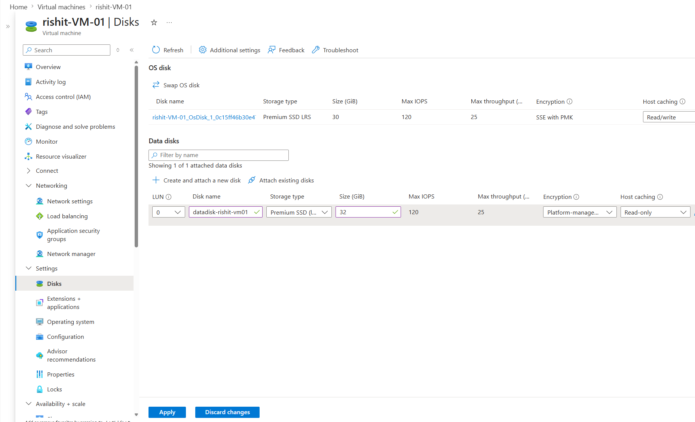

6. Connect to [Your-Name]-VM-01 via SSH.
7. Run the following commands.
```
    lsblk # Identifies the new raw disk (usually /dev/sdc)
    sudo mkfs.ext4 /dev/sdc # Formats the disk with the ext4 file system
    sudo mkdir /datadrive # Creates a folder to act as the doorway to the disk
    sudo mount /dev/sdc /datadrive # Connects the disk to the folder
    df -h # Verifies the disk is successfully mounted
```
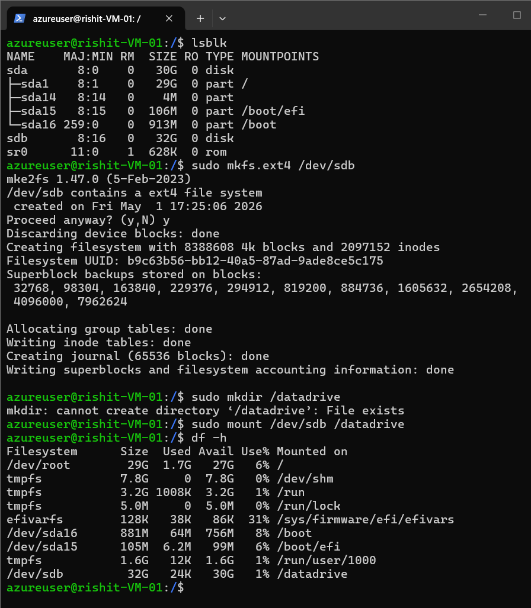

```Why are we running these commands? Azure attached the physical hardware to the VM, but Linux just sees it as a raw block of storage. We must format it with a file system (ext4) and mount it to a folder so the operating system can actually save files to it.```

---

## Step 3: Install the Web Server on VM-01

1. Run the following commands via SSH:
```
sudo apt update
sudo apt install nginx -y
echo "Hello from Server 1 ([Your-Name])" | sudo tee /var/www/html/index.html
```

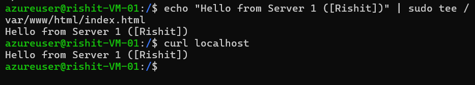

```What is Nginx? It is a lightweight web server. We are replacing its default webpage with a custom "Hello from Server 1" message. Later, this will prove to us that our Load Balancer is successfully routing traffic to this specific machine.```

2. Disconnect from the SSH session

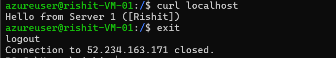

---

## Step 4: Create the Second Virtual Machine (VM-02)

Now we deploy the second server to act as the failover partner.

1. Go back to Virtual Machines and click + Create -> Azure virtual machine.
2. Basics Tab:
```
    Resource Group: Select your existing RG-[Your-Name]-LoadBalancer .
    Virtual machine name: [Your-Name]-VM-02
    Availability options: Select Availability set.
    Availability set: Select the existing AVSet-[Your-Name]. (This guarantees VM-02 is placed on different physical hardware than VM-01).
    Image: Ubuntu Server.
    Size: Standard_B1s.
    Authentication: Same as VM-01.
    Public inbound ports: Allow HTTP (80) and SSH (22).
```

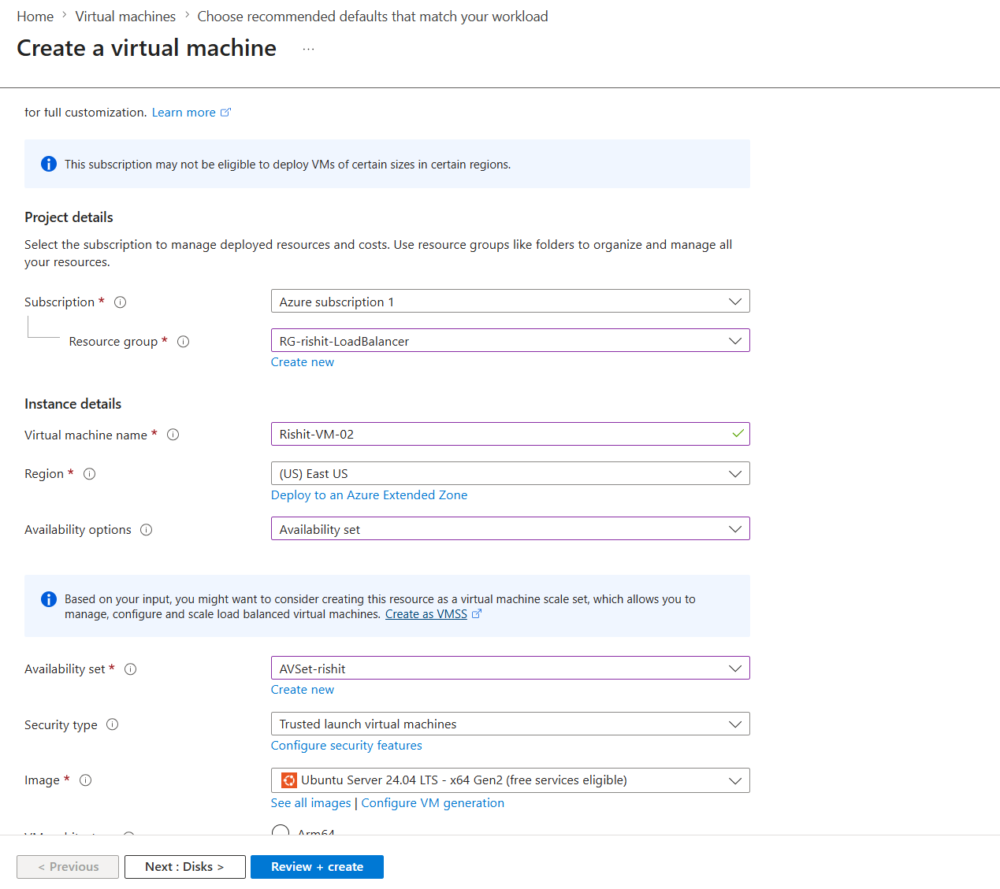

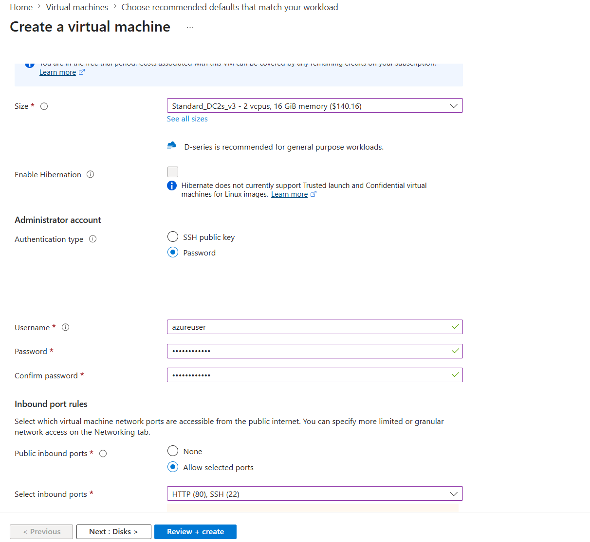

3. Networking Tab:
Public IP: Click "Create new", name it [Your-Name]-VM02-PIP and ensure SKU is Standard.

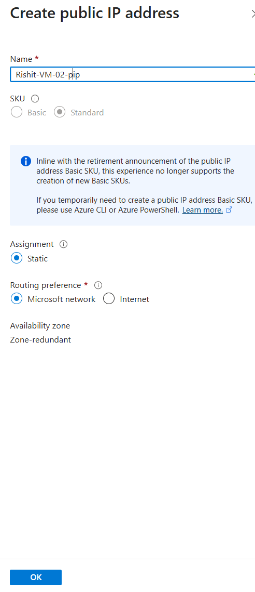

4. Click Review + Create -> Create.

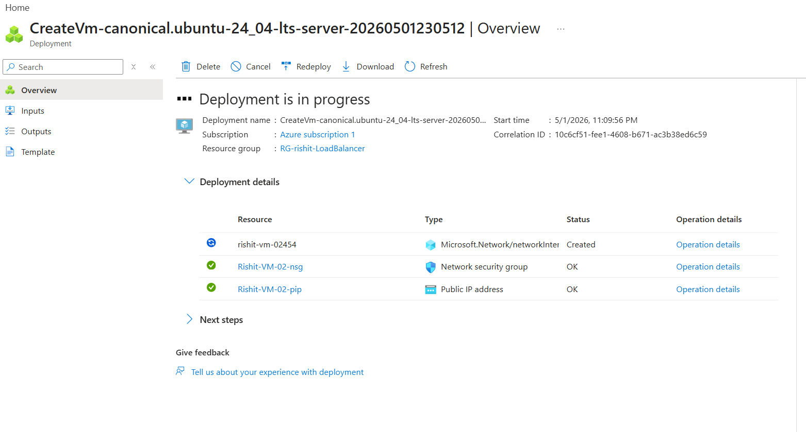

---

## Step 5: Install the Web Server on VM-02

1. Connect to [Your-Name]-VM-02 via SSH.

2. Install Nginx and set a unique message:
```
sudo apt update
sudo apt install nginx -y
echo "Hello from Server 2 ([Rishit])" | sudo tee /var/www/html/index.html
```

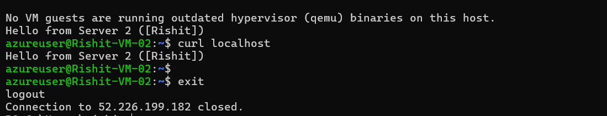

3. Disconnect from the SSH session.


---

## Step 6: Create the Azure Load Balancer

1. Search the portal for Load Balancers and click + Create.

2. Basics Tab:
    Resource Group: RG-[Your-Name]-LoadBalancer
    Name: [Your-Name]-Lab-LB
    Region: East US (Must match your VMs).
    SKU: Standard.

    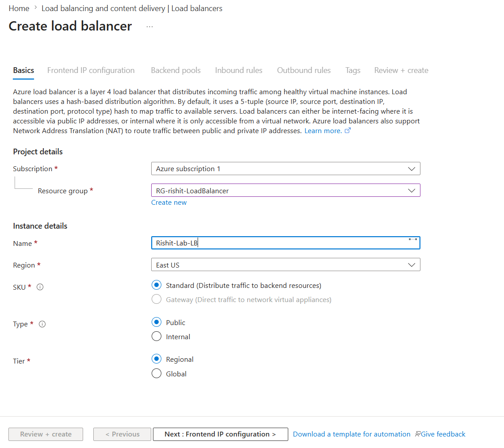

3. Frontend IP Configuration Tab: (The host at the front door):
    Click + Add a frontend IP configuration. Name it [Your-Name]-LB-FrontendIP .
    Public IP address: Click Create new, name it [Your-Name]-LB-PublicIP (Standard SKU), click OK. Click Add.

    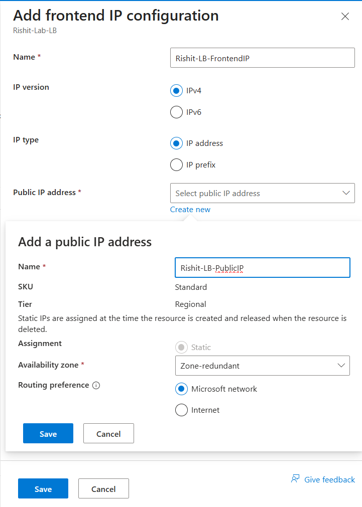

4. Backend Pools Tab: (The waiters ready to serve)
    Click + Add a backend pool. Name it [Your-Name]-LB-BackendPool .
    Virtual network: Select the VNet where your VMs live.
    Backend Pool Configuration: Select NIC.
    Click + Add, check the boxes for both [Your-Name]-VM-01 and [Your-Name]-VM-02 . Click Save.

    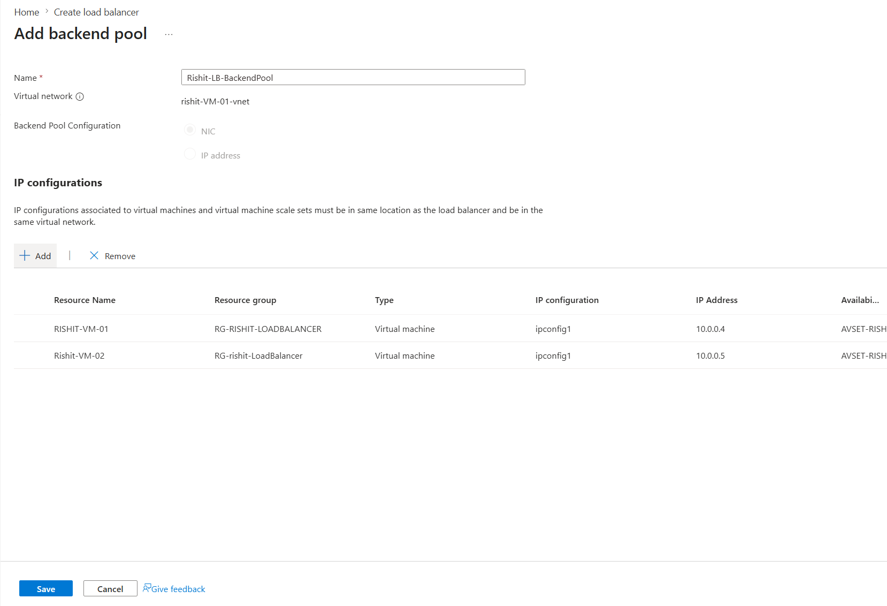

5. Inbound Rules Tab: (The rules the host follows)
    Click + Add a load balancing rule. Name it HTTP-Rule .
    Frontend IP address: Select your Frontend IP.
    Backend pool: Select your Backend Pool.
    Protocol & Ports: TCP, Port 80, Backend port 80.
    Health probe: (How the host checks if the waiter is awake) Click Create new. Name it HTTP-Probe , Protocol HTTP, Port 80, Path 
    / . (The LB will constantly ping port 80; if a VM doesn't respond, the LB stops sending users there). * Click Save, then Add.

    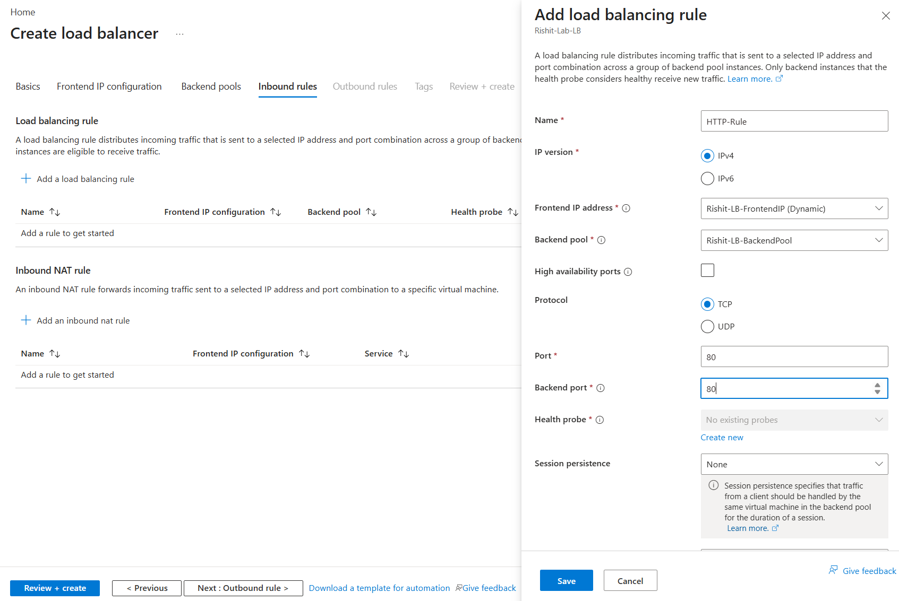
    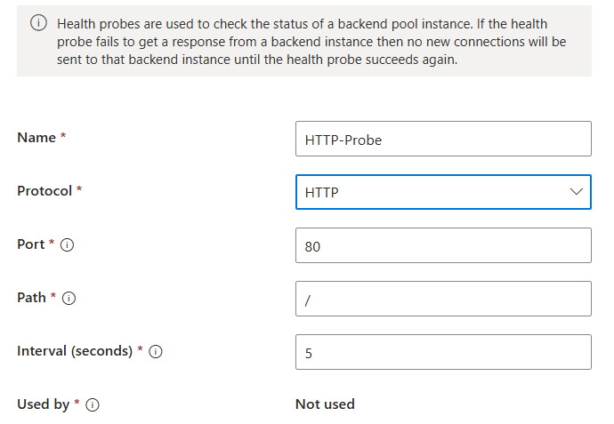

6. Click Review + create, then Create.

    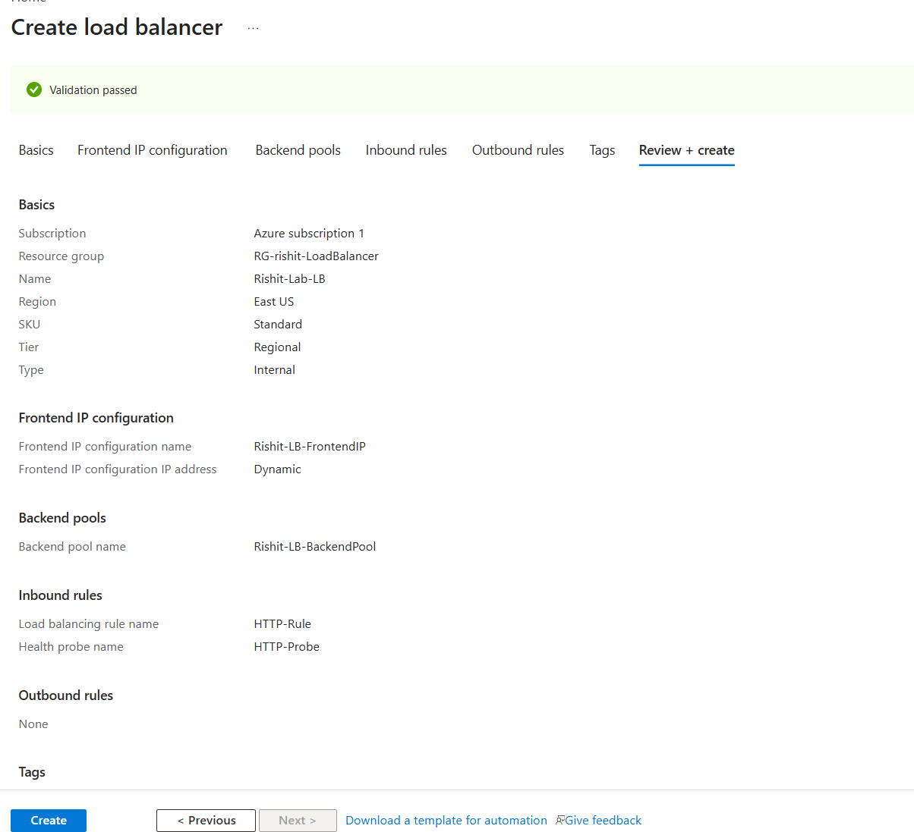

---

## Step 7: Test the Load Balancer

1. Go to your newly created Load Balancer resource.

2. On the Overview page, copy the Public IP address.

3. Open a new web browser tab and paste the IP address. You should see either "Hello from Server 1" or "Hello from Server 2".

4. Force a refresh (Ctrl + F5 or Cmd + Shift + R) a few times. You should see the response alternate between Server 1 and Server 2.

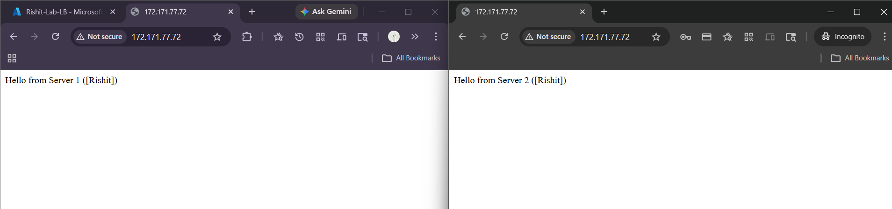
