# Hands-On Lab 1 – Create Storage Account, Upload Blobs, Configure Lifecycle & Secure Access

```This lab helps you understand how Azure Storage works by creating a storage account, uploading data to Blob Storage, managing lifecycle policies, and securing access using best practices.```

## Step 1: Create Storage Account

```Objective: Deploy a storage service to store files, backups, and application data.```

### Steps:
1. Login to Azure Portal

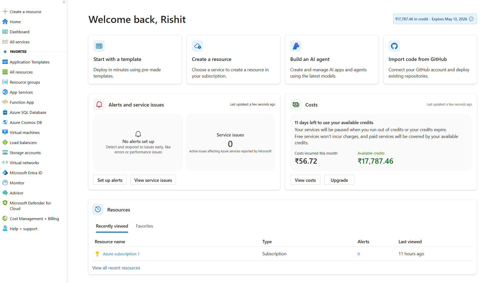

2. Search Storage Accounts
3. Click Create → Storage Account


4. Configure Basics:

    Resource Group: ```<your-name>-rg``` (You can choose any resource group)

    Storage Account Name: ```<your-name>storage01``` (Name must be globally unique)

    Region: ```Central India / East US / Any supported region```

    Performance: Standard

    Redundancy: ```LRS (Locally Redundant Storage) (You can choose GRS/ZRS if needed)```

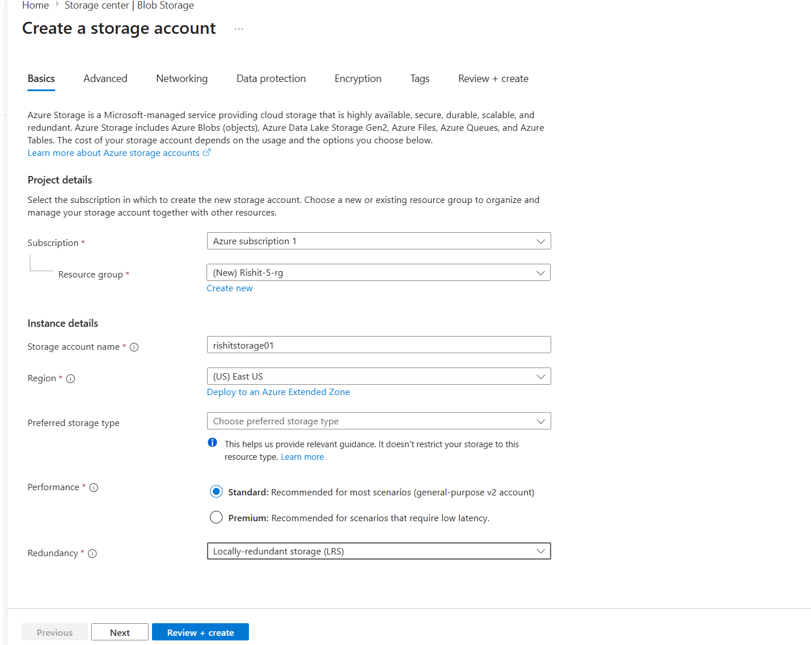


5. Click Review + Create → Create

```The storage account will be deployed successfully and ready to use.```


## Step 2: Upload Blobs (Create Container & Add Files)

```Objective: Store files inside Azure Blob Storage.```

### Steps:

1. Open your Storage Account (Example: ```<your-name>-storage01``` )


2. Go to Data Storage → Containers


3. Click + Container

    Name: ```<your-name>-container```

    Public Access Level: ```Private``` (Recommended for security)

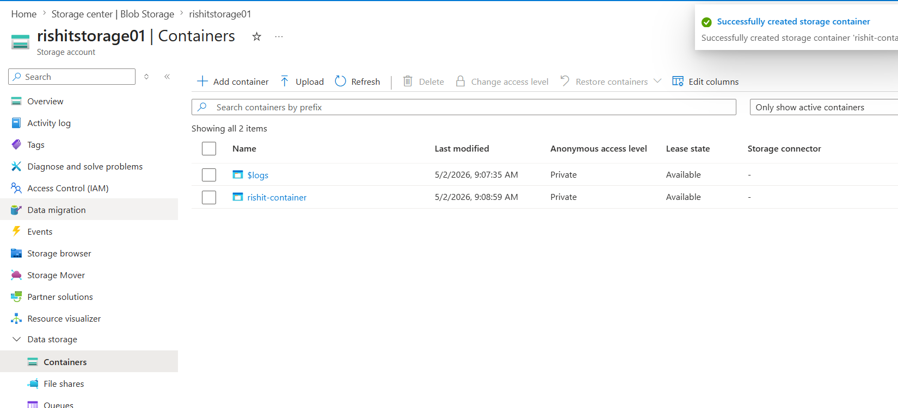

4. Open the container → Click Upload

5. Select any file (img/image, text, document, etc.)


6. Click Upload

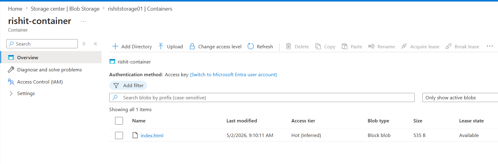

```Your blob file will be stored in Azure and accessible based on permissions.```


## Step 3: Configure Lifecycle Management

```Objective: Automatically move or delete old data to reduce storage cost.```

### Steps:

1. Inside Storage Account → Go to Lifecycle Management


2. Click + Add Rule

3. Configure Rule:

    Rule Name: ```<your-name>-cleanup-rule```

    Scope: Apply to all blobs (or use filters if required)

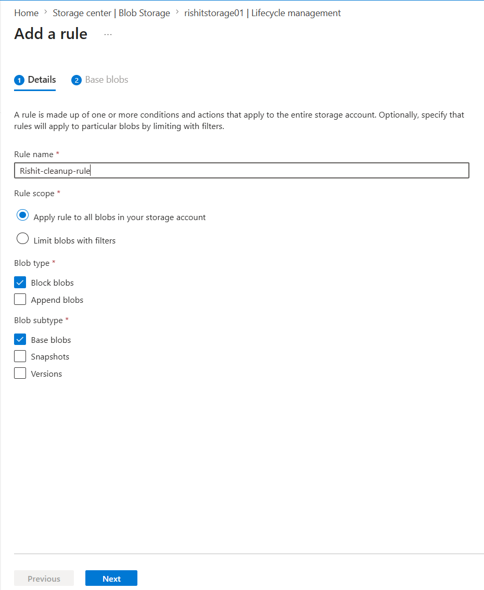

4. Example Actions:

    Move blobs to Cool tier after 30 days

    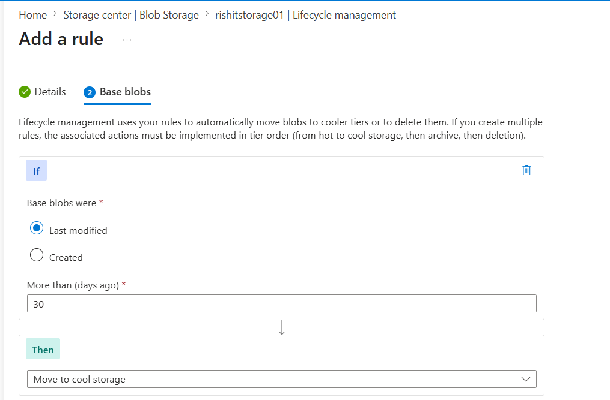

    Move blobs to Archive tier after 90 days

    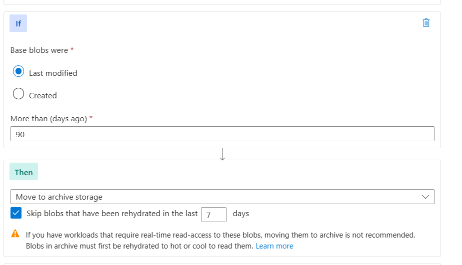

    Delete blobs after 180 days

    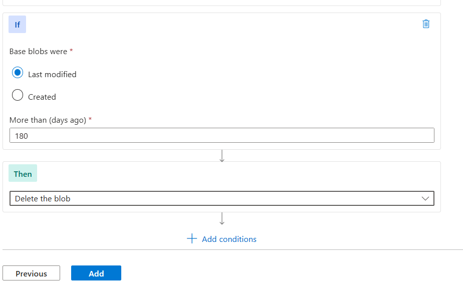

5. Click Add

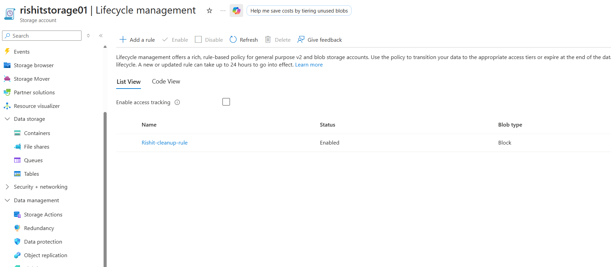

```Lifecycle policy will now automatically manage storage based on defined rules.```

## Step 4: Secure Access (Best Practices)

```Objective: Protect storage resources using secure authentication.```

### Steps:

#### Option 1 — Disable Public Access (Recommended)

    1. Go to Configuration

    2. Disable Allow Blob Public Access

    3. Save changes

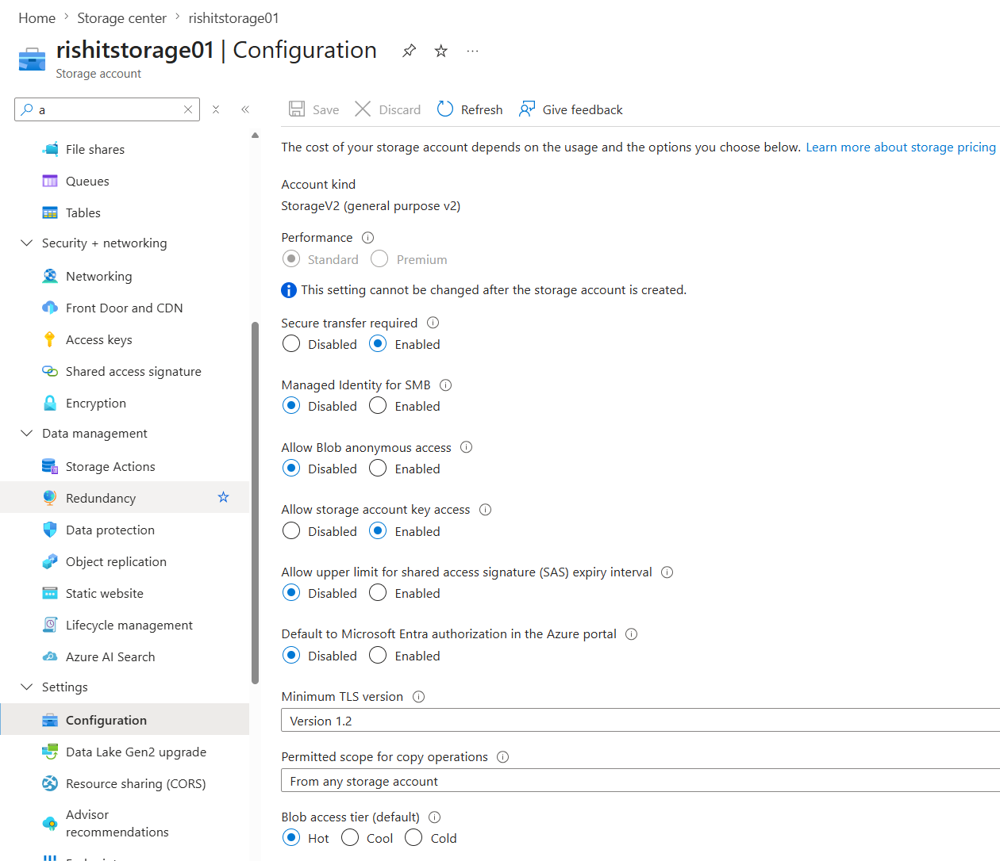

#### Option 2 — Use Shared Access Signature (SAS)

    1. Go to Security + Networking → Shared Access Signature

    2. Select permissions (Read/Write based on requirement)

    3. Generate SAS Token

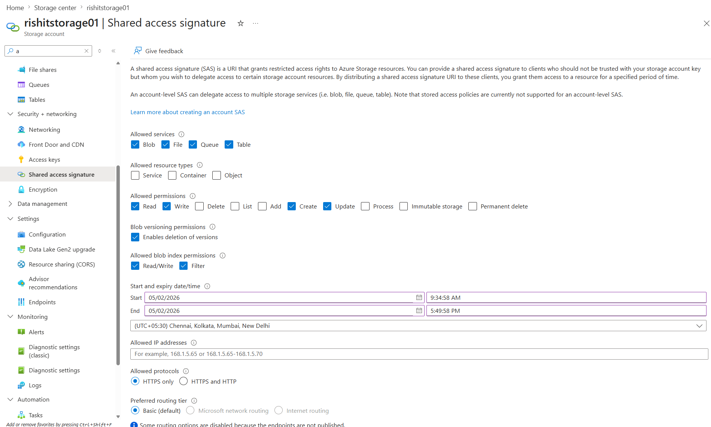

```SAS provides temporary secure access without sharing account keys.```

#### Option 3 — Role Based Access Control (RBAC)

    1. Go to Access Control (IAM)

    2. Click Add Role Assignment

    3. Assign roles like:

        Storage Blob Data Reader

        Storage Blob Data Contributor

```RBAC ensures controlled and secure access using Azure identities.```

## Step 5: Test Storage Access

1. Open uploaded blob


2. Copy Blob URL or use SAS URL


3. Try accessing from browser or application

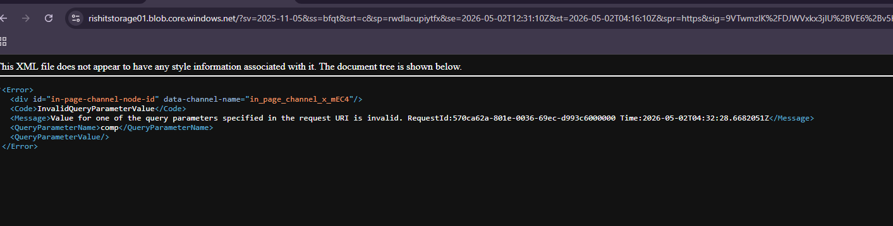

```If security is configured correctly, access will follow defined permissions.```

---

# Hands on Lab 2 - Securely Access Azure Storage from a VM using Managed Identities

## Step 1: Create the Storage Account

```First, we need the destination for our data.```

1. Go to the Azure Portal and search for Storage Accounts.

2. Click + Create.

3. Basics Tab:

    Resource Group: Select your existing group (```RG-<your-name>-StorageLab``` ).

    Storage account name: Enter a globally unique name (e.g., ```labstorage + <your_name> + random numbers```). All lowercase, no spaces.

    Region: Select the same region as your VM.

    Performance: ```Standard```.

    Redundancy: Locally-redundant storage (LRS) is fine for this lab to keep costs low.

4. Click Review + Create, then click Create.

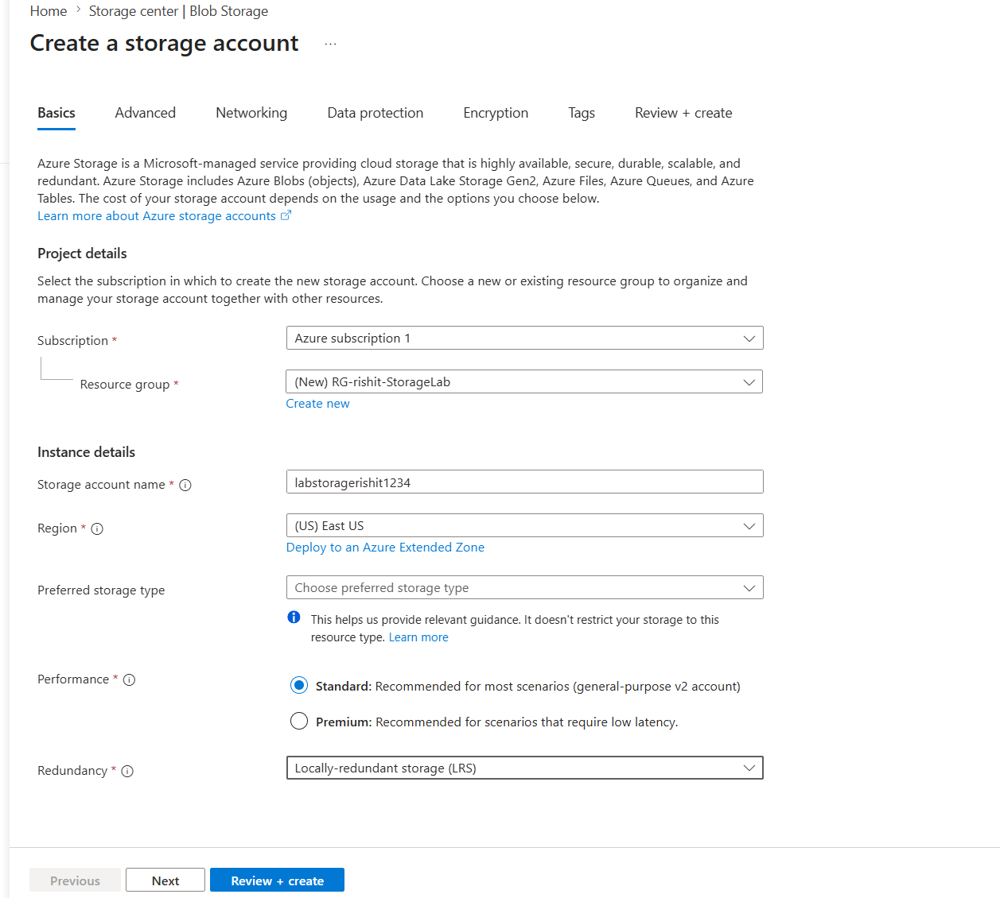

## Step 2: Create a Blob Container

```Containers are like folders inside your Storage Account where files (blobs) live.```

1. Once the Storage Account is deployed, click Go to resource.

2. On the left menu, under Data storage, click Containers.

3. Click + Container.

4. Name it ```lab-data +<your_name>``` and leave the Anonymous access level as Private (no 
anonymous access).

5. Click Create.

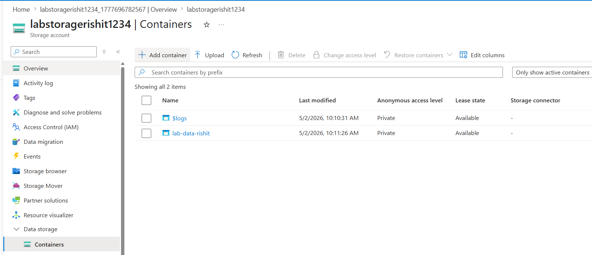

## Step 3: Enable Managed Identity on the VM

```This step gives your VM an identity in Azure Entra ID, allowing it to authenticate to other Azure services automatically.```

1. Search for Virtual Machines and select your existing VM.

2. On the left menu, scroll down to Security + Networking and click Identity.

3. Under the System assigned tab, toggle Status to On.

4. Click Save and confirm by clicking Yes.

    Azure has now registered this VM as an authorized entity.

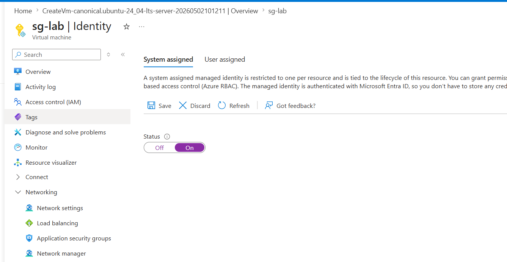

## Step 4: Grant the VM Access via RBAC

```Now we must tell the Storage Account that this specific VM is allowed to interact with its data.```

1. Go back to your Storage Account.

2. On the left menu, click Access Control (IAM).

3. Click + Add -> Add role assignment.

4. Role Tab: Search for and select Storage Blob Data Contributor (This allows reading, writing, and deleting blobs). Click Next.

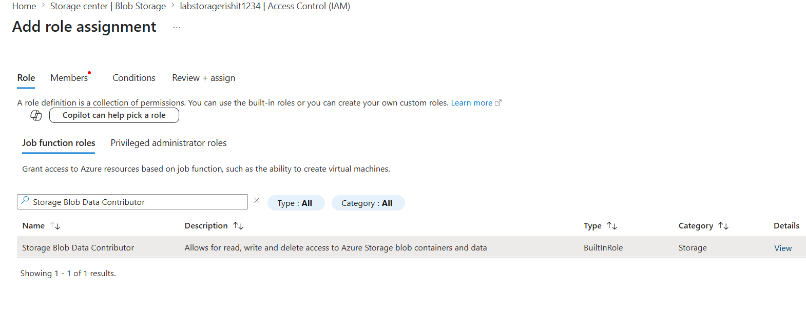

5. Members Tab:

    Next to "Assign access to", select Managed identity.

    Click + Select members.
    
    In the right-hand pane, choose your Subscription, select Virtual Machine as the Managed identity type, and click on your VM. Click Select.

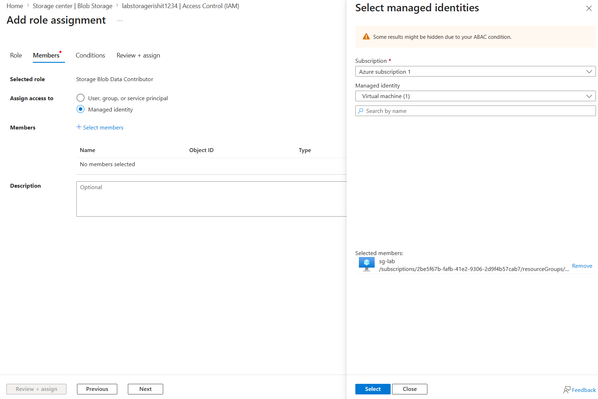

6. Click Review + assign twice to apply the role. (Note: RBAC changes can take 1-2 minutes to propagate).

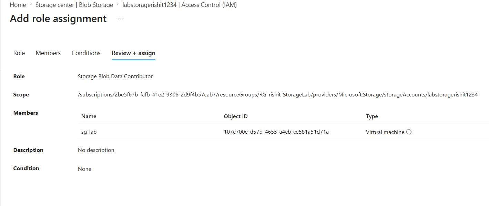

## Step 5: Test the Secure Connection from the VM

```Let's prove that the VM can access the storage without needing a password or access key.```

1. Log in to your VM (via SSH for Linux or RDP for Windows).

2. Ensure the Azure CLI is installed on the VM. (If using an Azure marketplace img/image, it might already be there. If not, download it via the browser or package manager).


    ```curl -sL https://aka.ms/InstallAzureCLIDeb | sudo bash```

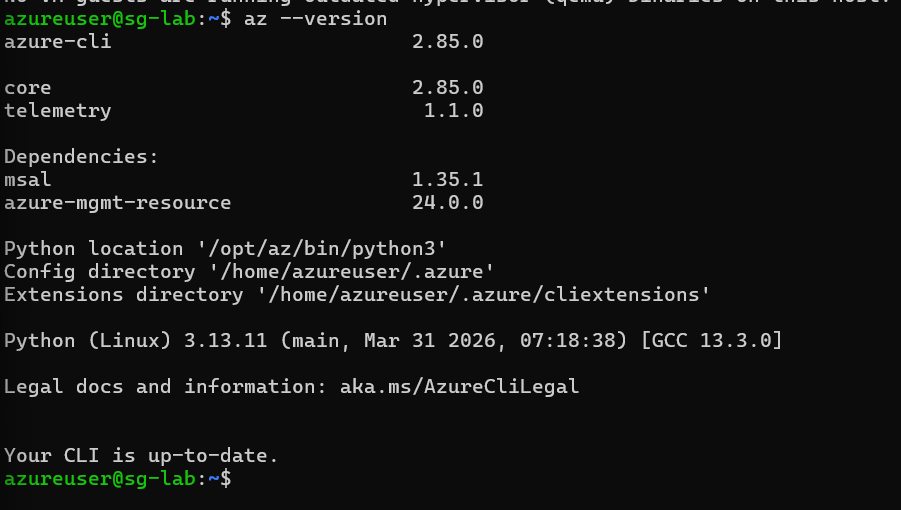

3. Open a Command Prompt / Terminal on the VM.

4. Authenticate using the VM's identity by running this exact command:
    ```az login --identity```

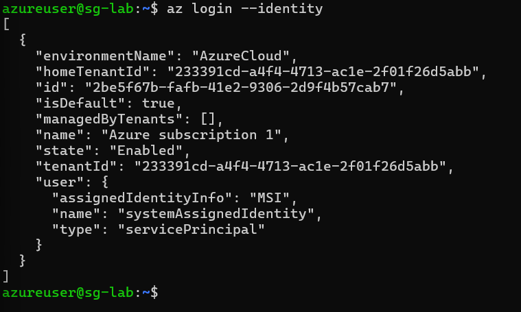

You should see a JSON output confirming you are logged in as the System Assigned Identity.

5. Upload a test file: Let's create a quick text file and upload it to the container we made in Step 2.

    For Windows Command Prompt:
    ```echo "Hello from the VM!" > testfile.txt
    az storage blob upload --account-name YOUR_STORAGE_ACCOUNT_NAME --container-name <container-name> --name testfile.txt --file testfile.txt --auth-mode login
    ```

    For Linux Terminal:
    ```echo "Hello from the VM!" > testfile.txt
    az storage blob upload --account-name YOUR_STORAGE_ACCOUNT_NAME --container-name <container-name> --name testfile.txt --file testfile.txt --auth-mode login
    ```
    (Make sure to replace YOUR_STORAGE_ACCOUNT_NAME with the name you chose in Step 1).

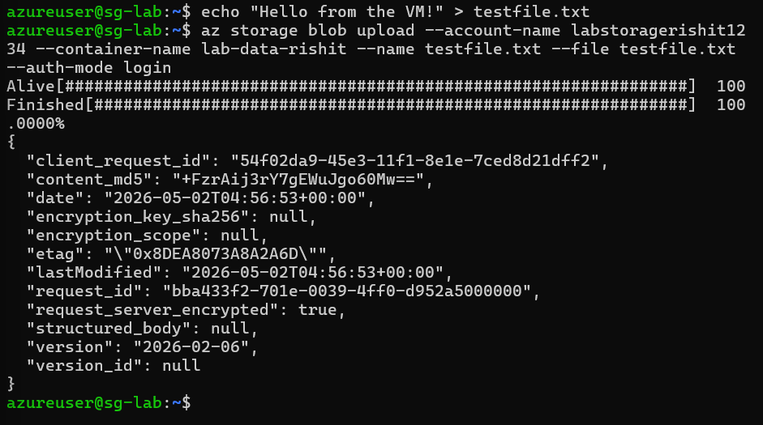

6. Verify: Go back to the Azure Portal on your local machine, navigate to your Storage Account -> Containers -> your-container. You should see testfile.txt successfully uploaded

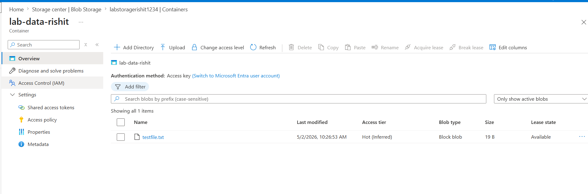

