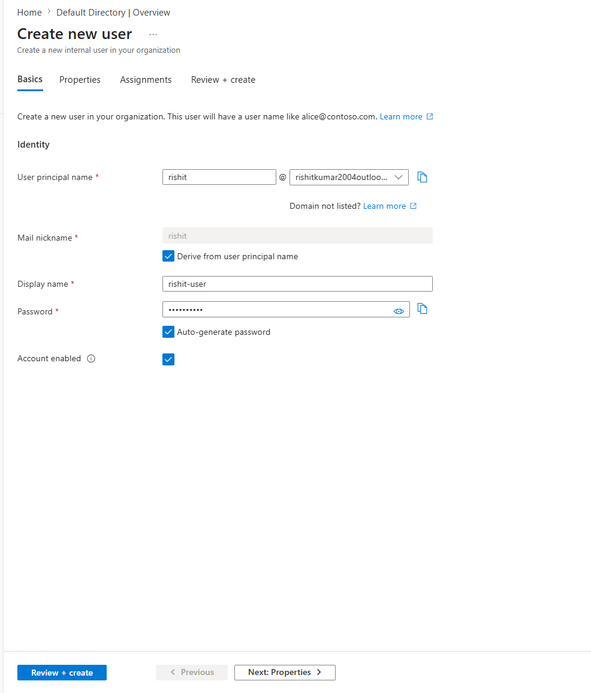
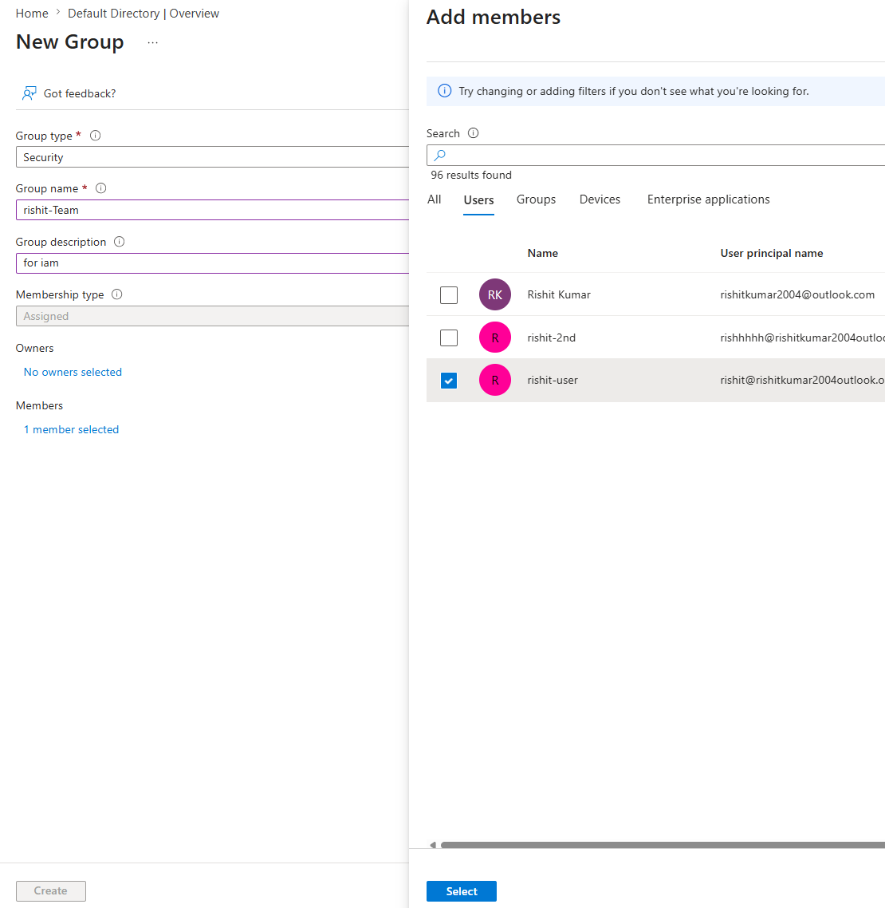
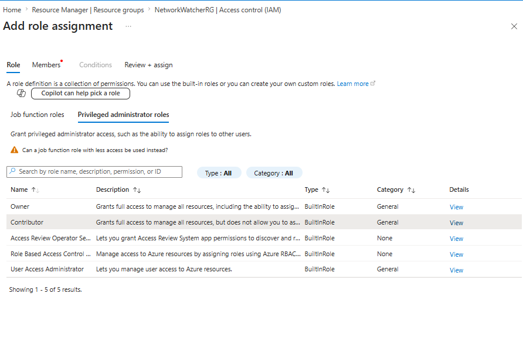
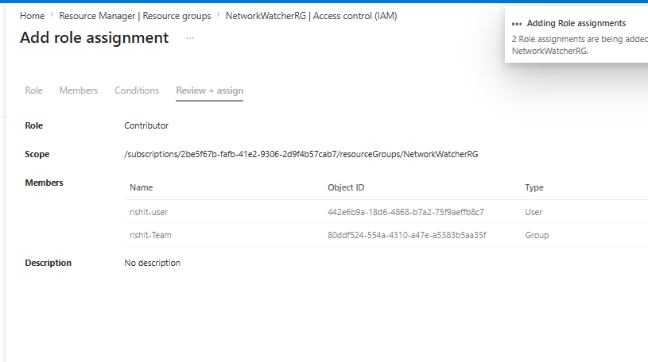
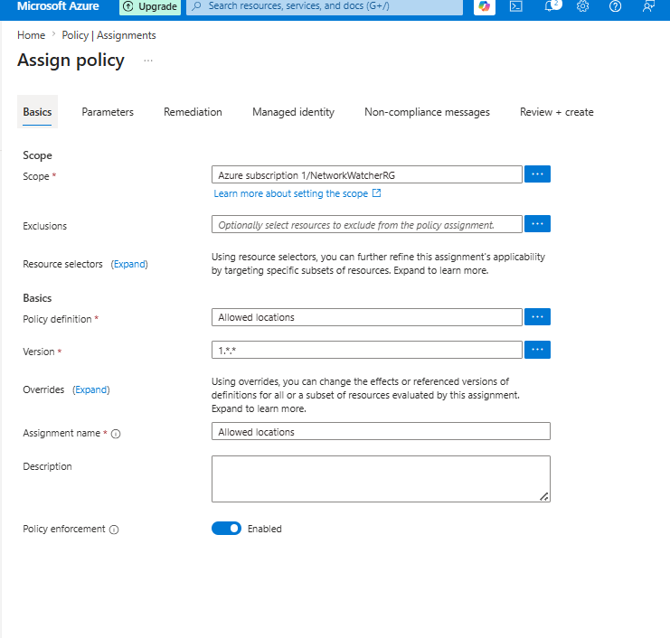
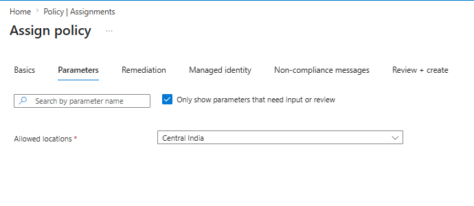
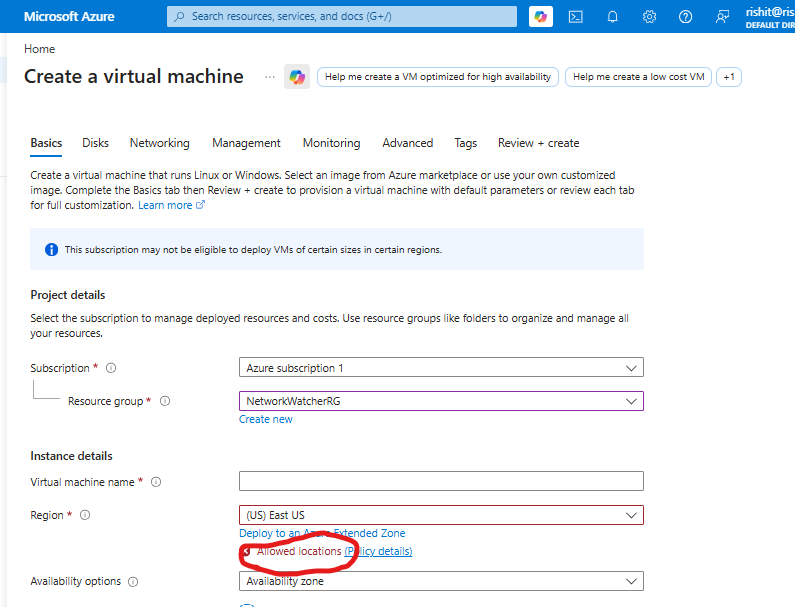

# Hands-On Lab – Manage Users, Assign RBAC Roles & Apply Azure Policies

```This lab helps you create users and groups in Azure, assign role-basedaccess control (RBAC) permissions, and apply governance policies to enforce standards.```

## Step 1: Create Users & Groups in Azure

```Objective: Create Azure users and organize them into groups for easier access management.```

### Create a User
Steps:
1. Login to Azure Portal
2. Search Microsoft Entra ID
3. Click Users
4. Click + New User → Create new user
5. Configure:
    User principal name: <your-user>@<yourdomain>.onmicrosoft.com
    Name: <Your Name>
    Auto-generate password or set manually
6. Click Create



```User account is successfully created.```

### Create a Group
Steps:
1. In Microsoft Entra ID
2. Click Groups
3. Click + New Group
4. Configure:
    Group type: Security
    Group name: <your-name>-Team
    Add Members: Select the created user
5. Click Create



```Group is created and user is added successfully.```

## Step 2: Assign RBAC Roles
```Objective: Provide controlled access to Azure resources using Role-Based Access Control (RBAC).```


Azure uses built-in roles such as:
    Reader
    Contributor
    Owner
    Assign Role to a User or Group


Steps:
1. Go to your Resource Group ( <your-name>-rg )

2. Click Access Control (IAM)

3. Click + Add → Add role assignment

4. Select Role:

    Example: Contributor



5. Click Next

6. Assign access to:

    Select User, group, or service principal

7. Click Select Members

8. Choose:

    <Your User> OR Dev-Team

9. Click Review + Assign



```Role assignment completed successfully.```


#### Verify Role Assignment
    1. In Access Control (IAM)
    2. Click Role assignments
    3. Confirm your user/group appears with assigned role

```RBAC is now properly configured.```

## Step 3: Apply Azure Policy

```Objective: Enforce governance rules across Azure resources.```

Azure Policy ensures compliance such as:

    Restrict allowed regions
    Enforce tagging
    Restrict VM sizes
    Require HTTPS
    Create & Assign Policy


Steps:
1. Search Policy in Azure Portal

2. Click Assignments

3. Click + Assign policy

4. Scope:Select your Resource Group (<your-name>-rg )

5. Click Next

6. Select Policy Definition:

Example: Allowed locations



7. Click Next

8. Specify allowed region:

Example: 
    Central India



9. Click Review + Create


```Policy is now enforced on the selected scope.```


Verify Policy Enforcement
1. Try creating a resource in a different region
2. Azure will block deployment due to policy restriction



```This confirms governance is working correctly```