# VM → ACR → AKS (Public) using Managed Identity

## Lab Goal

Build an architecture where:

    a public VM is used to build Docker images

    the VM pushes images to Azure Container Registry

    AKS is publicly accessible

    AKS is accessed from your local terminal

    AKS pulls images from ACR using Managed Identity

    when a new img/image version is pushed to ACR, you update the Kubernetes manifest and redeploy

    the browser shows the updated version of the application


## Architecture:


### Step 1: Create Resource Group
```
Go to:
    Azure Portal → Resource groups → Create

Fill in:
    Resource Group: [Your-Name]-rg-aks-lab
    Region: choose one region and use it for all resources

Click Review + Create
```

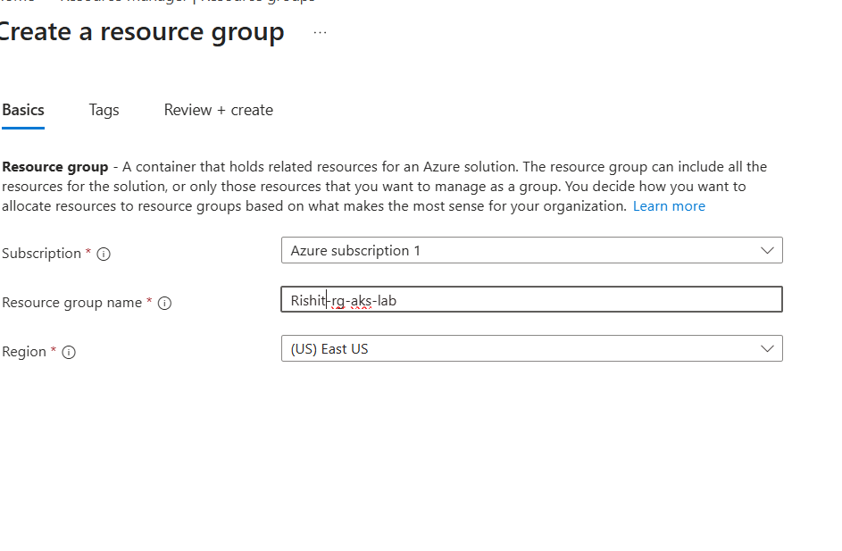

### Step 2: Create Virtual Network
```
Go to:
    Azure Portal → Virtual Networks → Create

Basics:
    Resource Group: [Your-Name]-rg-aks-lab
    Name: [Your-Name]-vnet-aks
    Region: same as resource group

IP Addresses:
    Address space: 10.0.0.0/16    

Subnets:
    Create these two subnets:
        vm-subnet: 10.0.1.0/24
        aks-subnet: 10.0.2.0/24

Click Review + Create
```

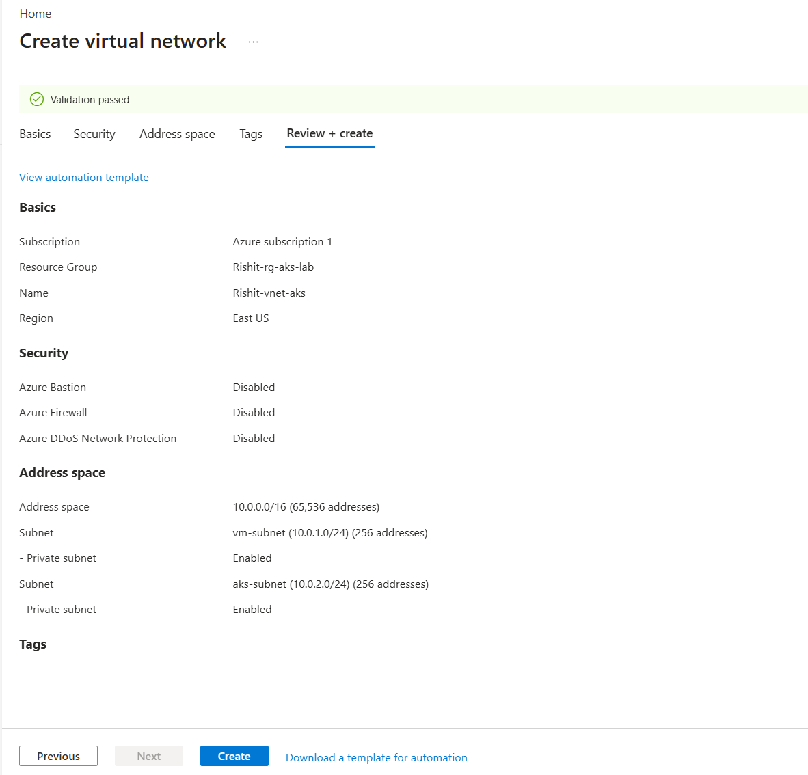

### Step 3: Create Virtual Machine
```
Go to:
    Azure Portal → Virtual Machines → Create

Basics:
    Resource Group: [Your-Name]-rg-aks-lab
    Virtual machine name: [Your-Name]-vm-jumpbox
    Region: same as VNet
    Image: Ubuntu Server 22.04 LTS
    Size: any small lab size is fine

Administrator Account
    Choose one: SSH public key, or
    Password

Networking
    Virtual network: [Your-Name]-vnet-aks
    Subnet: vm-subnet
    Public IP: Enabled
    NIC network security group: Basic

Recommended:
    allow SSH only from your own public IP

Click Review + Create
```

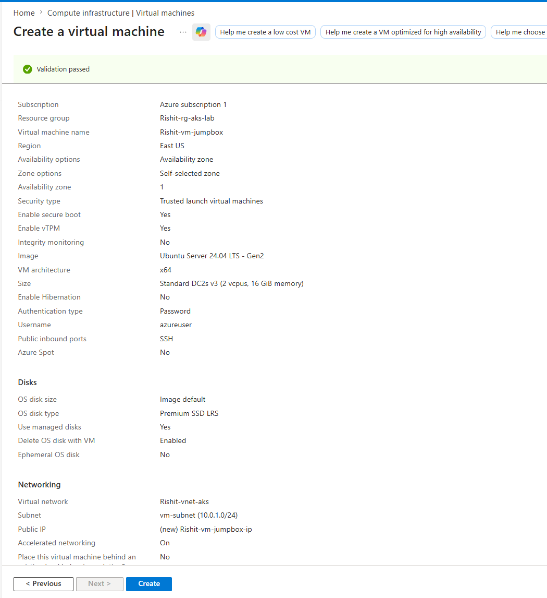

### Step 4: Create Azure Container Registry
```
Go to:
    Azure Portal → Container registries → Create

Fill in:
    Resource Group: [Your-Name]-rg-aks-lab
    Name: [Your-Name]acr
    Location: same region
    SKU: Standard

Click Review + Create
```

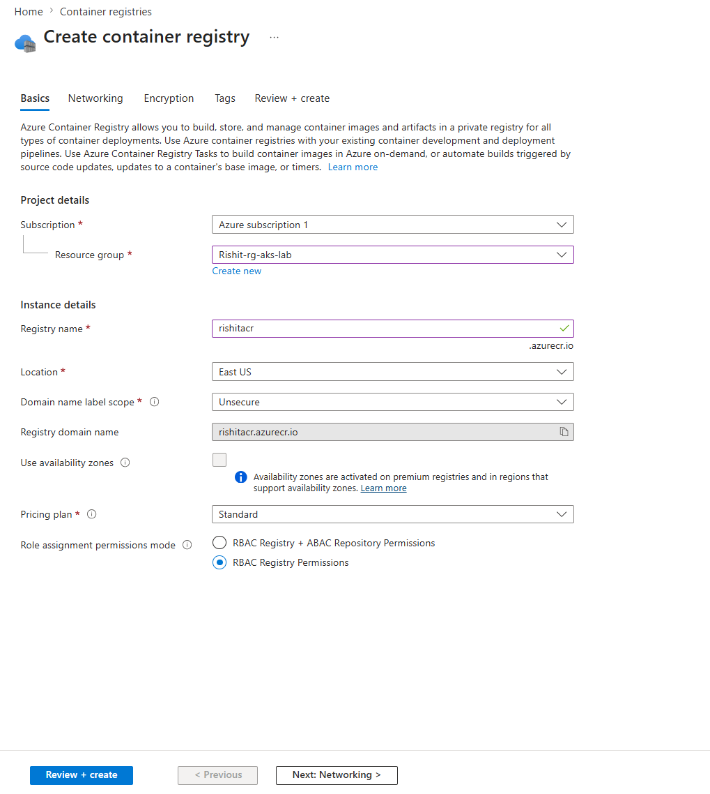

### Step 5: Connect to the VM

From your laptop, connect to the VM.
Example:
```ssh azureuser@<VM-Public-IP>```

If using Azure CLI SSH:
```
az ssh vm \
    --resource-group [Your-Name]-rg-aks-lab \
    --name [Your-Name]-vm-jumpbox
```

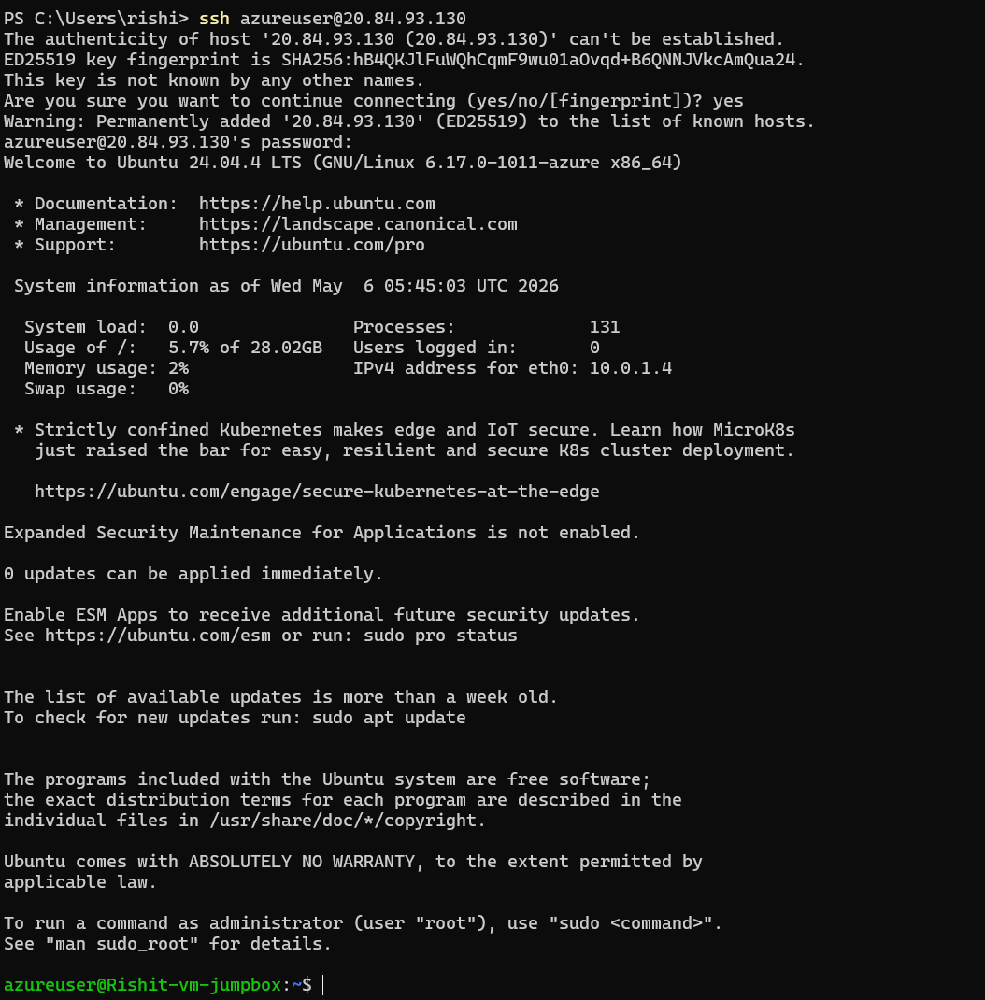

### Step 6: Install Docker and Azure CLI on VM

Inside the VM:
```
sudo apt update
sudo apt install -y ca-certificates curl apt-transport-https lsb-release gnupg
```

Install Docker:
```
curl -fsSL https://get.docker.com | sudo sh
sudo usermod -aG docker $USER
newgrp docker
```

Install Azure CLI:
```curl -sL https://aka.ms/InstallAzureCLIDeb | sudo bash```

Verify:
```
docker --version
az version
```

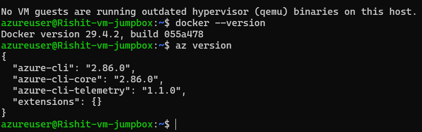

### Step 7: Create Custom Web App Files on VM

Create a working directory:
```
mkdir aks-webapp
cd aks-webapp
```
Create ```index.html``` :
```
<!DOCTYPE html>
<html>
  <head>
    <title>Version 1</title>
    <style>
      body {
        font-family: Arial, sans-serif;
        background-color: #f4f7fb
        text-align: center;
        padding-top: 80px;
      }
      .card {
        width: 60%;
        margin: auto;
        padding: 30px;
        background: white;
        border-radius: 12px;
        ;
        box-shadow: 0 0 10px rgba(0,0,0,0.1);
      }
      h1 {
        color: #0078d4
      }
    </style>
  </head>
  <body>
    ;
    <div class="card">
      <h1>Welcome to AKS - Version 1</h1>
      <p>This img/image was built on the VM and pushed to Azure Container Registry.</p>
    </div>
  </body>
</html>
```

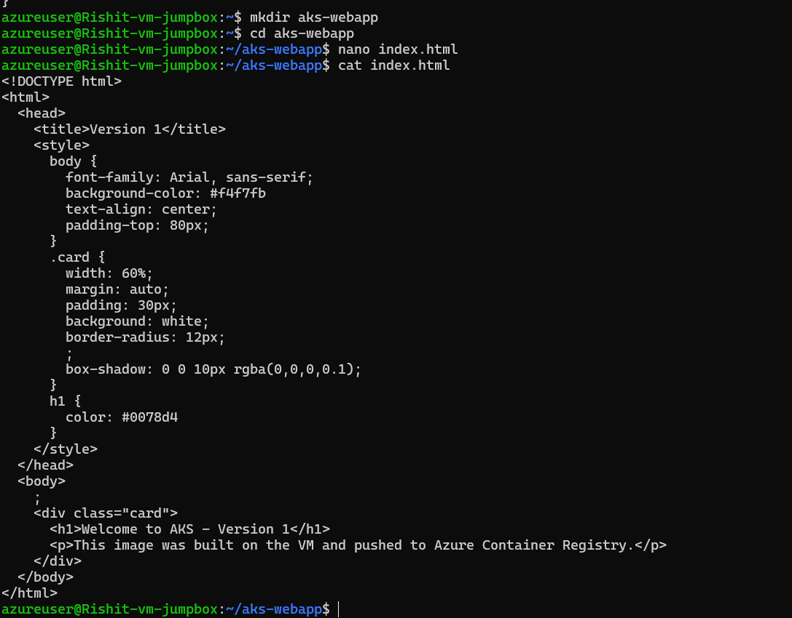

Create ```Dockerfile``` :
```
FROM nginx:alpine
COPY index.html /usr/share/nginx/html/index.html
EXPOSE 80
```

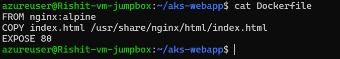

### Step 8: Login to Azure and Push Image to ACR from VM

Login:
```az login```

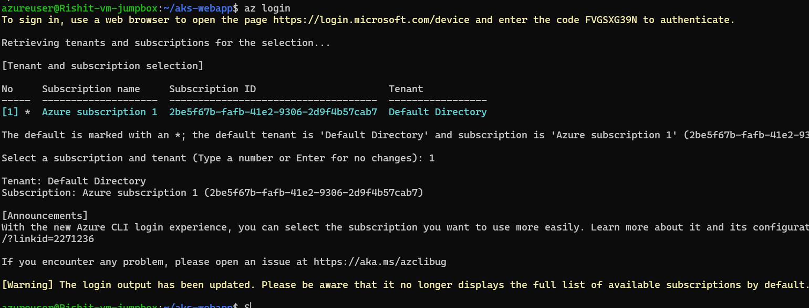

Login to ACR:
```az acr login --name [Your-Name]acr```

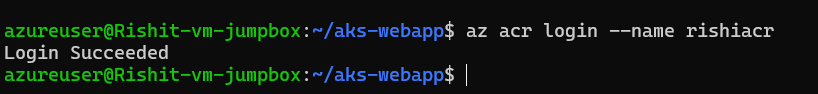

Build the img/image:
```docker build -t [Your-Name]acr.azurecr.io/webapp:v1 .```

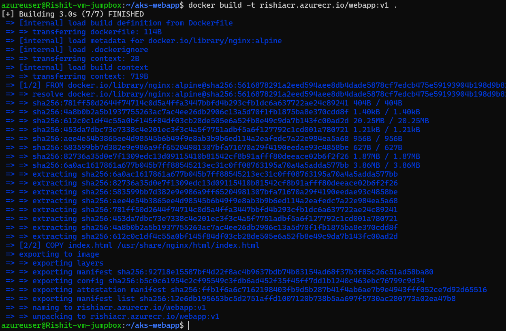

Push the img/image:
```docker push [Your-Name]acr.azurecr.io/webapp:v1```

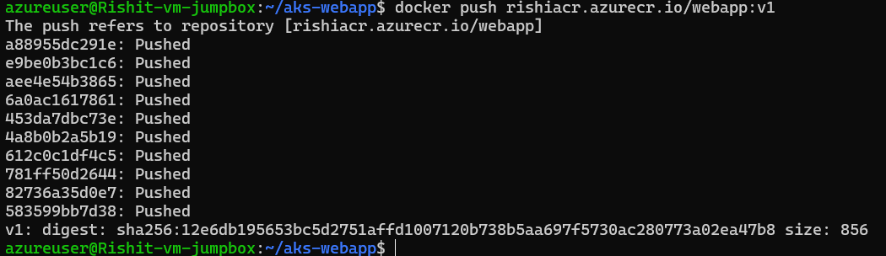

You now have version 1 stored in ACR.

### Step 9: Create AKS Cluster from Portal
```
Go to:
    Azure Portal → Kubernetes services → Create

Basics:
    Resource Group: [Your-Name]-rg-aks-lab
    Kubernetes cluster name: [Your-Name]-aks-public
    Region: same as VNet
    Node count: 1 or 2 for lab

Node Pools
    Keep defaults or choose a small VM size for lab use.

Access
    Since this requirement is updated:
        Do not choose private cluster
        keep AKS publicly accessible

Identity
    Select System-assigned managed identity

This is required for pulling images from ACR securely.

Networking
    Network configuration: Azure CNI
    Virtual network: [Your-Name]-vnet-aks
    Subnet: aks-subnet

Create the cluster.
```

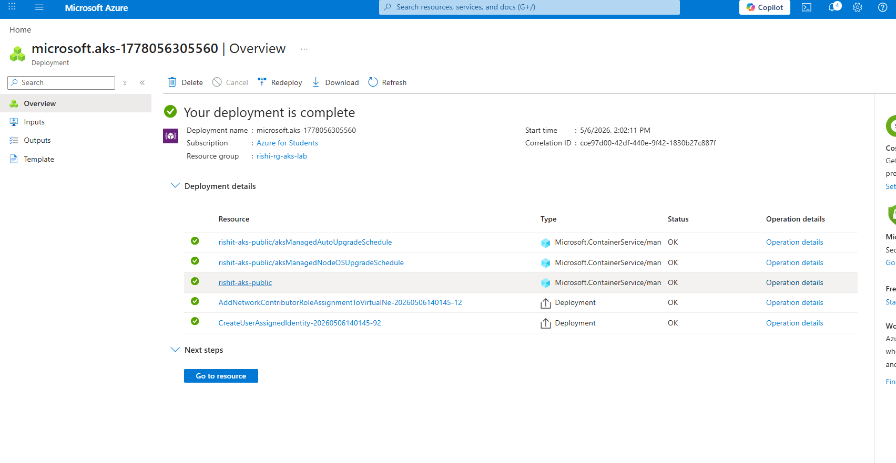

### Step 10: Attach ACR to AKS

After AKS is created:

Go to:

```AKS → Settings → Container Registry```

Click Attach

Select:
    [Your-Name]acr

This gives AKS permission to pull images from ACR using managed identity.

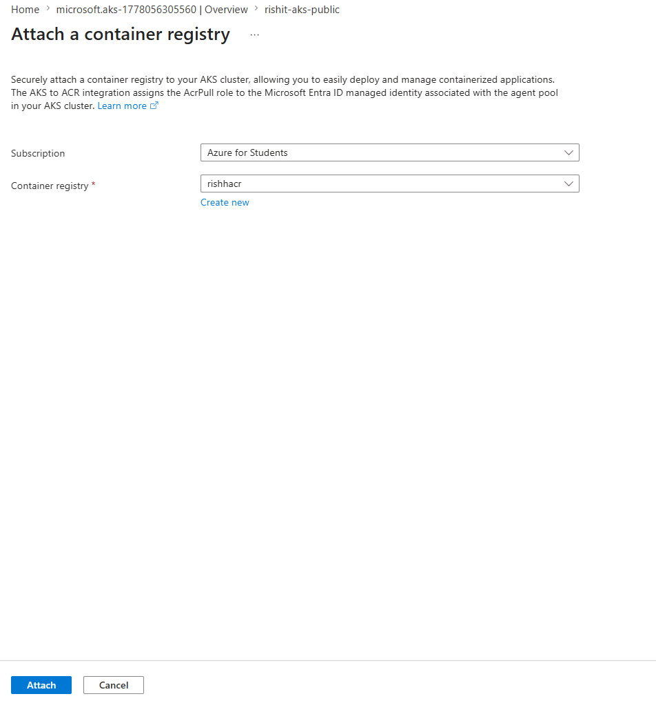

### Step 11: Connect to AKS from Your Local Terminal

Now switch to your local laptop terminal.
Login:```az login```

Get AKS credentials:
```
az aks get-credentials \
    --resource-group [Your-Name]-rg-aks-lab \
    --name [Your-Name]-aks-public
```

Verify:
```kubectl get nodes```

This confirms you are managing AKS from your local terminal, not from the VM.

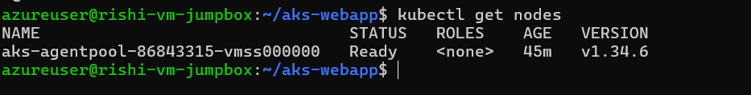

### Step 12: Create Kubernetes Manifest for Version 1

On your local machine, create a file named ```deployment.yaml```:
```
apiVersion: apps/v1
kind: Deployment
metadata:
    name: webapp
spec:
    replicas: 2
    selector:
        matchLabels:
            app: webapp
    template:
        metadata:
            labels:
            app: webapp
spec:
    containers:
    - name: webapp
        img/image: [Your-Name]acr.azurecr.io/webapp:v1
        ports:- containerPort: 80
---
apiVersion: v1
kind: Service
metadata:
    name: webapp-service
spec:
    type: LoadBalancer
    selector:
        app: webapp
    ports:
    - port: 80
    targetPort: 80
```

Apply it:
```
kubectl apply -f deployment.yaml
```

Check:
```
kubectl get pods
kubectl get svc
```

Wait until the service gets an EXTERNAL-IP.

Example:
```kubectl get svc webapp-service```

Once the public IP is assigned, open it in the browser:
```http://<EXTERNAL-IP>```

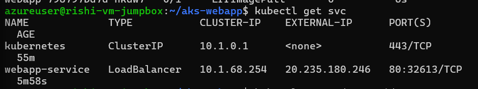

You should see:
```Welcome to AKS - Version 1```

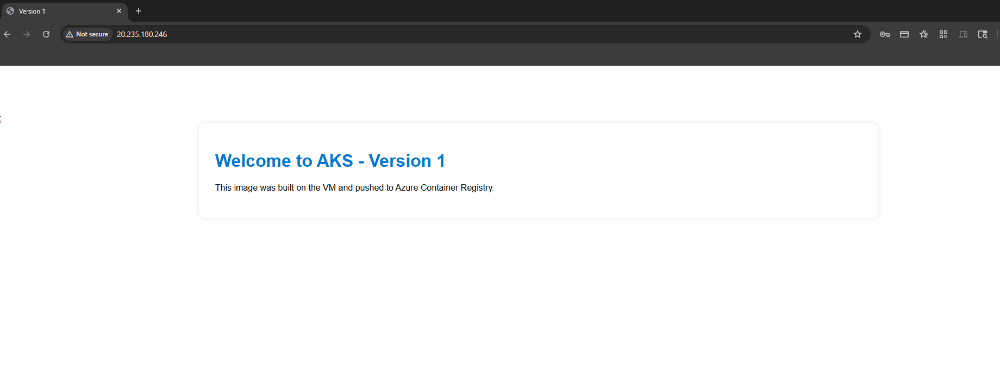

### Step 13: Update the Application to Version 2

Now go back to the VM.

Edit ```index.html``` :
```
<!DOCTYPE html>
<html>
<head>
    <title>Version 2</title>
    <style>
        body {
            font-family: Arial, sans-serif;
            background-color: #fff8e7;
            text-align: center;
            padding-top: 80px;
        }
        .card {
            width: 60%;
            margin: auto;
            padding: 30px;
            background: white;
            border-radius: 12px;
            box-shadow: 0 0 10px rgba(0,0,0,0.1);
        }
    h1 {
        color: #d83b01 ;
    }
    </style>
</head>
<body>
    <div class="card">
        <h1>Welcome to AKS - Version 2</h1>
        <p>The img/image has been rebuilt on the VM and pushed again to AC
        </p>
    </div>
</body>
</html>
```

Build the new version:

```docker build -t [Your-Name]acr.azurecr.io/webapp:v2 .```

Push version 2:

```docker push [Your-Name]acr.azurecr.io/webapp:v2```

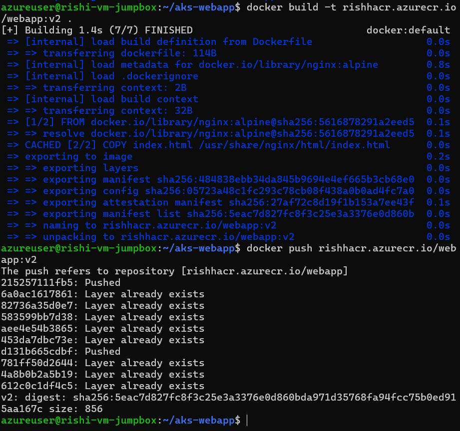

### Step 14: Update Kubernetes Manifest from Local Terminal

Now return to your local terminal.

Edit ```deployment.yaml``` and change the img/image from:
```img/image: [Your-Name]acr.azurecr.io/webapp:v1```

to:
```img/image: [Your-Name]acr.azurecr.io/webapp:v2```

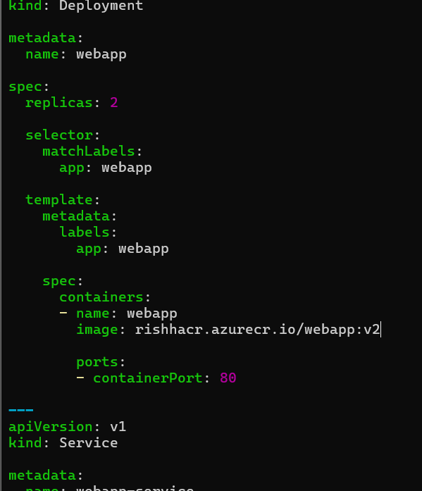

Apply again:
```kubectl apply -f deployment.yaml```

Check rollout:
```kubectl rollout status deployment/webapp```

Check pods:
```kubectl get pods```

Refresh the same browser page using the service public IP.

Now the browser should show:
```Welcome to AKS - Version 2```

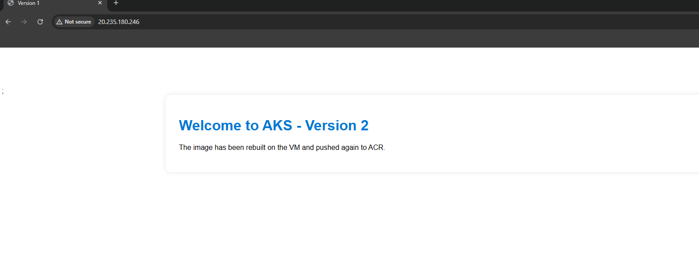

### What Happened in This Lab

You used:

    the VM to build container images

    the VM to push images to ACR

    your local terminal to connect to AKS

    managed identity so AKS could pull images from ACR

    a Kubernetes deployment update to move from img/image v1 to v2

    a public LoadBalancer service so the browser showed the application


### Final Architecture

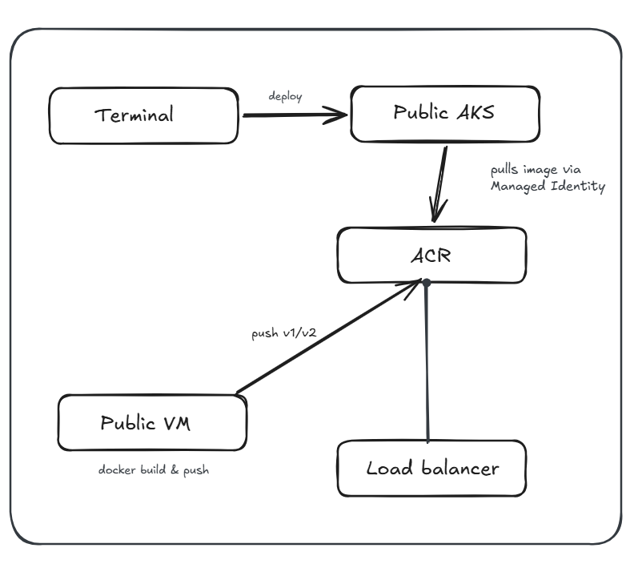