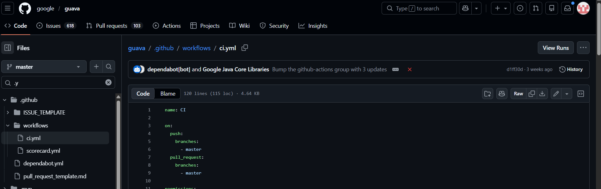

# Task 1: Manual Deployment risks:
1.  Inconsistent Environments
    Dev, staging, and production may differ
    “Works on my machine” problem becomes common
2.  No Version Control for Deployments
    Hard to track what was deployed and when
    Difficult to roll back to a stable version
3.  Slow and Inefficient Process
    Manual steps take time
    Delays in releasing features or fixes
4.  Lack of Automation Testing
    No automatic validation before deployment
    Bugs can reach production easily

# Task 2: Explore github actions in a Repository:

From the workflow file:
1.  Triggered on:
push
pull_request
2.  Actions:
build
Uses Java (Gradle/Maven)
Compiles the project
3.  test:
Runs unit tests
Validates functionality

# Task 3: Arrange the CI/CD Pipeline Flow
### Correct CI/CD Pipeline Order
1.  Write code
2.  Build Tests (build the application / prepare artifacts)
3.  Run tests
4.  Deploy Application
5.  Monitor Application
