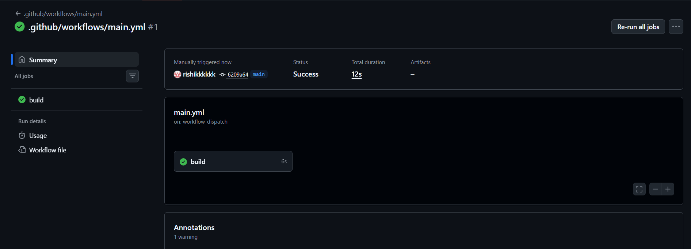
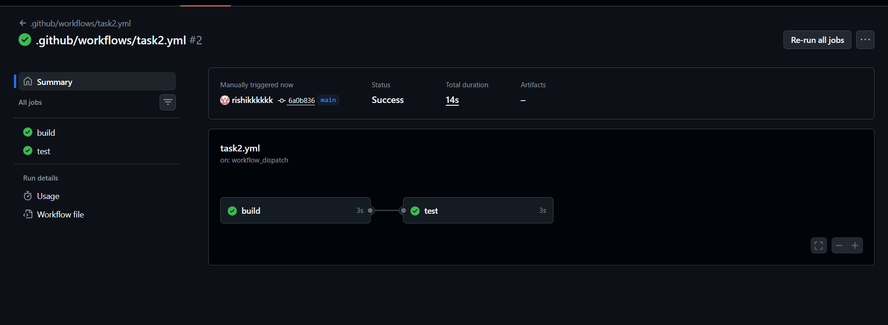
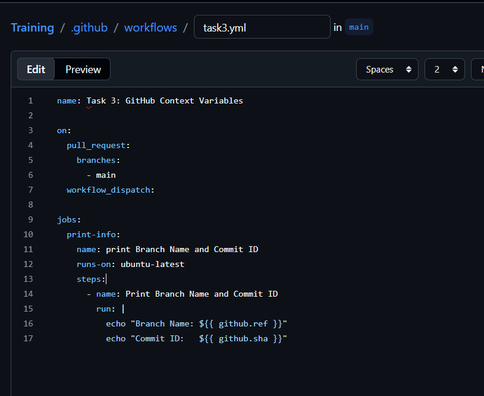
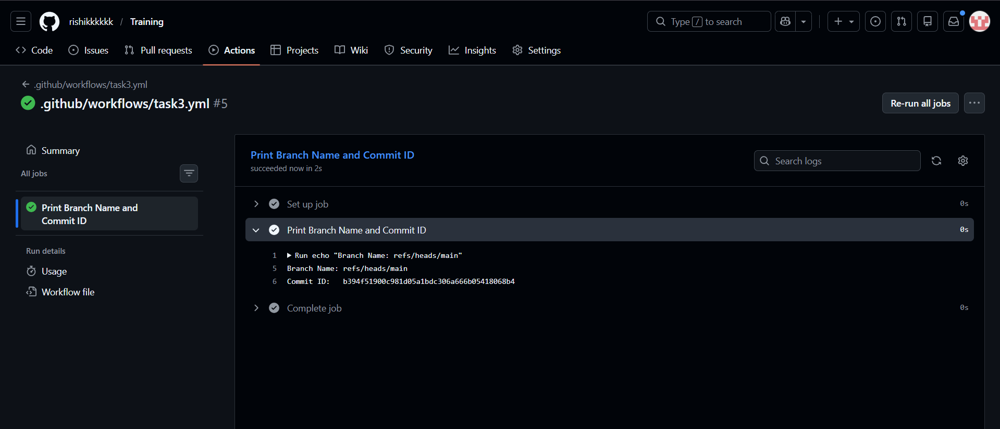
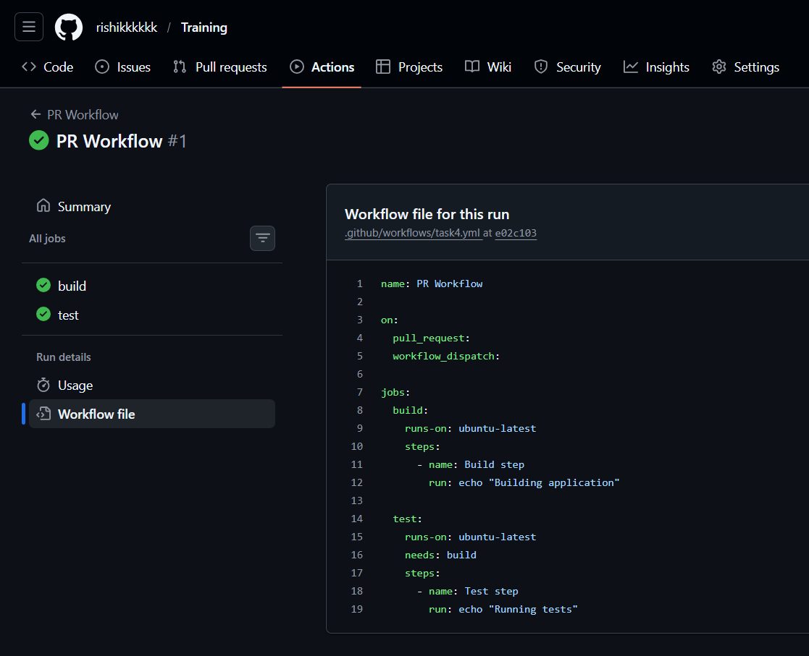
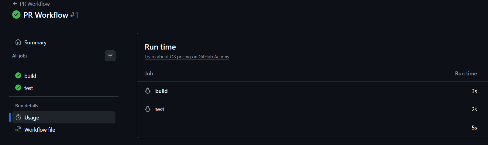
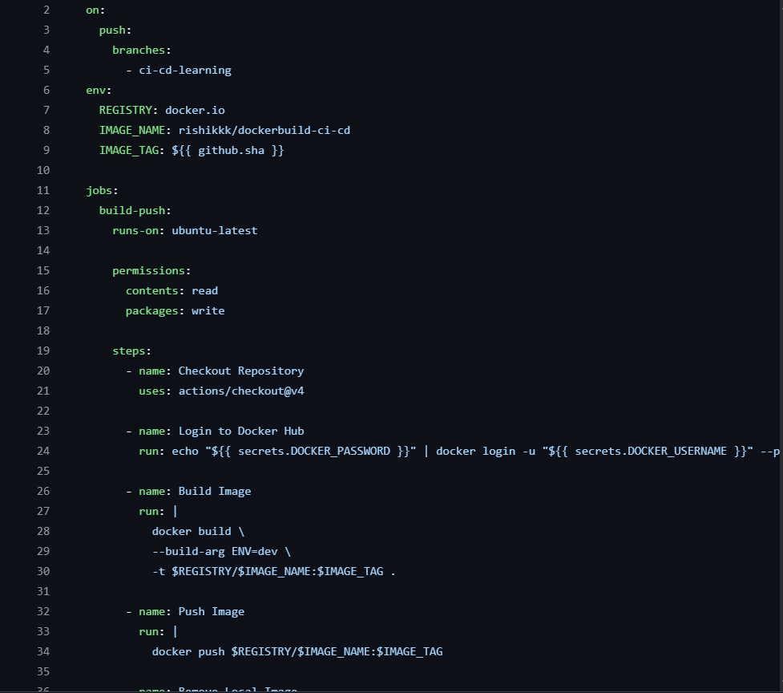
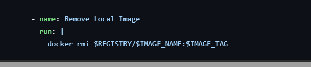
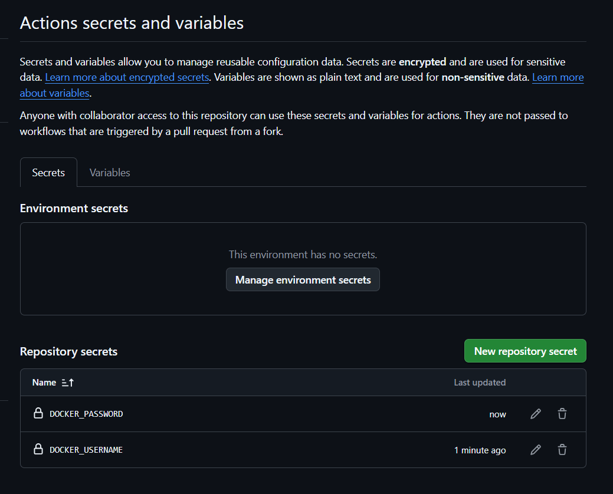

# Task 1: Trigger Configuration:
```
on:
  pull_request:
    branches:
      - main   # or your target branch
  workflow_dispatch:

jobs:
  build:
    runs-on: ubuntu-latest
    steps:
      - uses: actions/checkout@v2
```


# Task 2: Job Dependency Design:
```
jobs:
  build:
    runs-on: ubuntu-latest
    steps:
      - name: Build step
        run: echo "Building application..."

  test:
    runs-on: ubuntu-latest
    needs: build
    steps:
      - name: Test step
        run: echo "Running tests..."
```

# Task 3: Using GitHub Context Variables






# Task 4: Implement a Pull Request Workflow
Trigger: Pull Request
Job: Build (can be a simple echo command)
Job: Test (runs after Build)





# Task 5 : Docker Build & Push
Scenario:
Build a Docker images/day2/image and push it to a container registry using environment variables for registry,
repository, and images/day2/image tag.
Task:



