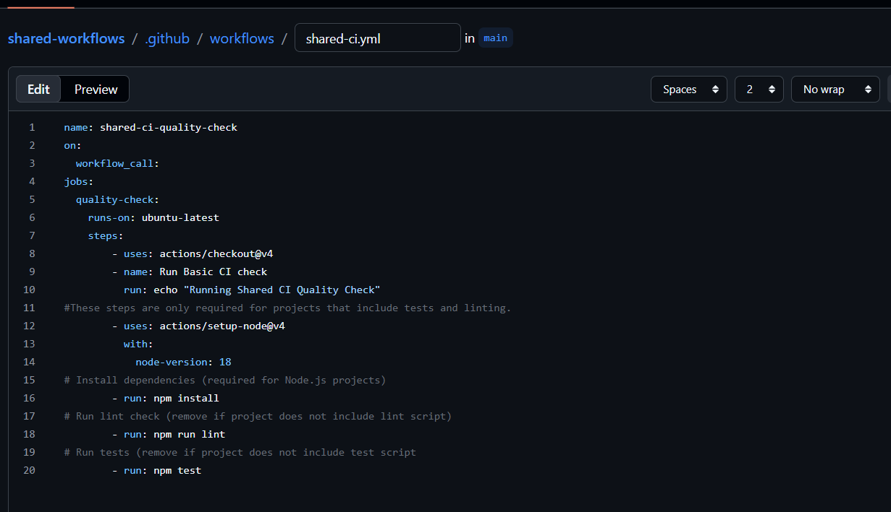
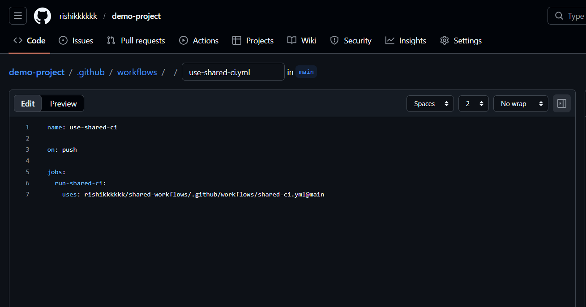
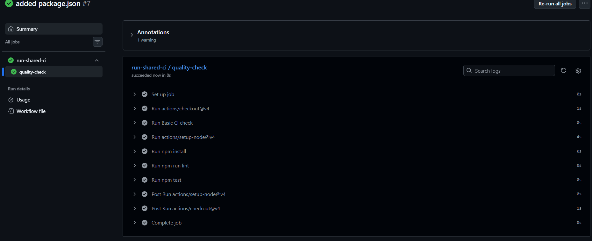
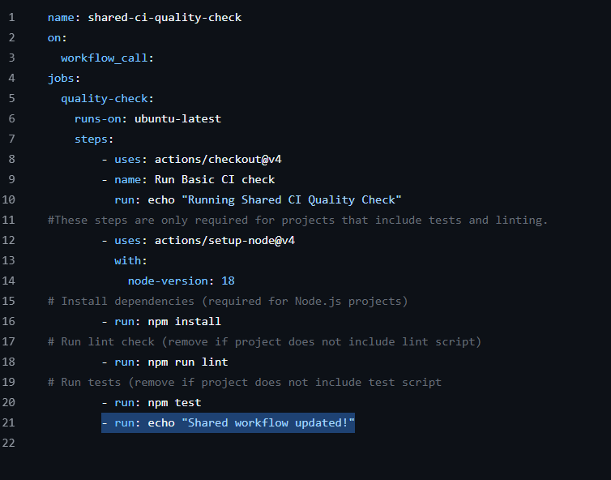
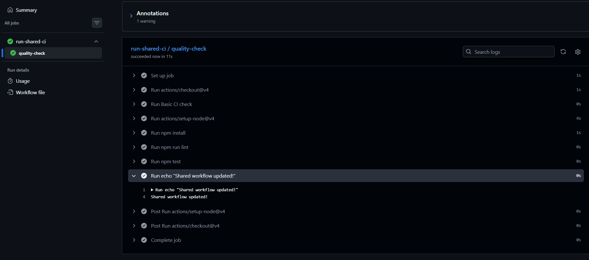
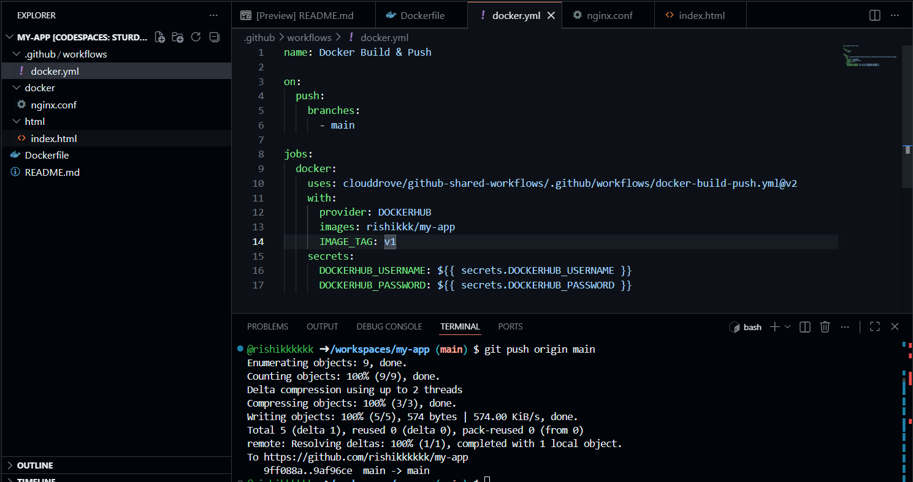
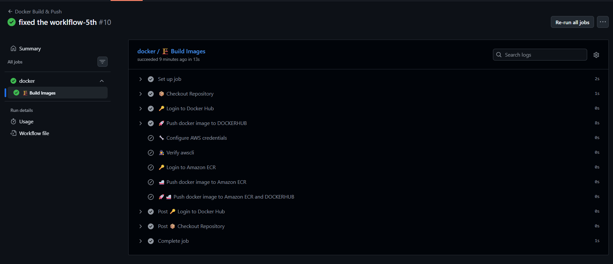
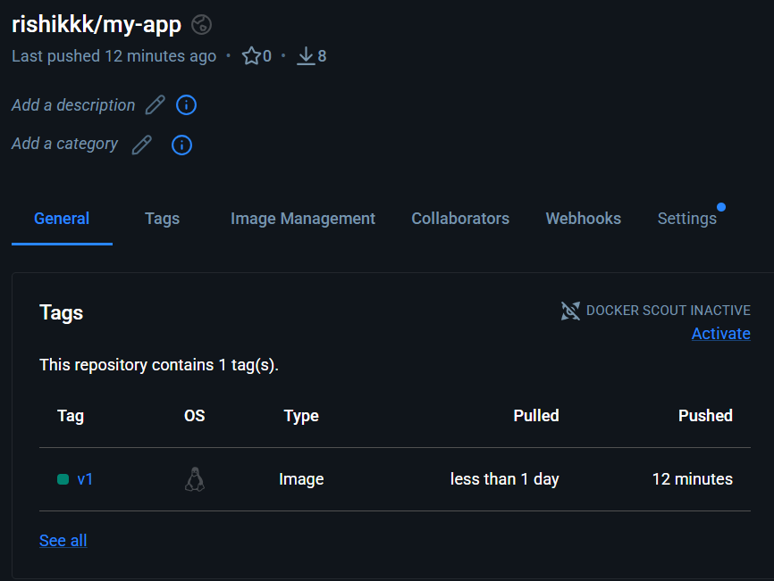

# Task 1: Create a Shared CI Quality Check Workflow
## Scenario
Your organization wants every project to run a Standard CI quality check
Instead of duplicating the same workflow in every repo, you will create a shared workflow.
Steps:
Create a central repository:
``` shared-workflows ```
Create workflow file:
``` .github/workflows/shared-ci.yml ```
Add workflow:


### Link:
``` https://github.com/rishikkkkkk/shared-workflows/blob/main/.github/workflows/shared-ci.yml ```

# Task 2: Call Shared Workflow from Another Repositor
Create another repository:
```demo-project```
Create workflow:
```.github/workflows/use-shared-ci.yml```
Add workflow:

Checked the workflow by pushing json:


### Link:
``` https://github.com/rishikkkkkk/demo-project/blob/main/.github/workflows/use-shared-ci.yml ```

# Task 3: Modify Shared Workflow & Observe Impact
Update shared workflow:
```- run: echo "Shared workflow updated!"```

Pushed changes.
Triggers workflow in demo project.
Observe updated output.


# Built and pushed image to dockerhub using shared-workflow:
## Shared-workflow for build and push:
``` https://github.com/clouddrove/github-shared-workflows/blob/master/.github/workflows/docker-build-push.yml ```
## Used shared-workflow:
name: Docker Build & Push

on:
  push:
    branches:
      - main

jobs:
  docker:
    uses: clouddrove/github-shared-workflows/.github/workflows/docker-build-push.yml@v2
    with:
      provider: DOCKERHUB
      images: rishikkk/my-app
      IMAGE_TAG: v1
    secrets:
      DOCKERHUB_USERNAME: ${{ secrets.DOCKERHUB_USERNAME }}
      DOCKERHUB_PASSWORD: ${{ secrets.DOCKERHUB_PASSWORD }}


### verified on dockerhub:


