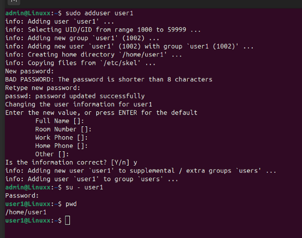

# Lab 1 — User Management

## Objective
Create a new Linux user, switch to that user, and verify the user’s home directory.

## Commands Used

| `sudo adduser user1` | Creates a new user named `user1`, sets password, and creates home directory |
| `su - user1` | Switches to the `user1` account and loads its environment |
| `pwd` | Displays the current working directory |

## Procedure
1. Created a new user `user1`.
2. Switched to the new user account.
3. Verified the home directory path.

## Output

User `user1` was successfully created and verified.

# Lab 2 — File Permissions

## Objective
Create a file, modify permissions, change ownership, and verify access.

## Commands Used

| `touch test2.txt` | Creates an empty file named `test2.txt` |
| `ls -la` | Lists files with detailed permissions and ownership |
| `umask` | Shows default permission mask for new files |
| `chmod 664 test2.txt` | Sets file permissions to rw-rw-r-- |
| `sudo chown user1 test2.txt` | Changes file owner to `user1` |
| `ls -la` | Verifies updated permissions and ownership |

## Procedure
1. Created file `test2.txt`.
2. Checked default permissions.
3. Modified permissions to `664`.
4. Changed ownership to `user1`.
5. Verified changes.

## Output

## Result
File permissions and ownership successfully updated.

# Lab 3 — Process Control

## Objective
Run a background process, identify its PID, and terminate it.

## Commands Used

| `sleep 100 &` | Runs a process in the background for 100 seconds |
| `ps` | Displays active processes and their PIDs |
| `kill 6315` | Terminates the process with PID 6315 |
| `ps` | Confirms process termination |

## Procedure
1. Started a background process.
2. Identified its PID.
3. Terminated the process.
4. Confirmed termination.

## Output

## Result
Background process successfully created and terminated.

# Lab 4 — Editing with Vim

## Objective
Create and edit a file using Vim, then save and verify contents.

## Commands Used

| `vim newfile.txt` | Opens or creates `newfile.txt` in Vim editor |
| `i` | Enters insert mode in Vim |
| `:wq` | Saves and exits Vim |
| `cat newfile.txt` | Displays file contents |

## Procedure
1. Opened a new file in Vim.
2. Entered insert mode and added text.
3. Saved and exited Vim.
4. Verified contents using `cat`.

## Output

## Result

File successfully created and edited using Vim.
