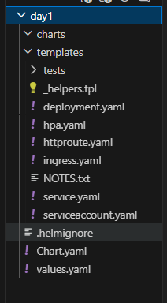
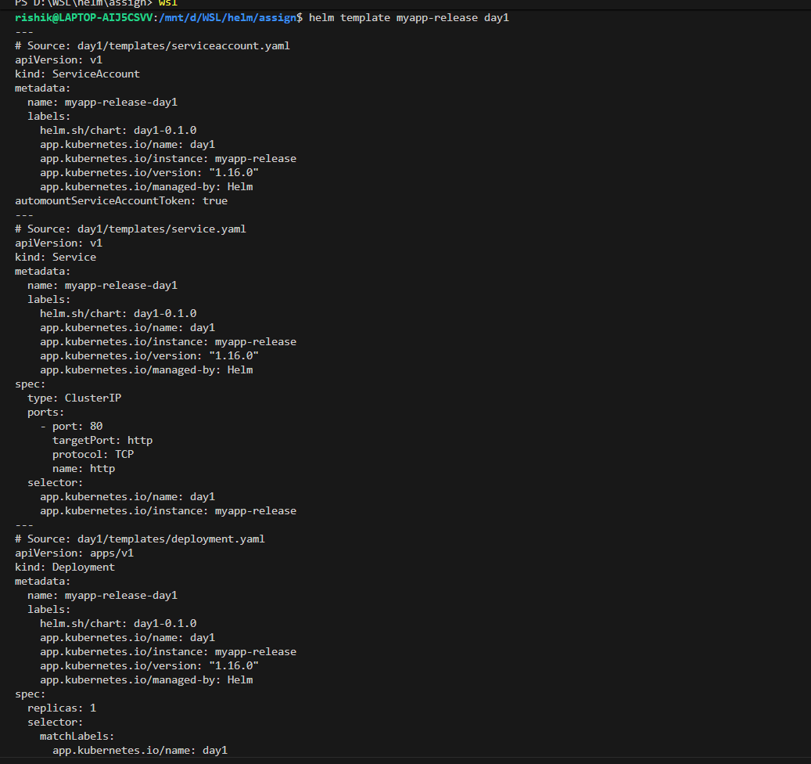
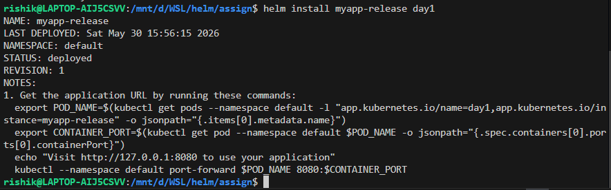
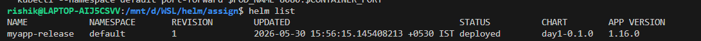
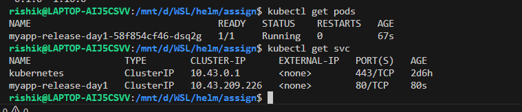
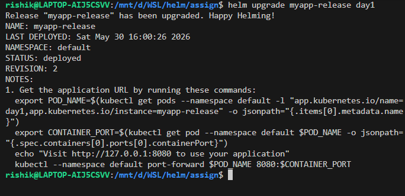
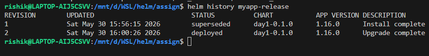
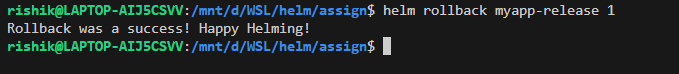
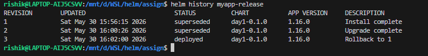
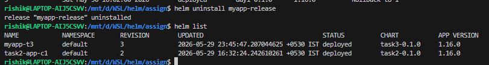

# Day 1 - Introduction to Helm

## Overview

Helm is the package manager for Kubernetes. It helps developers and DevOps engineers install, upgrade, configure, and manage Kubernetes applications efficiently.

Just like:

* **APT/YUM** manages Linux packages
* **NPM** manages Node.js packages
* **Helm** manages Kubernetes applications

Instead of manually creating and maintaining multiple Kubernetes YAML files, Helm allows applications to be packaged and deployed using reusable templates called **Charts**.

---

## Why Helm?

Deploying applications directly with Kubernetes manifests can become difficult as applications grow.

Without Helm, a typical deployment may require managing multiple files such as:

* Deployment YAML
* Service YAML
* ConfigMap YAML
* Secret YAML
* Ingress YAML
* Persistent Volume YAML

Managing all these resources manually is manageable for small projects but becomes challenging for larger environments.

### Challenges Without Helm

* Managing separate YAML files for multiple environments (Dev, QA, Production)
* Updating configuration across many microservices
* Tracking application versions
* Rolling back failed deployments
* Reusing Kubernetes configurations across projects

---

## Need of Helm

Helm simplifies Kubernetes application management by providing:

### 1. Templating

Helm allows Kubernetes manifests to be parameterized using variables.

Benefits:

* Reusable YAML files
* Environment-specific configurations
* Reduced duplication

Example:

```yaml
replicaCount: 2
img/image:
  repository: nginx
  tag: latest
```

The same template can be used for Dev, QA, and Production by simply changing values.

---

### 2. Versioning

Every deployment performed through Helm is stored as a **Release**.

Benefits:

* Track deployment history
* View previous versions
* Rollback easily if an upgrade fails

Example:

```bash
helm rollback my-app 1
```

---

### 3. Packaging

Helm packages Kubernetes applications into reusable units called **Charts**.

Benefits:

* Easy sharing of applications
* Standardized deployments
* Reusable across teams and projects

Example:

```bash
helm package my-chart
```

---

### 4. Automation

A complete application stack can be installed with a single command.

Instead of applying multiple YAML files:

```bash
kubectl apply -f deployment.yaml
kubectl apply -f service.yaml
kubectl apply -f ingress.yaml
kubectl apply -f configmap.yaml
```

Helm allows:

```bash
helm install my-app my-chart
```

Benefits:

* Faster deployments
* Consistent environments
* Reduced manual effort

---

## Key Helm Concepts

| Component   | Description                             |
| ----------- | --------------------------------------- |
| Helm        | Kubernetes Package Manager              |
| Chart       | Package containing Kubernetes resources |
| Release     | Running instance of a Chart             |
| Repository  | Collection of Helm Charts               |
| Values.yaml | Configuration file for templates        |
| Templates   | Parameterized Kubernetes manifests      |

---

## Advantages of Helm

* Simplifies Kubernetes deployments
* Reduces YAML duplication
* Supports multiple environments
* Enables version control and rollback
* Improves application portability
* Encourages Infrastructure as Code (IaC)
* Supports CI/CD automation

---

# Helm Basic Commands

## Objective

Learn the basic Helm workflow for creating, validating, installing, upgrading, rolling back, and uninstalling a Helm chart.

---

## Prerequisites

* Kubernetes Cluster (Minikube, K3s, Kind, AKS, EKS, etc.)
* Helm Installed
* kubectl Configured

Verify installation:

```bash
helm version
kubectl version --client
```

---

## 1. Create a Helm Chart

Create a new Helm chart named **myapp**.

```bash
helm create myapp
```

This command generates the following structure:

```text
myapp/
├── Chart.yaml
├── values.yaml
├── charts/
└── templates/
    ├── deployment.yaml
    ├── service.yaml
    ├── ingress.yaml
    └── ...
```



---

## 2. Validate / Render Templates

Check the generated Kubernetes manifests without deploying them.

```bash
helm template myapp-release myapp
```



### Purpose

* Validate Helm templates
* Render Kubernetes YAML files
* Detect syntax issues before deployment

---

## 3. Install Helm Chart

Deploy the chart to the Kubernetes cluster.

```bash
helm install myapp-release myapp
```



### Verify Installation

```bash
helm list

kubectl get pods

kubectl get svc
```




---

## 4. Upgrade Existing Release

After modifying templates or values, update the deployed release.

Changed pullPolicy: IfNotPresent to Always


```bash
helm upgrade myapp-release myapp
```




### Verify Upgrade

```bash
helm history myapp-release
```



---

## 5. Rollback to Previous Revision

Rollback to the immediately previous version.

```bash
helm rollback myapp-release
```

### Check Revision History

```bash
helm history myapp-release
```


## 6. Rollback to Specific Revision

Rollback to a particular revision number.

```bash
helm rollback myapp-release 1
```



This restores the release to Revision 1.

Verify:

```bash
helm history myapp-release
```

---

## 7. Uninstall Release

Remove the Helm deployment from the cluster.

```bash
helm uninstall myapp-release
```



Verify removal:

```bash
helm list

```

---

## Complete Workflow

```bash
# Create Chart
helm create myapp

# Validate Templates
helm template myapp-release myapp

# Install Chart
helm install myapp-release myapp

# Upgrade Chart
helm upgrade myapp-release myapp

# View History
helm history myapp-release

# Rollback Previous Revision
helm rollback myapp-release

# Rollback Specific Revision
helm rollback myapp-release 2

# Remove Release
helm uninstall myapp-release
```

---

## Key Concepts

| Term      | Description                                  |
| --------- | -------------------------------------------- |
| Chart     | Helm package containing Kubernetes manifests |
| Release   | Running instance of a chart                  |
| Install   | Deploy a chart                               |
| Upgrade   | Update an existing release                   |
| Rollback  | Revert to a previous release version         |
| Uninstall | Remove a release from Kubernetes             |

---

## Conclusion

Helm simplifies Kubernetes application management by providing a complete lifecycle for deployments. Using a few commands, you can create, deploy, upgrade, rollback, and remove applications while maintaining version history and deployment consistency.

