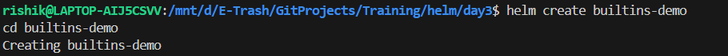
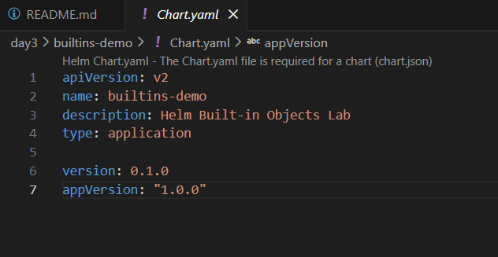
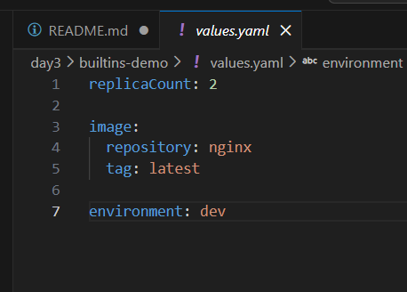
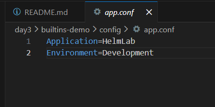
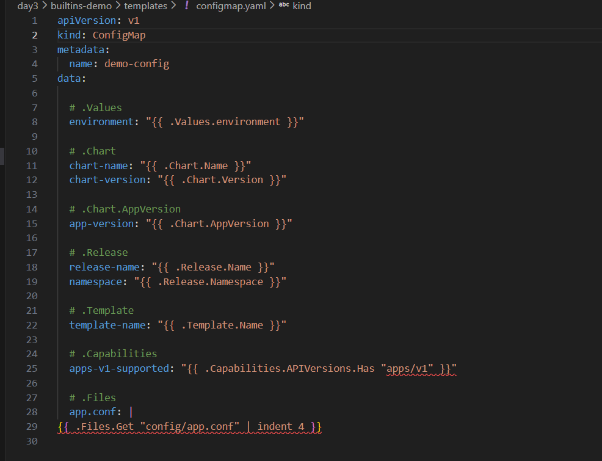
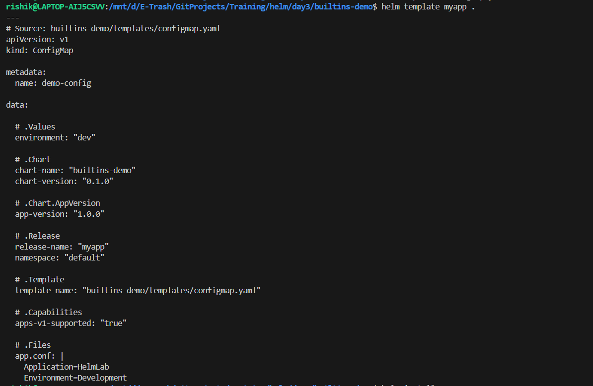
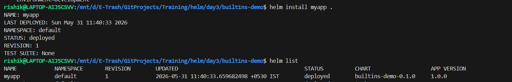
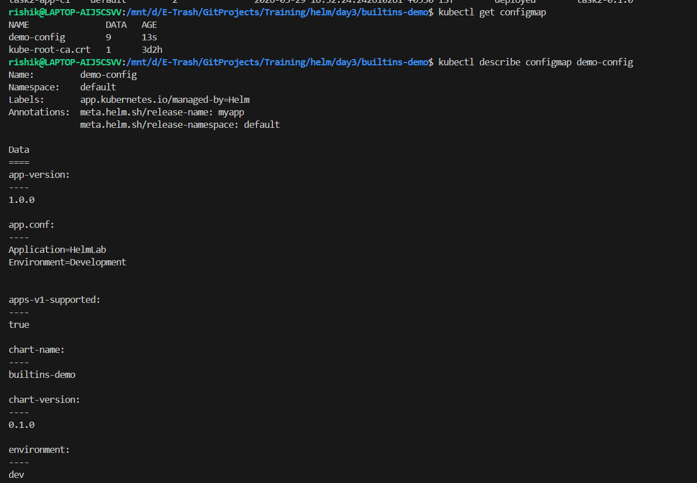
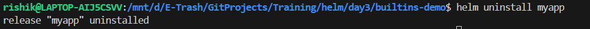

# Understanding `_helpers.tpl`

## Overview

`_helpers.tpl` is a special file inside the `templates/` directory of a Helm chart. It is used to define reusable template snippets that can be called from other Kubernetes manifest files.

This helps avoid repeating the same code across multiple templates and keeps Helm charts organized and maintainable.

---

## What is `_helpers.tpl`?

* A Helm template file used to store reusable functions and template blocks.
* Located inside the `templates/` directory.
* Does not create Kubernetes resources directly.
* Provides common values such as names, labels, annotations, and configuration logic.

---

## Why Use `_helpers.tpl`?

### 1. Avoid Code Duplication (DRY Principle)

Instead of writing the same labels, names, or metadata repeatedly in different files, define them once and reuse them.

### 2. Maintain Consistency

Ensures all Kubernetes resources use the same naming conventions and labels.

### 3. Improve Readability

Keeps Deployment, Service, ConfigMap, and other YAML files clean and easier to understand.

### 4. Reusability

A single helper function can be used across multiple templates.

---

## Key Concepts

### Defining a Helper

Helpers are created using the `define` keyword.

```yaml
{{- define "myapp.labels" }}
app: nginx
environment: production
{{- end }}
```

---

### Using a Helper

Helpers are called using the `include` function.

```yaml
metadata:
  labels:
{{ include "myapp.labels" . | indent 4 }}
```

---

### YAML Formatting

When including helper templates, proper indentation is important.

Common functions:

```yaml
indent
nindent
```

Example:

```yaml
{{ include "myapp.labels" . | nindent 4 }}
```

`nindent` adds a new line and applies indentation, making YAML formatting cleaner.

---

## Common Uses of `_helpers.tpl`

### Resource Naming

```yaml
{{- define "myapp.name" -}}
{{ .Chart.Name }}
{{- end -}}
```

---

### Labels

```yaml
{{- define "myapp.labels" -}}
app.kubernetes.io/name: {{ .Chart.Name }}
app.kubernetes.io/instance: {{ .Release.Name }}
{{- end -}}
```

---

### Full Resource Names

```yaml
{{- define "myapp.fullname" -}}
{{ .Release.Name }}-{{ .Chart.Name }}
{{- end -}}
```

---

## Benefits

| Benefit             | Description                      |
| ------------------- | -------------------------------- |
| Reusability         | Write once, use many times       |
| Consistency         | Uniform names and labels         |
| Maintainability     | Easier updates and modifications |
| Cleaner Templates   | Less clutter in YAML files       |
| Better Organization | Centralized template logic       |

---

## Key Points to Remember

* `_helpers.tpl` is stored inside `templates/`.
* It contains reusable template definitions.
* Use `{{ define "name" }}` to create helpers.
* Use `{{ include "name" . }}` to call helpers.
* Use `indent` or `nindent` for proper YAML formatting.
* It does **not** generate Kubernetes resources by itself.
* Primarily used for names, labels, annotations, and shared logic.

---

## Conclusion

`_helpers.tpl` acts as a **utility file for Helm charts**, allowing developers to create reusable template snippets and maintain consistent configurations across Kubernetes resources. It helps keep charts modular, clean, and easier to manage as applications grow.

---

# Built-in Objects

## Overview

Helm provides several **built-in objects** that can be accessed inside templates. These objects contain information about the chart, release, cluster, files, and values used during deployment.

Built-in objects help create dynamic and reusable Kubernetes manifests without hardcoding values.

---

## What are Built-in Objects?

Built-in objects are predefined variables available in Helm templates. They allow templates to access chart metadata, user-defined values, release information, cluster capabilities, and files.

Example:

```yaml
{{ .Values.img/image.repository }}
```

This retrieves a value from `values.yaml`.

---

## Common Helm Built-in Objects

### 1. `.Values`

#### Purpose

Stores values defined in:

* `values.yaml`
* CLI `--set`
* Custom values files (`-f values-prod.yaml`)

#### Example

```yaml
img/image:
  repository: nginx
```

```yaml
img/image: {{ .Values.img/image.repository }}
```

#### Use Cases

* Image names
* Replica counts
* Environment variables
* Service ports

---

### 2. `.Chart`

#### Purpose

Provides metadata from `Chart.yaml`.

#### Example

```yaml
{{ .Chart.Name }}
{{ .Chart.Version }}
```

#### Sample Chart.yaml

```yaml
apiVersion: v2
name: myapp
version: 1.0.0
```

#### Output

```text
myapp
1.0.0
```

---

### 3. `.Release`

#### Purpose

Contains information about the current Helm release.

#### Example

```yaml
{{ .Release.Name }}
{{ .Release.Namespace }}
```

#### Output

```text
my-release
default
```

#### Use Cases

* Resource naming
* Namespace management
* Release tracking

---

### 4. `.Capabilities`

#### Purpose

Provides information about Kubernetes cluster capabilities and supported API versions.

#### Example

```yaml
{{ .Capabilities.APIVersions.Has "apps/v1" }}
```

#### Output

```text
true
```

#### Use Cases

* Kubernetes version compatibility
* Conditional resource creation

Example:

```yaml
{{ if .Capabilities.APIVersions.Has "networking.k8s.io/v1" }}
```

---

### 5. `.Files`

#### Purpose

Accesses non-template files stored inside the Helm chart.

#### Example

Directory:

```text
mychart/
├── config/
│   └── app.conf
```

Template:

```yaml
{{ .Files.Get "config/app.conf" }}
```

#### Use Cases

* ConfigMap creation
* Loading application configs
* Embedding scripts

---

### 6. `.Template`

#### Purpose

Provides information about the template currently being rendered.

#### Example

```yaml
{{ .Template.Name }}
```

#### Output

```text
templates/deployment.yaml
```

#### Use Cases

* Debugging templates
* Logging template information

---

### 7. `.Chart.AppVersion`

#### Purpose

Returns the application version specified in `Chart.yaml`.

#### Chart.yaml

```yaml
appVersion: "1.2.3"
```

#### Example

```yaml
{{ .Chart.AppVersion }}
```

#### Output

```text
1.2.3
```

#### Use Cases

* Container img/image tags
* Application version tracking

---

## Summary Table

| Object              | Purpose                                      |
| ------------------- | -------------------------------------------- |
| `.Values`           | Access values from `values.yaml`             |
| `.Chart`            | Access metadata from `Chart.yaml`            |
| `.Release`          | Access release information                   |
| `.Capabilities`     | Access cluster capabilities and API versions |
| `.Files`            | Read non-template files from chart           |
| `.Template`         | Access current template information          |
| `.Chart.AppVersion` | Access application version                   |

---

## Key Points to Remember

* `.Values` → Reads user-defined values.
* `.Chart` → Reads chart metadata.
* `.Release` → Provides release details.
* `.Capabilities` → Checks Kubernetes API support.
* `.Files` → Reads files packaged inside the chart.
* `.Template` → Gives current template details.
* `.Chart.AppVersion` → Returns application version.
* Built-in objects make Helm charts dynamic and reusable.

---

## Conclusion

Helm Built-in Objects provide access to chart data, release information, cluster capabilities, and configuration values. They are the foundation of Helm templating and allow charts to be flexible, reusable, and environment-independent.

---

# Built-in Objects Lab

## Objective

Learn and practice Helm Built-in Objects by creating a Helm chart that demonstrates the usage of:

* `.Values`
* `.Chart`
* `.Release`
* `.Capabilities`
* `.Files`
* `.Template`
* `.Chart.AppVersion`

---

## Prerequisites

* Kubernetes Cluster
* Helm Installed
* kubectl Configured

Verify installation:

```bash
helm version
kubectl get nodes
```

---

## Steps Performed

### 1. Created a Helm Chart

```bash
helm create builtins-demo
cd builtins-demo
```


---

### 2. Updated `Chart.yaml`

Added chart metadata and application version.

```yaml
version: 0.1.0
appVersion: "1.0.0"
```


---

### 3. Updated `values.yaml`

Defined custom values.

```yaml
environment: dev

img/image:
  repository: nginx
  tag: latest
```



---

### 4. Created External Configuration File

```bash
mkdir config
vim config/app.conf
```


---

### 5. Created ConfigMap Template

Used all Helm Built-in Objects inside a ConfigMap.

```yaml
environment: "{{ .Values.environment }}"
chart-name: "{{ .Chart.Name }}"
release-name: "{{ .Release.Name }}"
app-version: "{{ .Chart.AppVersion }}"
template-name: "{{ .Template.Name }}"
```

Also loaded external configuration using:

```yaml
{{ .Files.Get "config/app.conf" }}
```



---

### 6. Rendered Templates

```bash
helm template myapp .
```



Verified generated manifests before deployment.

---

### 7. Installed the Chart

```bash
helm install myapp .
```



---

### 8. Verified Output

```bash
kubectl get configmap
kubectl describe configmap demo-config
```

Confirmed values from:

* `.Values`
* `.Chart`
* `.Release`
* `.Capabilities`
* `.Files`
* `.Template`
* `.Chart.AppVersion`



were successfully rendered.

---

## Built-in Objects Used

| Object              | Purpose                          |
| ------------------- | -------------------------------- |
| `.Values`           | Access values from `values.yaml` |
| `.Chart`            | Access chart metadata            |
| `.Release`          | Access release information       |
| `.Capabilities`     | Check cluster API support        |
| `.Files`            | Read files from chart            |
| `.Template`         | Get current template details     |
| `.Chart.AppVersion` | Access application version       |

---

## Cleanup

```bash
helm uninstall myapp
```



---

## Result

Successfully created and deployed a Helm chart demonstrating all major Helm Built-in Objects and verified their functionality using a Kubernetes ConfigMap.
