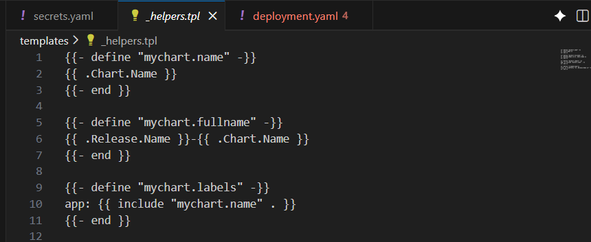
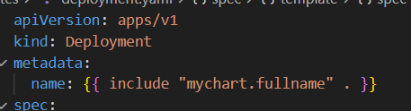
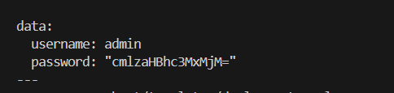
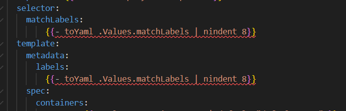
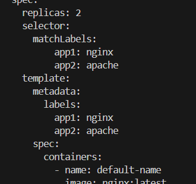

# Helm Day 4 - Functions & Control Structures

## Objective

Learn and practice Helm template functions and control structures to create dynamic, reusable, and configurable Kubernetes manifests.

---

# Functions Used in Helm

| Function   | Purpose                                       | Example                                         |
| ---------- | --------------------------------------------- | ----------------------------------------------- |
| `default`  | Provides a fallback value if a value is empty | `{{ .Values.image.tag \| default "latest" }}`   |
| `quote`    | Wraps a value in quotes                       | `{{ .Values.name \| quote }}`                   |
| `len`      | Returns length of a string/list               | `{{ len .Values.ports }}`                       |
| `replace`  | Replaces text in a string                     | `{{ replace "nginx" "apache" .Values.app }}`    |
| `contains` | Checks if a string contains another string    | `{{ contains "ng" .Values.app }}`               |
| `trim`     | Removes leading/trailing spaces               | `{{ trim .Values.name }}`                       |
| `add`      | Adds numeric values                           | `{{ add 2 3 }}`                                 |
| `list`     | Creates a list                                | `{{ list "a" "b" "c" }}`                        |
| `b64enc`   | Encodes value in Base64                       | `{{ .Values.password \| b64enc }}`              |
| `merge`    | Merges multiple maps                          | `{{ merge $map1 $map2 }}`                       |
| `include`  | Includes helper templates                     | `{{ include "mychart.labels" . }}`              |
| `tpl`      | Renders a string as a template                | `{{ tpl .Values.customTemplate . }}`            |
| `toYaml`   | Converts object to YAML                       | `{{ toYaml .Values }}`                          |
| `fromYaml` | Converts YAML string to object                | `{{ fromYaml $yaml }}`                          |
| `lookup`   | Reads existing cluster resources              | `{{ lookup "v1" "Pod" "default" "" }}`          |
| `required` | Makes a value mandatory                       | `{{ required "Image required" .Values.image }}` |

---

# Control Structures

| Structure | Purpose                               | Example                       |
| --------- | ------------------------------------- | ----------------------------- |
| `if`      | Executes block when condition is true | `{{ if .Values.debug }}`      |
| `else if` | Additional condition                  | `{{ else if .Values.prod }}`  |
| `else`    | Default block                         | `{{ else }}`                  |
| `range`   | Iterates over list/map                | `{{ range .Values.ports }}`   |
| `with`    | Changes context for cleaner access    | `{{ with .Values.image }}`    |
| `define`  | Creates reusable template block       | `{{ define "my.labels" }}`    |
| `include` | Calls reusable template               | `{{ include "my.labels" . }}` |

---

# Values Used in This Lab

### values.yaml

```yaml
deployment:
  name: nginx-deployment
  replicas: 2
  label: nginx

container:
  image: nginx:latest
  pullPolicy: Always
  port: 80

matchLabels:
  app1: nginx
  app2: apache

data:
  username: admin
  password: rishpass123
```

---

# Functions & Structures Applied

Based on the templates created during this lab, the following Helm features were used:

### `if / else`

Used for conditional resource creation or optional fields.

**Use Case:**

```yaml
{{ if .Values.deployment.replicas }}
replicas: {{ .Values.deployment.replicas }}
{{ end }}
```

---

### `range`

Used to iterate through labels, annotations, or lists.

**Use Case:**

```yaml
{{ range $key, $value := .Values.matchLabels }}
{{ $key }}: {{ $value }}
{{ end }}
```

Output:

```yaml
app1: nginx
app2: apache
```

---

### `with`

Used to simplify access to nested objects.

**Use Case:**

```yaml
{{ with .Values.container }}
image: {{ .image }}
imagePullPolicy: {{ .pullPolicy }}
{{ end }}
```

---

### `define` and `include`

Used in `_helpers.tpl` for reusable labels and names.

**Example:**

```yaml
{{ define "mychart.labels" }}
app: nginx
{{ end }}
```



Called using:

```yaml
{{ include "mychart.labels" . }}
```



---

### `quote`

Used to ensure string values are properly quoted.

```yaml
username: {{ .Values.data.username | quote }}
```

Output:

```yaml
username: "admin"
```

---

### `b64enc`

Used for Kubernetes Secrets.

```yaml
username: {{ .Values.data.username | b64enc }}
password: {{ .Values.data.password | b64enc }}
```

Output:

```yaml
username: YWRtaW4=
password: cmlzaHBhc3MxMjM=
```


---

### `default`

Used to provide fallback values.

```yaml
image: {{ .Values.container.image | default "nginx:latest" }}
```

---

### `toYaml`

Used to render complex objects as YAML.

```yaml
{{ toYaml .Values.matchLabels }}
```


Output:

```yaml
app1: nginx
app2: apache
```



---

# Learning Outcomes

After completing this lab, I learned:

* Using Helm functions to manipulate values dynamically.
* Implementing conditional logic with `if`, `else if`, and `else`.
* Iterating over maps and lists using `range`.
* Simplifying nested value access using `with`.
* Creating reusable templates with `define` and `include`.
* Encoding Secret data using `b64enc`.
* Rendering YAML dynamically using `toYaml`.
* Improving chart reusability and maintainability through Helm templating.

---

# Result

Successfully implemented Helm Functions and Control Structures to create dynamic Kubernetes manifests. Used conditional logic, loops, reusable templates, YAML rendering, and Secret encoding to make the chart more flexible and maintainable.
