# Pods 

```Firstly we will create a namespace then perform on that```
## exmaple 

### without specifying the namespace in the file we can do that manually
```
apiVersion: v1
kind: Pod

metadata:
  name: hello-pod

spec:
  containers:
    - name: hello-container
      img/image: nginx
      ports:
        - containerPort: 80
```

#### To apply
```kubectl apply -f pod.yaml -n dev```

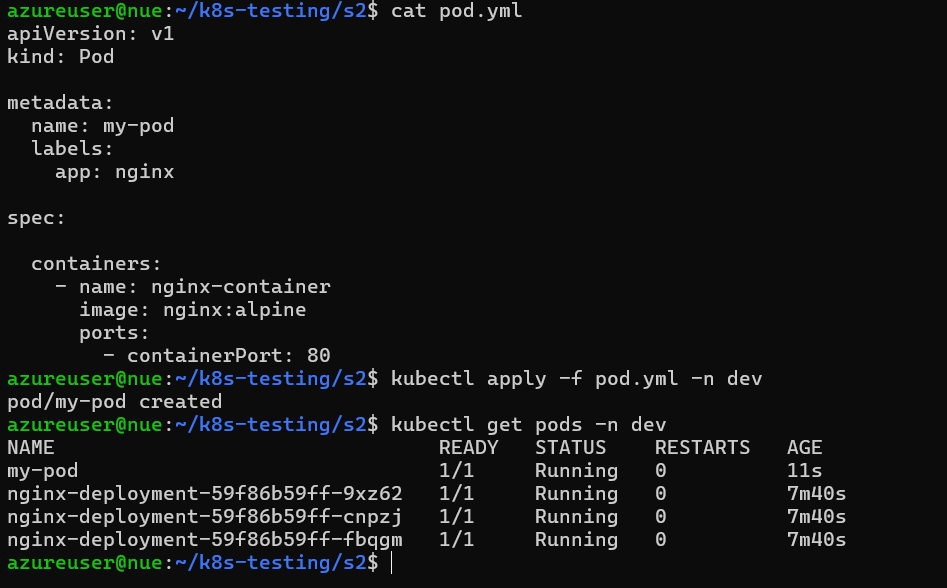

```now we will delete it and retry by adding namespace in the pod.yml file and see what it does```
```
apiVersion: v1
kind: Pod

metadata:
  name: hello-pod
  namespace: dev

spec:
  containers:
    - name: hello-container
      img/image: nginx
      ports:
        - containerPort: 80
```

#### To apply
```kubectl apply -f pod.yaml```

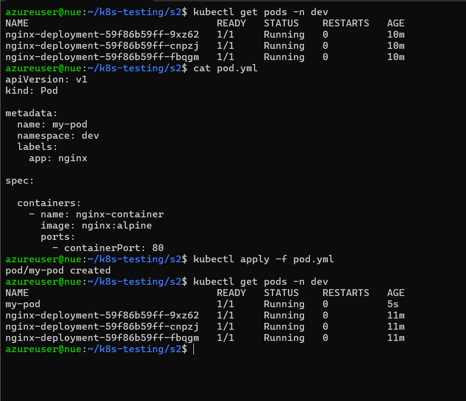

---

# Deployment
```here in this we write deployment.yml file which really helps us in self-healing, easy scaling, rolling out updates or rollback support.```


``` runs app reliably, scales it, and keeps it healthy.```

## example

```
apiVersion: apps/v1
kind: Deployment

metadata:
  name: nginx-deployment
  namespace: dev
  labels:
    app: nginx

spec:
  replicas: 3

  selector:
    matchLabels:
      app: nginx

  template:
    metadata:
      labels:
        app: nginx

    spec:
      containers:
        - name: nginx
          img/image: nginx:latest
          ports:
            - containerPort: 80
```

#### To apply
```kubectl apply -f deployment.yaml```

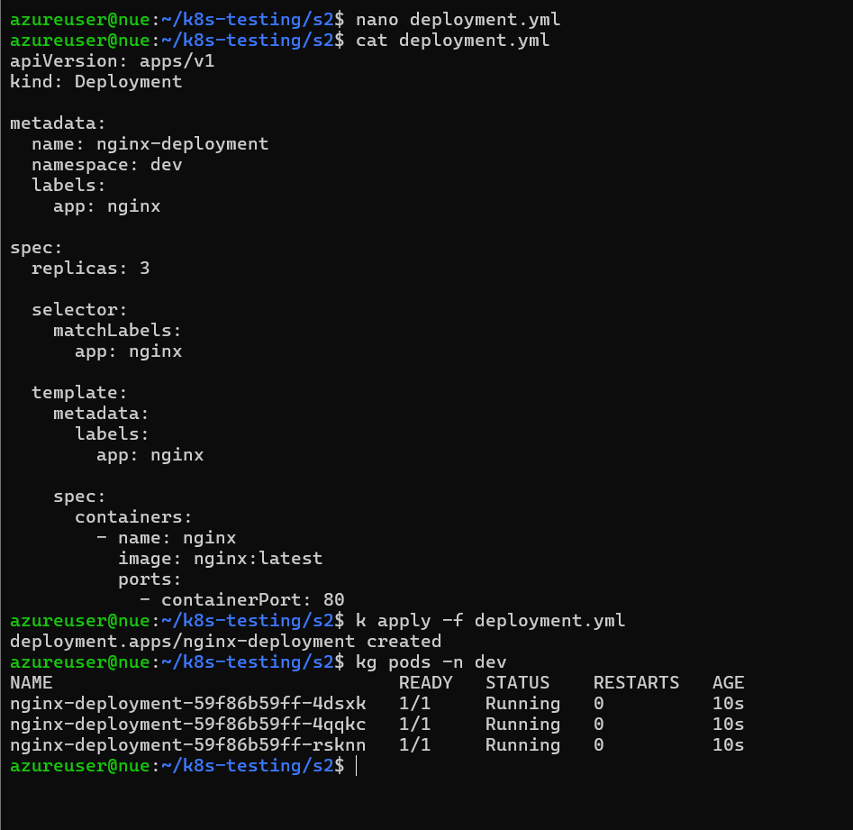

## Testing self healing by deleteing one of the pods:

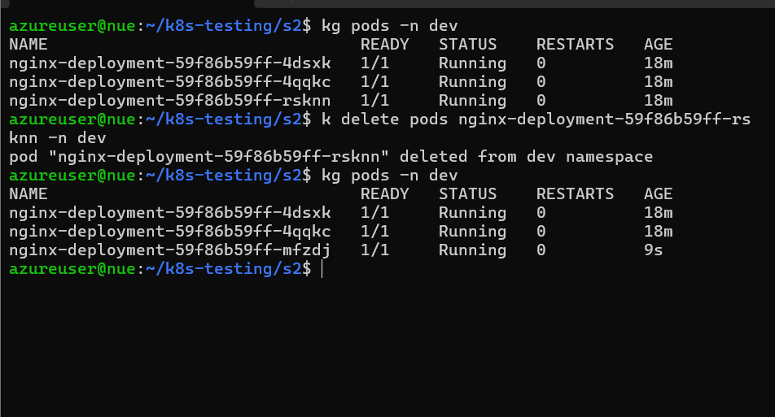

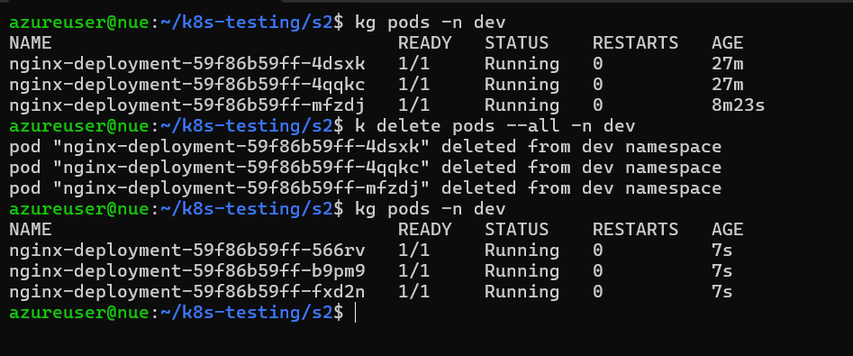


## now we will try rolling out updates

```firstly we need to change something and then apply ```

changd ```nginx:latest``` to ```nginx:1.14.2```

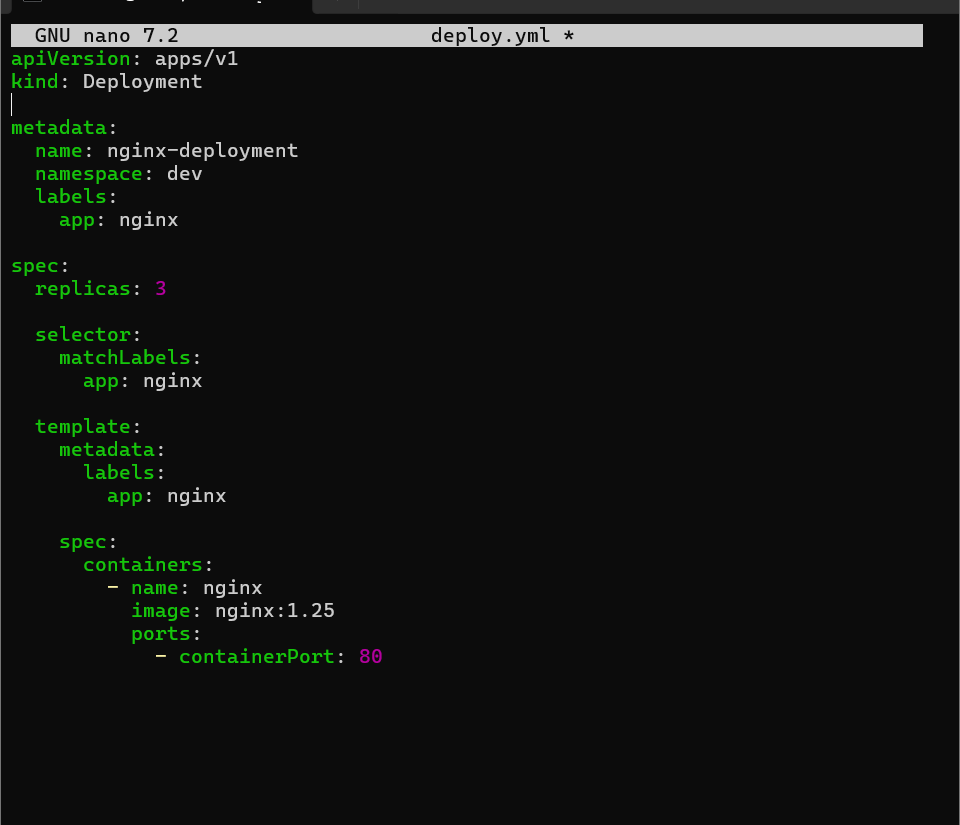

then deployed it

observed changes:
    firstly creation of new replica set 
    all the pods shifted to new replica set

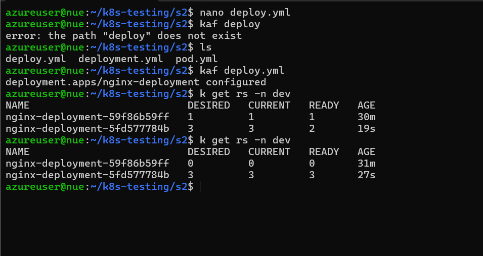

also checked rollout history 

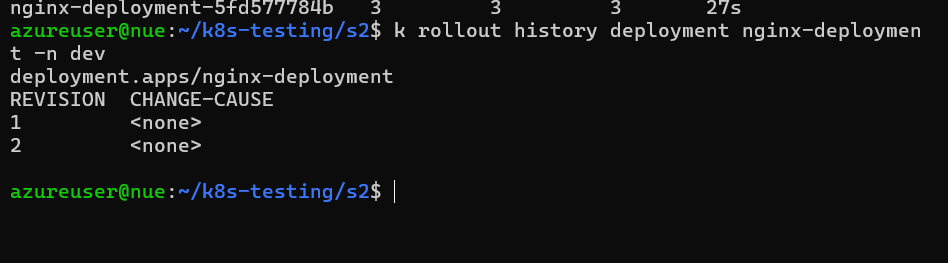

## now we will try to rollback the changes

```k rollout undo deployment nginx-deployment --to-revision=1 -n dev```

Meaning:
    nginx-deployment → deployment name
    --to-revision=1 → rollback target
    -n dev → namespace


### Trying configmap and secrets

#### Configmap
```
apiVersion: v1
kind: ConfigMap

metadata:
  name: app-config
  namespace: dev

data:
  APP_ENV: "production"
  APP_COLOR: "blue"
```

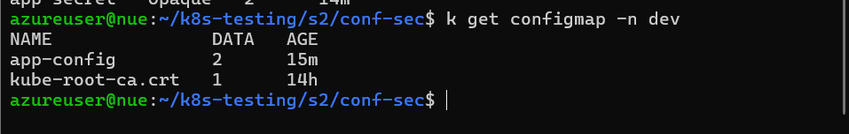

#### Secrets
```
apiVersion: v1
kind: Secret

metadata:
  name: app-secret
  namespace: dev

type: Opaque

stringData:
  DB_USERNAME: admin
  DB_PASSWORD: password123
```

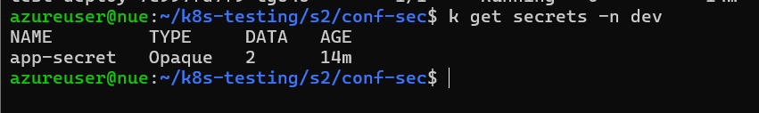

``` now after applying both of this we have to give the deployment file the refrence of the configmap and secrets```

```if we have started the deployment before the configmap and secrets ref those will not get updated in the live deployment```


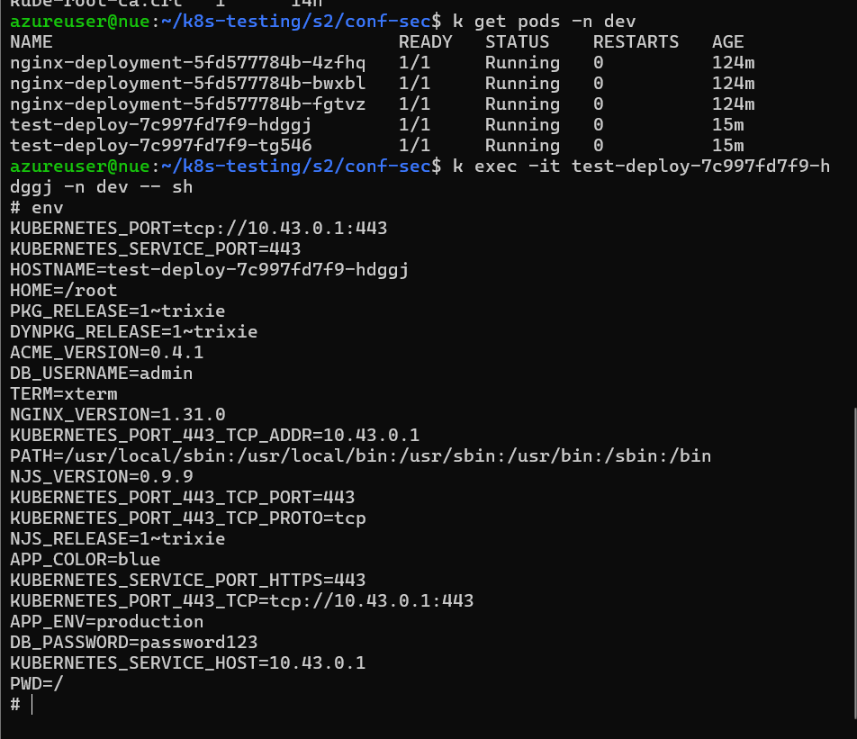