## Install and Verify Terraform

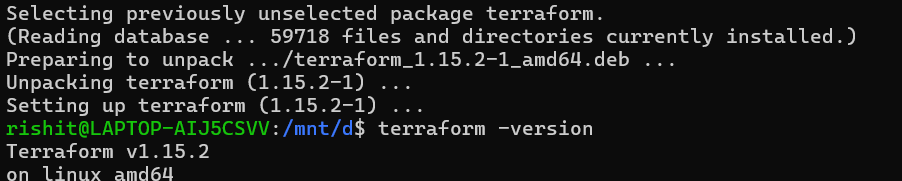

## Setup Terraform Alias

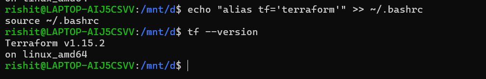

## Create First Terraform Resource

```In this lab, AWS provider configuration and the first VPC resource were created using Terraform.```

### Provider Configuration

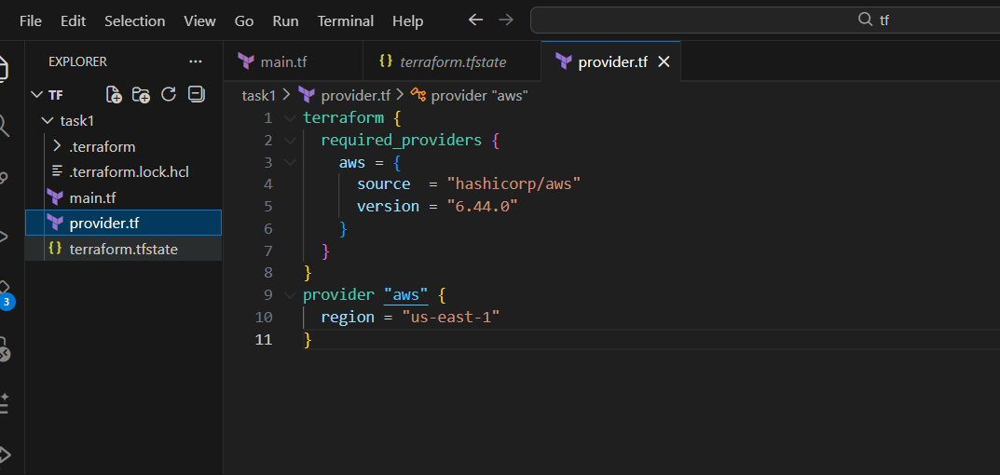

### Resource

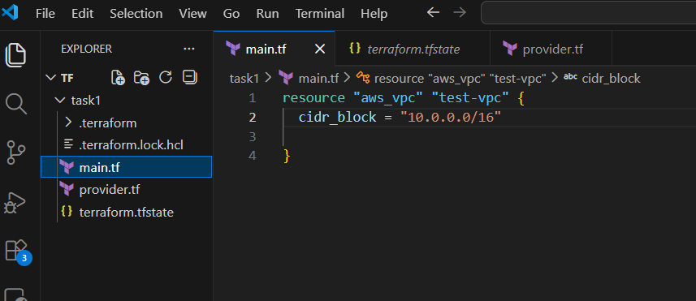

### Terraform Plan

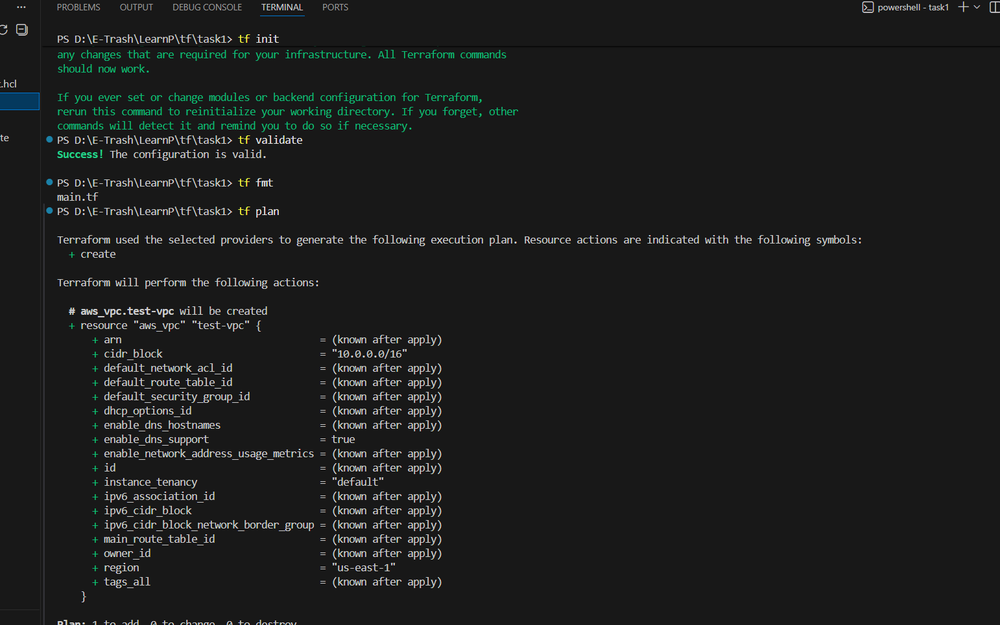

This command checks the Terraform configuration and shows what infrastructure changes Terraform is going to perform.

### Terraform Validate

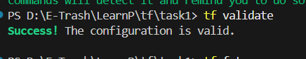

### Terraform Apply

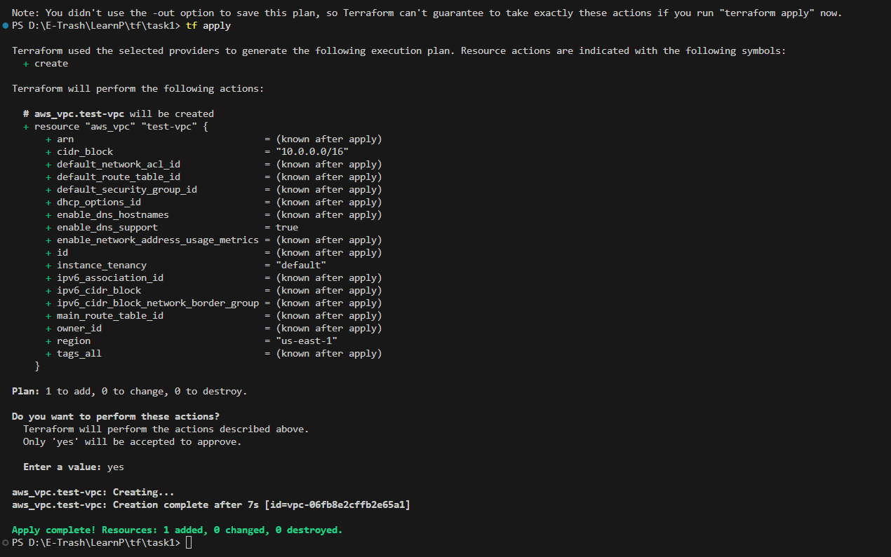

### Terraform State

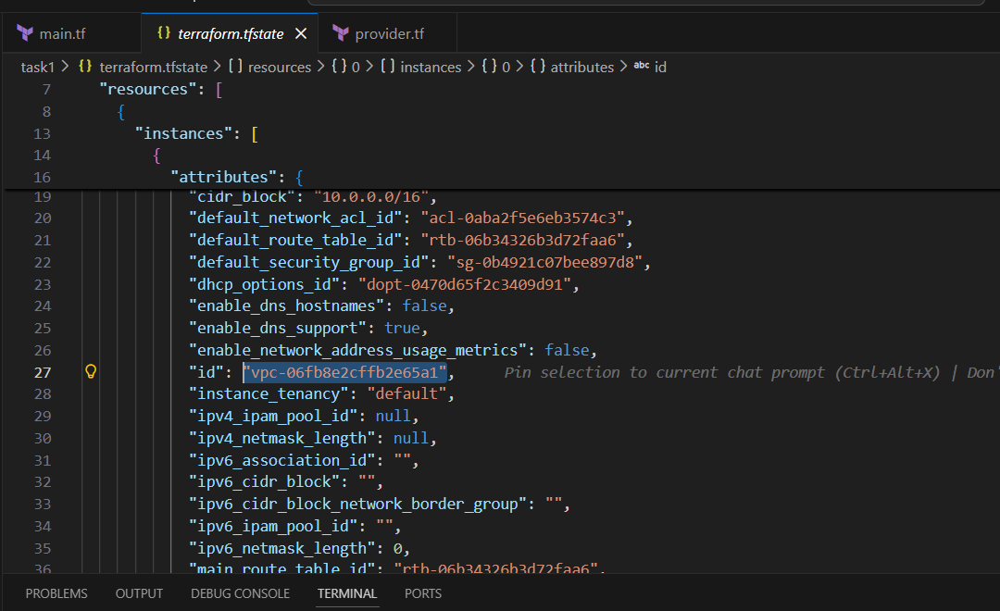

### Verified by console:

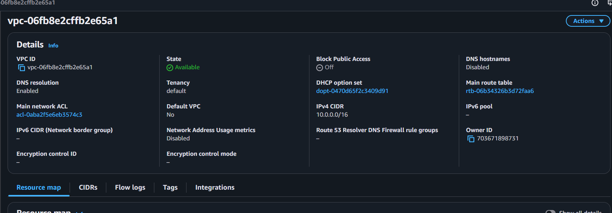

### Terraform Destroy:

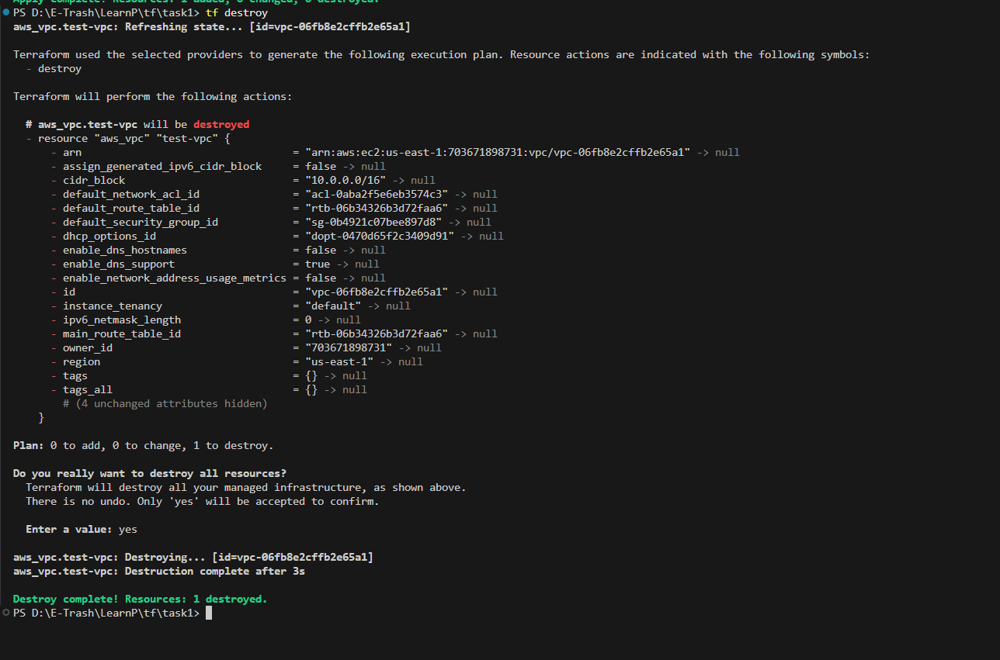

---

## Create Multiple Resources Using Terraform

### Create  EC2 Resource

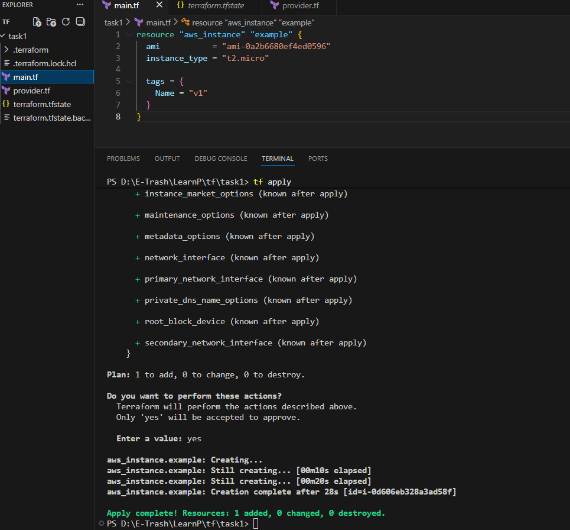

### Verify EC2 instance:

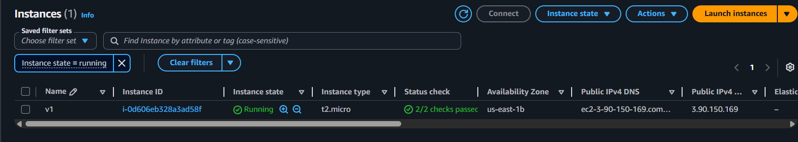

### Create VPC

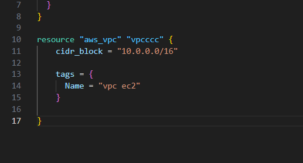

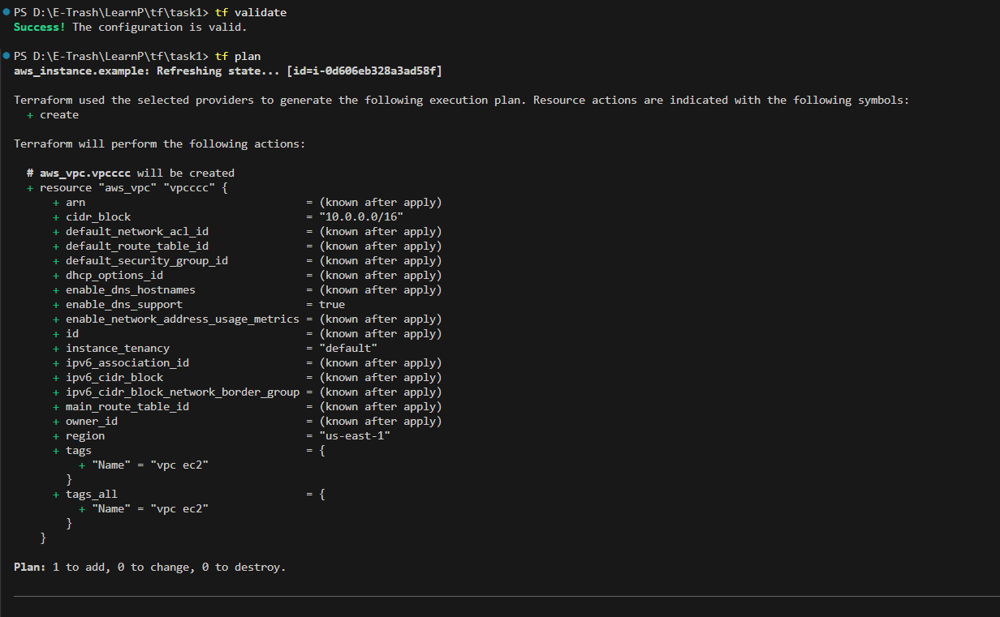

Terraform detected another new infrastructure resource.

### Applied 

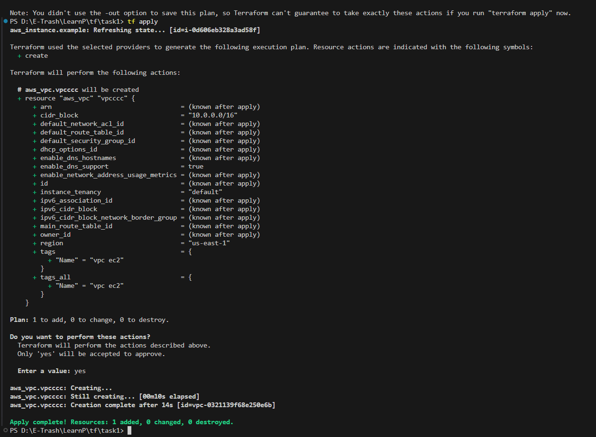

### Verify VPC resource:

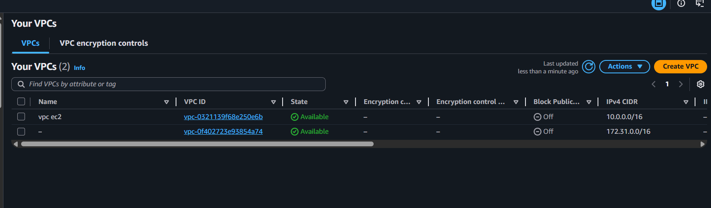

## Now we will try changing existing resource
Changed the CIDR block

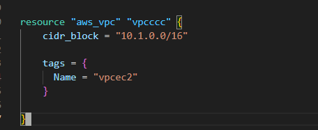

Changing some properties like:

cidr_block
forces Terraform to:

Destroy existing resource

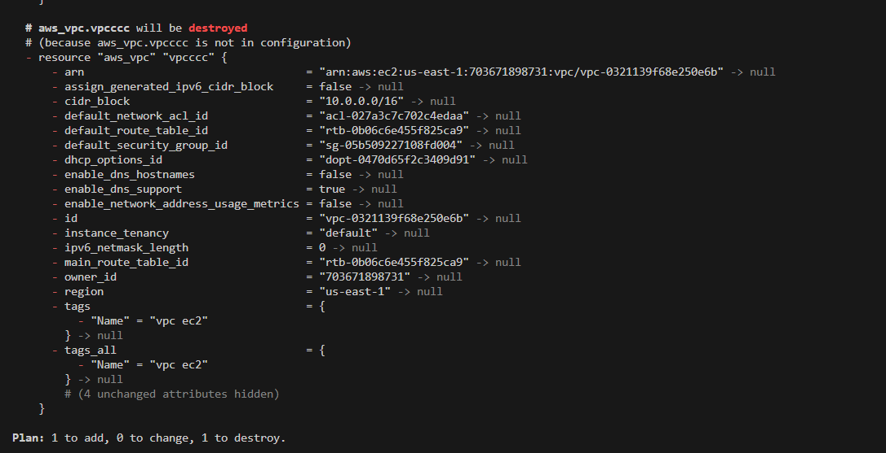

Create a new replacement resource

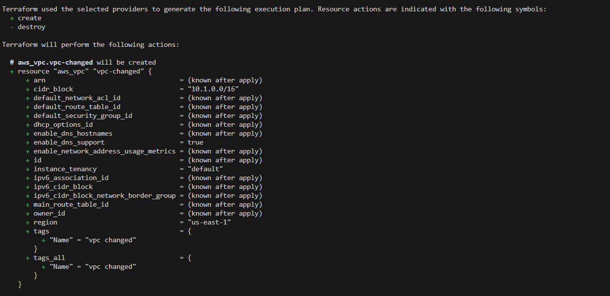

### applied changes

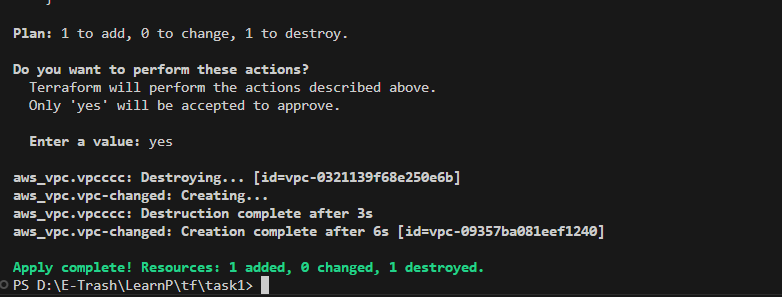

#### Previous cidr was ```10.0.0.0/16```
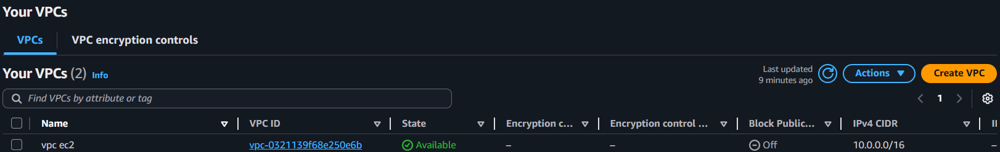

#### Now updated cidr is ```10.1.0.0/16```


### Now testsing refresh

Here i have changed instance name tag from previous v1 to ```test-instance``

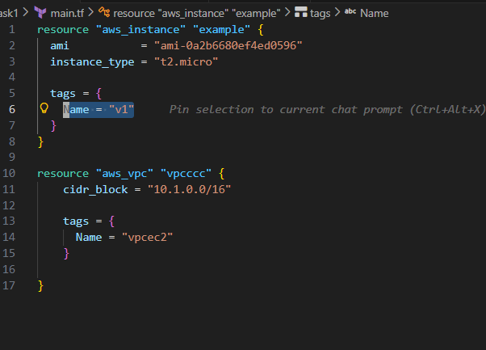

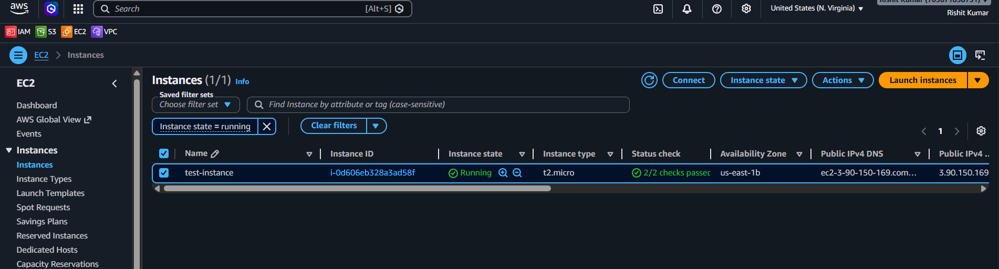

### now used refresh
```what it does is it pulls all changes that were performed directly in AWS Console```

checked the tfstate file to see it has updated or not

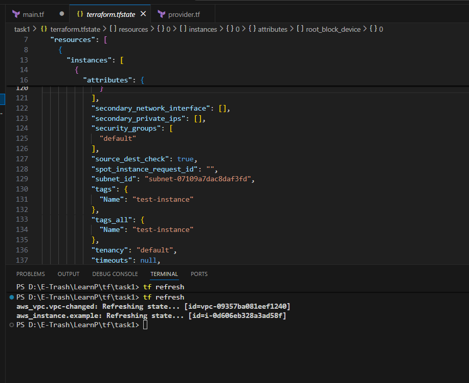


| Command      | Meaning                                    |
| ------------ | ------------------------------------------ |
| `tf plan`    | “Shows what Terraform WILL do before applying changes”        |
| `tf refresh` | “Updates Terraform state file with REAL cloud infrastructure state.” |


### Commands

| Command       | Purpose                                                    |
| ------------- | ---------------------------------------------------------- |
| `tf validate` | Checks Terraform configuration for errors.                 |
| `tf fmt`      | Formats Terraform files properly.                          |
| `tf show`     | Displays current Terraform-managed infrastructure details. |
| `tf state`    | Manages and views Terraform state information.             |
| `tf plan`     | Shows what changes Terraform will make.                    |
| `tf apply`    | Creates or updates infrastructure.                         |
| `tf destroy`  | Deletes Terraform-managed resources.                       |
| `tf init`     | Initializes Terraform project and downloads providers.     |
| `tf refresh`  | Syncs Terraform state with real infrastructure.            |

